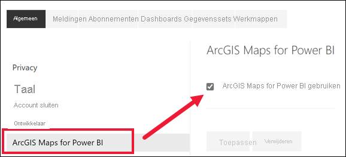

# Aanmelden voor preview-functies van Power BI-service
## Wat zijn *preview-functies*?
Wanneer we verbeteringen aan de Power BI-service aanbrengen, brengen we een aantal nieuwe functionaliteiten uit als *preview-functies*. Preview-functies kunnen worden in- of uitgeschakeld, zodat u ze kunt uitproberen.

## Voorbeelden zoeken en deze inschakelen (en uitschakelen)
1. Open het menu instellingen door het tandwielpictogram in de rechterbovenhoek van uw Power BI-scherm selecteren en te kiezen **instellingen**.
   
   .
2. Selecteer het tabblad **Algemeen**. Als er voorbeelden beschikbaar zijn, ziet u een optie om **voorbeelden van functies te zien** of een voorbeeldfunctie aan de linkerkant.  In dit voorbeeld wordt een voorbeeld weergegeven voor ArcGIS Maps. 
   
   
3. Selecteer het keuzerondje **Aan** of schakel het selectievakje in om de nieuwe ervaring uit te proberen. Selecteer vervolgens **Toepassen**.
4. Als preview-functies uitschakelen, volgt u bovenstaande stappen 1-3 en kiest u in stap 3, **uit**, of verwijder het vinkje en selecteer **toepassen**.

Vragen of feedback? [Bezoek de Power BI-community](http://community.powerbi.com/t5/Navigation-Preview-Forum/bd-p/NavigationPreview).

