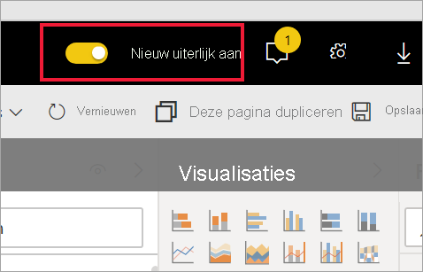
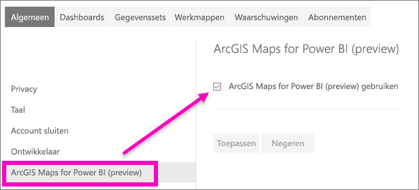

# Aanmelden voor preview-functies van de Power BI-service
## Wat zijn *preview-functies*?
Wanneer we verbeteringen aanbrengen aan de Power BI-service, brengen we een aantal nieuwe functionaliteiten uit als *preview-functies*. Preview-functies kunnen worden in- of uitgeschakeld, zodat u ze kunt uitproberen.

Sommige preview-functies kunnen worden in- of uitgeschakeld vanuit uw Power BI-dashboard, -startscherm of rapport zelf.

   

Andere preview-functies zijn beschikbaar via uw menu *Instellingen*. In dit artikel leest u hoe u met behulp van het menu Instellingen toegang krijgt tot preview-functies.

## Voorbeelden zoeken en deze inschakelen (en uitschakelen)
1. Open het menu Instellingen door het tandwielpictogram te selecteren in de rechterbovenhoek van het scherm van Power BI en kies **Instellingen**.
   
   .
2. Selecteer het tabblad **Algemeen**. Als er voorbeelden beschikbaar zijn, ziet u een optie om **voorbeelden van functies te zien** of een voorbeeldfunctie aan de linkerkant.  In dit voorbeeld wordt een voorbeeld weergegeven voor ArcGIS Maps. 
   
   
3. Selecteer het keuzerondje **Aan** of schakel het selectievakje in om de nieuwe ervaring uit te proberen. Selecteer vervolgens **Toepassen**.
4. Als u voorbeeldfuncties wilt uitschakelen, volgt u de stappen 1 t/m 3 hierboven. Kies **Uit** in stap 3 of schakel het selectievakje uit en selecteer **Toepassen**.

Vragen of feedback? [Bezoek de Power BI-community](https://community.powerbi.com/t5/Navigation-Preview-Forum/bd-p/NavigationPreview).

