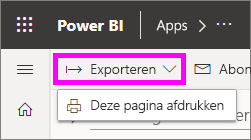
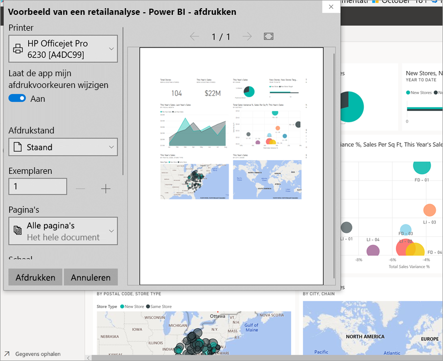
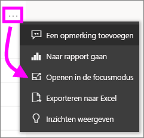
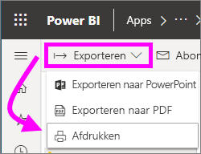

# Afdrukken via de Power BI-service
U kunt een volledig dashboard, een dashboardtegel, een rapportpagina of een rapportvisual afdrukken via de Power BI-service. Rapporten kunnen alleen pagina voor pagina worden afgedrukt. U kunt niet het hele rapport in één keer afdrukken.

   > [!NOTE]
   > Welk afdrukvenster wordt weergegeven, is afhankelijk van de browser die u gebruikt.
   > 
## Een dashboard afdrukken
1. Open het dashboard dat u wilt afdrukken.
2. Selecteer in de linkerbovenhoek Exporteren en kies **Deze pagina afdrukken**.
   
    
3. Het venster Afdrukken voor uw browser wordt geopend. Kies de instellingen en de afdrukbestemming en selecteer **Afdrukken**.
   

   
    

## Een dashboardtegel afdrukken
1. Open het dashboard in de [modus Volledig scherm](end-user-focus.md) door in de navigatiebalk aan de bovenkant het pictogram voor de modus Volledig scherm  te selecteren.
3. [Open de tegel in de focusmodus](end-user-focus.md) door de muisaanwijzer te bewegen om het weglatingsteken weer te geven en **Openen in focusmodus** of het focussymbool  te kiezen.
   
    
4. Beweeg de muisaanwijzer over de tegel om het menu Opties weer te geven.
   
    
4. Selecteer het pictogram voor afdrukken .     
   

## Een rapportpagina afdrukken
Rapporten kunnen alleen pagina voor pagina worden afgedrukt.

1. Open het rapport en selecteer **Exporteren** > **Afdrukken** om de huidige rapportpagina af te drukken.
   
    
3. Het venster Afdrukken voor uw browser wordt geopend.
   

## Een rapportvisual afdrukken
1. [Open de visual in de focusmodus](end-user-focus.md) door de muisaanwijzer over de tegel te bewegen en in de rechterbovenhoek het focuspictogram  te selecteren.

2. Selecteer in de linkerbovenhoek **Exporteren** > **Afdrukken** om de visual af te drukken.

    

## Aandachtspunten en probleemoplossing

* V: Ik kan niet alle rapportpagina's in een keer afdrukken.    
* A: Dat klopt. Rapportpagina's kunnen alleen pagina voor pagina worden afgedrukt.
* V: Ik kan niet afdrukken naar PDF.    
* A: Deze optie wordt alleen weergegeven als u het PDF-stuurprogramma al hebt geconfigureerd in de browser.    
* V: Wat wordt weergegeven wanneer ik **Afdrukken** selecteer, komt niet overeen met wat ik hier zie.    
* A: De afdrukschermen kunnen per browser en softwareversie verschillen.
* V: Mijn afdruk is niet goed geschaald.  Mijn dashboard past niet op de pagina. Andere vragen over schalen en de afdrukstand.    
* A: We kunnen niet garanderen dat de afdruk exact hetzelfde is als de weergave in de Power BI-service. Elementen als het schalen, de marges, de visuele details, de afdrukstand en de grootte worden niet bepaald door Power BI. Raadpleeg de documentatie voor uw specifieke browser voor hulp bij dergelijke problemen.      

## Volgende stappen
[Dashboards en rapporten delen met collega's en anderen](../service-share-dashboards.md)

Nog vragen? [Misschien dat de Power BI-community het antwoord weet](http://community.powerbi.com/)

