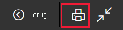
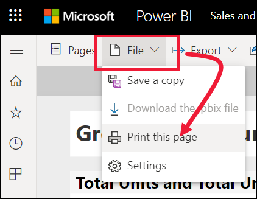
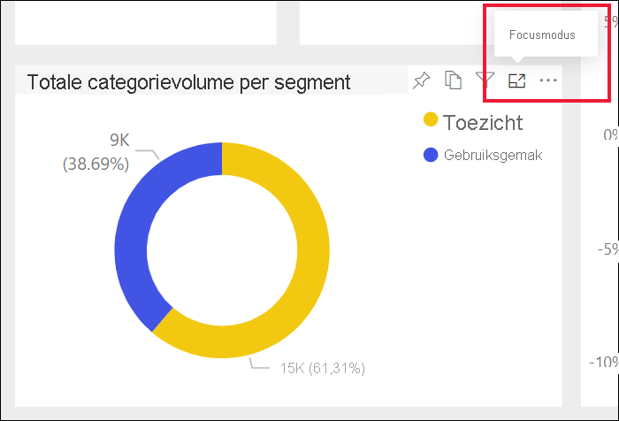

# Afdrukken via de Power BI-service

[!INCLUDE[consumer-appliesto-yynn](../includes/consumer-appliesto-yynn.md)]
## Wat er kan worden afgedrukt
[!INCLUDE [power-bi-service-new-look-include](../includes/power-bi-service-new-look-include.md)]

U kunt een volledig dashboard, een dashboardtegel, een rapportpagina of een rapportvisual afdrukken via de Power BI-service. Als uw rapport meer dan één pagina bevat, moet u elke pagina afzonderlijk afdrukken. 

## Overwegingen bij afdrukken

De meeste Power BI-dashboards en -rapporten worden door *rapportontwerpers* zo gemaakt dat ze online kunnen worden gebruikt en er op verschillende apparaten goed uitzien. Wanneer u een rapport afdrukt, wordt door uw browser bepaald hoe die inhoud op papier wordt weergegeven. 

Er zijn browserinstellingen die u kunt gebruiken om de afdruk aan te passen, maar zelfs dan bestaat de kans dat u niet het gewenste resultaat krijgt. U kunt het rapport eerst [exporteren naar PDF](end-user-pdf.md) en in plaats daarvan de PDF afdrukken. 

## De afdrukinstellingen voor de browser aanpassen
Wanneer u afdrukt vanuit Power BI, wordt in de browser het venster Afdrukken geopend. Elke browser heeft een eigen afdrukvenster. Maar u zult zien dat elke browser vergelijkbare opties heeft waarmee u het uiterlijk van uw afdruk kunt bepalen. 

Hier volgen enkele tips waarmee u de opmaak van uw afdruk kunt bepalen.

   > 
1. Wanneer de breedte van uw dashboard, rapport of visual groter is dan de hoogte, kunt u overwegen de **Liggende** afdrukstand te gebruiken. 

   

2. Als u meer inhoud op een afgedrukte pagina wilt plaatsen, past u bijvoorbeeld de marges en schaal aan. 

    

Experimenteer met de instellingen van uw specifieke browser totdat u het gewenste uiterlijk krijgt. Sommige browsers hebben zelfs opties om achtergrondafbeeldingen af te drukken. 

## Een dashboard afdrukken
1. Open het dashboard dat u wilt afdrukken.
2. Selecteer in de linkerbovenhoek **Bestand** en kies **Deze pagina afdrukken**.
   
    

3. Het venster Afdrukken voor uw browser wordt geopend. Kies de instellingen. Als de breedte van uw dashboard bijvoorbeeld groter is dan de hoogte, kunt u ervoor kiezen de afdrukstand in **Liggend** te wijzigen. Selecteer **Afdrukken**.
   
    

## Een dashboardtegel afdrukken
1. Open het dashboard in de [modus Volledig scherm](end-user-focus.md) door in de navigatiebalk aan de bovenkant het pictogram voor de modus Volledig scherm  te selecteren.

3. [Open de tegel in de focusmodus](end-user-focus.md) door de muisaanwijzer te bewegen om **Meer opties** (...) weer te geven en **Openen in focusmodus** of het focuspictogram  te kiezen.
   
    

4. Beweeg de muisaanwijzer over de tegel om het menu Opties weer te geven.
   
    

    

4. Selecteer het pictogram voor afdrukken .     

5. Het venster Afdrukken voor uw browser wordt geopend. Kies de instellingen. Als uw tegel bijvoorbeeld niet op de pagina past, kunt u de schaal aanpassen naar 75%. Selecteer **Afdrukken**.

     

> [!TIP]
> Als u al deze stappen hebt gevolgd en de tegel nog steeds niet naar wens wordt weergegeven, kunt u het volgende proberen.
> 1. Open het venster Afdrukken en breng de gewenste wijzigingen aan in de afdrukinstellingen. U kunt bijvoorbeeld de opmaak, marges en schaal wijzigen. 
> 2. Maar in plaats van af te drukken selecteert u **Annuleren**. 
> 3. Voor nogmaals stap 1-5 uit. De tegel wordt aangepast aan de nieuwe instellingen van het afdrukvenster en kan worden afgedrukt.

## Een rapportpagina afdrukken
Rapporten kunnen alleen pagina voor pagina worden afgedrukt.

1. Open het rapport en selecteer **Bestand** > **Deze pagina afdrukken** om de huidige rapportpagina af te drukken.
   
    
2. Het venster Afdrukken voor uw browser wordt geopend.

3. Volg de afdrukstappen bij **Een dashboard afdrukken** hierboven.
   

## Een rapportvisual afdrukken
1. [Open de visual in de focusmodus](end-user-focus.md) door de muisaanwijzer over de tegel te bewegen en in de rechterbovenhoek het focuspictogram  te selecteren.

    

2. Selecteer in de linkerbovenhoek **Bestand** > **Deze pagina afdrukken** om de visual af te drukken.

    

3. Volg de afdrukstappen bij **Een dashboard afdrukken** hierboven.

## Aandachtspunten en probleemoplossing

* V: Ik kan niet alle rapportpagina's in een keer afdrukken.    
* A: Dat klopt. Rapportpagina's kunnen alleen pagina voor pagina worden afgedrukt.
* V: Ik kan niet afdrukken naar PDF.    
* A: Deze optie wordt alleen weergegeven als u het PDF-stuurprogramma al hebt geconfigureerd in uw browser.    
* V: Wat wordt weergegeven wanneer ik **Afdrukken** selecteer, komt niet overeen met wat ik hier zie.    
* A: De afdrukschermen kunnen per browser en softwareversie verschillen.
* V: Mijn afdruk is niet goed geschaald.  Mijn dashboard past niet op de pagina. Andere vragen over schalen en de afdrukstand.    
* A: We kunnen niet garanderen dat de afdruk exact hetzelfde is als de weergave in de Power BI-service. Elementen als het schalen, de marges, de visuele details, de afdrukstand en de grootte worden niet bepaald door Power BI. Pas de afdrukinstellingen voor uw browser aan. Enkele van de bovenstaande suggesties zijn de afdrukstand (staand of liggend), de grootte van de marge en de schaal. Raadpleeg de documentatie voor uw specifieke browser als deze instellingen niet het gewenste resultaat geven.      
* V: Wanneer ik vanuit de modus Volledig scherm afdruk, wordt de afdrukoptie niet weergegeven wanneer ik de muisaanwijzer over de visual beweeg.   
* A: Ga terug naar het dashboard of rapport in de standaardweergave en open de visual opnieuw in de focusmodus en vervolgens in de modus Volledig scherm. 

## Volgende stappen
[Dashboards en rapporten delen met collega's en anderen](../collaborate-share/service-share-dashboards.md)

Nog vragen? [Misschien dat de Power BI-community het antwoord weet](https://community.powerbi.com/)
