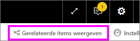

# Q&A voor Power BI-**consumenten**
## Wat is Q&A?
Soms krijgt u het snelst een antwoord uit uw gegevens wanneer u een vraag stelt in natuurlijke taal. Bijvoorbeeld: "Wat was de totale omzet het afgelopen jaar?"

Gebruik Q&A om aan de hand van intuïtieve, natuurlijke taal uw gegevens te verkennen en antwoorden te krijgen in de vorm van diagrammen en grafieken. Q&A verschilt van een zoekmachine. Q&A retourneert alleen resultaten over de gegevens in Power BI.

**Power BI Q&A** is beschikbaar met een Pro- of Premium-licentie.  [Q&A in de mobiele Power BI-apps](mobile/mobile-apps-ios-qna.md) en [Q&A met Power BI Embedded](../developer/qanda.md) komen in afzonderlijke artikelen aan bod. Op dit moment biedt **Power BI Q&A** alleen ondersteuning voor het beantwoorden van query's in natuurlijke taal, die in het Engels zijn opgesteld. Er is echter wel een preview beschikbaar in het Spaans. Deze kan door uw Power BI-beheerder worden ingeschakeld.

Het stellen van de vraag is slechts het begin.  Leef u uit met uw gegevens en verfijn of verbreed uw vraag om betrouwbare nieuwe informatie aan het licht te brengen, in te zoomen op details of uit te zoomen voor een breder perspectief. U zult aangenaam verrast worden door de inzichten die u vergaart en de ontdekkingen die u doet.

De ervaring is volledig interactief... en snel. Dankzij de opslag in het geheugen, kunt u vrijwel onmiddellijk een respons verwachten.

## Waar kan ik Q&A gebruiken?
U vindt Q&A op dashboards in de Power BI-service en onderaan het dashboard in Power BI - Mobiel. Tenzij de ontwerper u machtigingen voor bewerken heeft gegeven, kunt u gegevens verkennen met behulp van Q&A, maar kunt u geen visuals opslaan die met Q&A zijn gemaakt.

## Q&A gebruiken op een dashboard in de Power BI-service
In de Power BI-service (app.powerbi.com) bevat een dashboard tegels die zijn vastgemaakt vanuit één of meer gegevenssets, zodat u over gegevens in elk van deze gegevenssets vragen kunt stellen. Selecteer **Gerelateerde items weergeven** in de menubalk om te zien welke rapporten en gegevenssets zijn gebruikt om het dashboard te maken.

## Hoe kan ik beginnen?
Raak eerst vertrouwd met de inhoud. Bekijk de visuals op het dashboard en in het rapport. Krijg een idee van het type en het bereik van de gegevens die voor u beschikbaar zijn. 

Bijvoorbeeld:

* Als de aslabels en waarden van een visual 'sales', 'account', 'month' en 'opportunities' bevatten, kunt u bijvoorbeeld de volgende vragen stellen: 'Which *account* has the highest *opportunity*, or show *sales* by month as a bar chart.'

* Als u prestatiegegevens van een website in Google Analytics hebt, kunt u Q&A vragen over de tijd die aan een webpagina is besteed, het aantal unieke paginabezoeken en de percentages gebruikersbetrokkenheid. Of als u query's hebt voor demografische gegevens, kunt u vragen stellen over leeftijd en huishoudinkomens per locatie.

Zodra u vertrouwd bent met de gegevens gaat u terug naar het dashboard en plaatst u de cursor in het vraagvak. Hiermee opent u het Q&A-scherm.

 

Voordat u begint te typen, worden in een nieuw scherm suggesties weergegeven om u te helpen uw vraag te formuleren. U krijgt zinnen en vragen te zien die de namen bevatten van de tabellen in de onderliggende gegevenssets, en mogelijk krijgt u zelfs *aanbevolen** vragen te zien die door de eigenaar van de gegevensset zijn gemaakt.

Als u een zin of vraag selecteert, wordt die toegevoegd aan het vraagvak. Vervolgens kunt u die verfijnen om een specifiek antwoord te vinden. 

Een andere manier waarop Q&A u helpt vragen te stellen is met prompts, automatisch aanvullen en visuele aanwijzingen. 

 

### Welke visualisatie gebruikt Q&A?
Q&A kiest de beste visualisatie op basis van de gegevens die worden weergegeven. Soms worden gegevens in de onderliggende gegevensset(s) gedefinieerd als een bepaald type of een bepaalde categorie waardoor het voor Q&A duidelijker wordt hoe de gegevens moeten worden weergegeven. Als gegevens bijvoorbeeld zijn gedefinieerd als een gegevenstype, ligt het voor de hand ze als een lijndiagram weer te geven. Gegevens die zijn gecategoriseerd als een plaats, zullen eerder als een kaart worden weergegeven.

U kunt ook zelf bij de vraag opgeven welke visual Q&A moet gebruiken. Het is echter niet altijd mogelijk om de gegevens in het door u gevraagde visualtype weer te geven. Q&A biedt ook een lijst met bewerkbare visualtypen aan.

## Aandachtspunten en probleemoplossing
**Vraag**: Ik zie geen Q&A op dit dashboard.    
**Antwoord 1**: Als u geen vraagvak ziet, controleert u eerst de instellingen. Selecteer hiertoe het tandwielpictogram in de rechterbovenhoek van de Power BI-werkbalk.   

Kies vervolgens **Instellingen** > **Dashboards**. Zorg ervoor dat er een vinkje naast **Zoekvak van Q&A weergeven in dit dashboard** staat.    
  

**Antwoord 2**: Soms schakelt de *ontwerper* van het dashboard of de beheerder Q&A uit. Vraag diegene of de functie weer mag worden ingeschakeld.   

**Vraag**: Ik krijg niet de resultaten die ik graag zou zien als ik een vraag typ.    
**Antwoord**: Neem contact op met de *ontwerper* van het dashboard. Er zijn veel dingen die de ontwerper kan doen om de Q&A-resultaten te verbeteren. De ontwerper kan bijvoorbeeld de namen van kolommen in de gegevensset wijzigen in termen die gemakkelijk te begrijpen zijn (`CustomerFirstName` in plaats van `CustFN`). Omdat de ontwerper de gegevensset heel goed kent, kan deze ook nuttige vragen bedenken en deze toevoegen aan het Q&A-canvas.

## Volgende stappen
[Q&A-tips voor Power BI-gebruikers](end-user-q-and-a.md)
