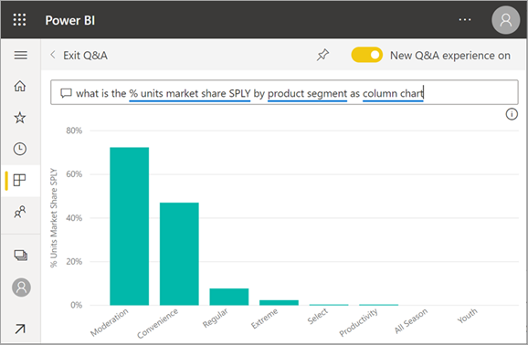
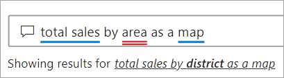

# Q&A voor Power BI-**consumenten**

[!INCLUDE [power-bi-service-new-look-include](../includes/power-bi-service-new-look-include.md)]

## Wat is Q&A?
Soms krijgt u het snelst een antwoord uit uw gegevens wanneer u een vraag stelt in natuurlijke taal. Bijvoorbeeld: "Wat was de totale omzet het afgelopen jaar?"

Gebruik Q&A om aan de hand van intuïtieve, natuurlijke taal uw gegevens te verkennen en antwoorden te krijgen in de vorm van diagrammen en grafieken. Q&A verschilt van een zoekmachine. Q&A retourneert alleen resultaten over de gegevens in Power BI.

## Welke visualisatie gebruikt Q&A?
Q&A kiest de beste visualisatie op basis van de gegevens die worden weergegeven. Soms worden gegevens in de onderliggende gegevensset gedefinieerd als een bepaald type of een bepaalde categorie waardoor het voor Q&A duidelijker wordt hoe de gegevens moeten worden weergegeven. Als gegevens bijvoorbeeld zijn gedefinieerd als een gegevenstype, ligt het voor de hand ze als een lijndiagram weer te geven. Gegevens die zijn gecategoriseerd als een plaats, zullen eerder als een kaart worden weergegeven.

U kunt ook zelf bij de vraag opgeven welke visual Q&A moet gebruiken. Het is echter niet altijd mogelijk om de gegevens in het door u gevraagde visualtype weer te geven. Q&A biedt ook een lijst met bewerkbare visualtypen aan.

## Waar kan ik Q&A gebruiken?
U vindt Q&A op dashboards in de Power BI-service en onderaan het dashboard in Power BI - Mobiel. Tenzij de ontwerper u machtigingen voor bewerken heeft gegeven, kunt u gegevens verkennen met behulp van Q&A, maar kunt u geen visuals opslaan die met Q&A zijn gemaakt.

U kunt Q&A ook vinden in rapporten als de rapport*ontwerper* een [Q&A-visual](../visuals/power-bi-visualization-q-and-a.md) heeft toegevoegd.   

## Q&A op dashboards

**Power BI Q&A** is beschikbaar met een Pro- of Premium-licentie.  [Q&A in de mobiele Power BI-apps](mobile/mobile-apps-ios-qna.md) en [Q&A met Power BI Embedded](../developer/qanda.md) komen in afzonderlijke artikelen aan bod. Op dit moment biedt **Power BI Q&A** alleen ondersteuning voor het beantwoorden van query's in natuurlijke taal, die in het Engels zijn opgesteld. Er is echter wel een preview beschikbaar in het Spaans. Deze kan door uw Power BI-beheerder worden ingeschakeld.

Het stellen van de vraag is slechts het begin.  Leef u uit met uw gegevens en verfijn of verbreed uw vraag om betrouwbare nieuwe informatie aan het licht te brengen, in te zoomen op details of uit te zoomen voor een breder perspectief. U zult aangenaam verrast worden door de inzichten die u vergaart en de ontdekkingen die u doet.

De ervaring is volledig interactief... en snel. Dankzij de opslag in het geheugen, kunt u vrijwel onmiddellijk een respons verwachten.

## Q&A gebruiken op een dashboard in de Power BI-service
In de Power BI-service (app.powerbi.com) bevat een dashboard tegels die zijn vastgemaakt vanuit één of meer gegevenssets, zodat u over gegevens in elk van deze gegevenssets vragen kunt stellen. Selecteer **Gerelateerde items weergeven** in het vervolgkeuzemenu **Meer opties** om te zien welke rapporten en gegevenssets zijn gebruikt om het dashboard te maken.

## Hoe kan ik beginnen?
Raak eerst vertrouwd met de inhoud. Bekijk de visuals op het dashboard en in het rapport. Krijg een idee van het type en het bereik van de gegevens die voor u beschikbaar zijn. 

Bijvoorbeeld:

* Als de aslabels en waarden van een visual 'sales', 'account', 'month' en 'opportunities' bevatten, kunt u bijvoorbeeld de volgende vragen stellen: 'Which *account* has the highest *opportunity*, or show *sales* by month as a bar chart.'

* Als u prestatiegegevens van een website in Google Analytics hebt, kunt u Q&A vragen over de tijd die aan een webpagina is besteed, het aantal unieke paginabezoeken en de percentages gebruikersbetrokkenheid. Of als u query's hebt voor demografische gegevens, kunt u vragen stellen over leeftijd en huishoudinkomens per locatie.

Zodra u vertrouwd bent met de gegevens gaat u terug naar het dashboard en plaatst u de cursor in het vraagvak. Hiermee opent u het Q&A-scherm.

 

Voordat u begint te typen, worden in een nieuw scherm suggesties weergegeven om u te helpen uw vraag te formuleren. U krijgt zinnen en vragen te zien die de namen bevatten van de tabellen in de onderliggende gegevenssets, en mogelijk krijgt u zelfs *aanbevolen* vragen te zien die door de eigenaar van de gegevensset zijn gemaakt.

Als u een zin of vraag selecteert, wordt die toegevoegd aan het vraagvak. Vervolgens kunt u die verfijnen om een specifiek antwoord te vinden. 

 

Een andere manier waarop Power BI u helpt vragen te stellen is met functies zoals prompts, automatisch aanvullen en visuele aanwijzingen. Power BI biedt deze hulp voor Q&A op dashboards, Q&A in rapporten en met de Q&A-visual. Deze functies worden hieronder in detail beschreven, in de sectie [een Q&A-visual maken door een query in natuurlijke taal te typen](#create-a-qa-visual-by-typing-a-natural-language-query)

<!--  -->

## De Q&A-visual in Power BI-rapporten

Met de Q&A-visual kunt u vragen in een natuurlijke taal stellen en antwoorden krijgen in de vorm van een visual. De Q&A-visual werkt net als andere visuals in een rapport en kan daarom ook kruislings worden gefilterd/gemarkeerd. Ook worden bladwijzers en opmerkingen ondersteund. 

U kunt een Q&A-visual herkennen aan het venster met vragen bovenaan. Hier kunt u vragen invoeren of typen in natuurlijke taal. De Q&A-visual kan steeds opnieuw worden gebruikt om vragen te stellen over uw gegevens. Als u het rapport afsluit, worden de standaardinstellingen van de Q&A-visual opnieuw ingesteld. 

## Q&A gebruiken 
U kunt de Q&A-visual op een dashboard of in een rapport gebruiken door een van de voorgestelde vragen te selecteren of uw eigen vraag in natuurlijke taal te typen. 

### Een Q&A-visual maken met behulp van een voorgestelde vraag

We hebben hier **de belangrijkste geografische staten geselecteerd op basis van het totale aantal eenheden**. Power BI kiest zelf het beste type visualtype dat moet worden gebruikt. In dit geval is het een kaart.

Maar u kunt Power BI vertellen welk visualtype moet worden gebruikt door deze toe te voegen aan uw query in natuurlijke taal. Onthoud dat niet alle visualtypen goed werken of logisch zijn met betrekking tot uw gegevens. Deze gegevens leveren bijvoorbeeld geen nuttig spreidingsdiagram op. Maar het werkt wel als een choropletenkaart.

### Een Q&A-visual maken met behulp van een query in natuurlijke taal

Als u niet zeker weet welk type vragen u wilt stellen of welke terminologie moet worden gebruikt, vouwt u **Alle suggesties weergeven** uit of bekijkt u de andere visuals in het rapport. Hiermee kunt u bekend raken met de termen en de inhoud van de gegevensset.

1. Typ uw vraag in natuurlijke taal in het Q&A-veld. Terwijl u uw vraag typt, helpt Power BI door middel van automatisch aanvullen, visuele aanwijzingen en feedback.

    **Automatisch aanvullen**; wanneer u uw vraag typt, geeft Power BI Q&A relevante en contextuele suggesties weer die u helpen om snel productief te zijn met natuurlijke taal. Terwijl u typt, krijgt u onmiddellijk feedback en resultaten. De ervaring is vergelijkbaar met het typen in een zoekmachine.

    In dit voorbeeld is de laatste suggestie de suggestie die we willen. 

    

    **Rode/blauwe onderstrepingen**: in Power BI Q&A worden woorden onderstreept weergegeven, zodat u kunt zien welke woorden wel of niet door Power BI zijn herkend. Een effen blauwe onderstreping geeft aan dat Power BI het woord heeft herkend. In het onderstaande voorbeeld ziet u dat Q&A het woord **store** heeft herkend.

    

    Selecteer een blauw onderstreept woord om een vervolgkeuzelijst met voorgestelde vragen weer te geven. 

    

    Wanneer u een woord typt in Q&A, wordt er vaak een rode streep onder gezet. Een rode onderstreping kan een of twee mogelijke problemen aangeven. Het eerste type probleem wordt gecategoriseerd als lage betrouwbaarheid. Als u een vaag of dubbelzinnig woord typt, wordt het veld rood onderstreept. Een voorbeeld hiervan is het woord 'Locatie'. Meerdere velden kunnen het woord 'Locatie' bevatten. Het systeem gebruikt daarom een rode onderstreping om u te vragen het veld te kiezen dat u bedoelde. In dit voorbeeld vraagt Power BI u om het veld te selecteren dat u wilt gebruiken voor 'VanArsdel'.
    
    
    
    Een ander voorbeeld van lage betrouwbaarheid is als u het woord 'gebied' typt, maar de kolom die overeenkomt is 'district'. Power BI Q&A herkent woorden die hetzelfde betekenen, dankzij de integratie met Bing en Office. Q&A zet een rode onderstreping onder het woord, zodat u weet dat het geen rechtstreekse overeenkomst is

    

    Het tweede type probleem doet zich voor wanneer Q&A het woord helemaal niet herkent. Een voorbeeld is het gebruik van het woord 'geografie', hoewel het nergens in de gegevens bestaat. Het woord staat in de woordenlijst, maar Q&A markeert deze term met een rode onderstreping. Power BI Q&A kan geen visualisatie maken en stelt voor dat u de ontwerper van het rapport vraagt om de term toe te voegen.

    

    **Suggesties**: naarmate u meer van de vraag typt, laat Power BI u weten dat de vraag niet wordt begrepen en wordt geprobeerd te helpen. In het onderstaande voorbeeld vraagt Power BI "Bedoelt u...", gevolgd door een suggestie om de vraag anders te stellen met behulp van terminologie uit uw gegevensset. 

    

    Nadat u de correctie van Power BI hebt geselecteerd, worden uw resultaten weergegeven als lijndiagram. 

    

    U kunt het lijndiagram ook wijzigen in een ander visualtype.  

    

## Aandachtspunten en probleemoplossing

**Vraag**: Ik zie geen Q&A op dit dashboard.    
**Antwoord 1**: Als u geen vraagvak ziet, controleert u eerst de instellingen. Selecteer hiertoe het tandwielpictogram in de rechterbovenhoek van de Power BI-werkbalk.   

Kies vervolgens **Instellingen** > **Dashboards**. Zorg ervoor dat er een vinkje naast **Zoekvak van Q&A weergeven in dit dashboard** staat.    
  

**Antwoord 2**: Soms hebt u geen toegang tot de instellingen. Als de dashboard*ontwerper* of uw beheerder Q&A heeft uitgeschakeld, moet u informeren of deze functie weer mag worden ingeschakeld.   

**Vraag**: Ik krijg niet de resultaten die ik graag zou zien als ik een vraag typ.    
**Antwoord**: Selecteer de optie om contact op te nemen met de eigenaar van het rapport of dashboard. U kunt dit rechtstreeks doen op de Q&A-dashboardpagina of in de Q&A-visual. U kunt de eigenaar ook opzoeken via de Power BI-koptekst.  Er zijn veel dingen die de ontwerper kan doen om de Q&A-resultaten te verbeteren. De ontwerper kan bijvoorbeeld de namen van kolommen in de gegevensset wijzigen in termen die gemakkelijk te begrijpen zijn (`CustomerFirstName` in plaats van `CustFN`). Omdat de ontwerper de gegevensset heel goed kent, kan deze ook nuttige vragen bedenken en deze toevoegen aan de voorgestelde Q&A-vragen.

## Volgende stappen
Zie [Q&A-visualtype](../visuals/power-bi-visualization-q-and-a.md) voor meer informatie over hoe een Q&A-visual wordt gemaakt en beheerd door een rapport*ontwerper*.
