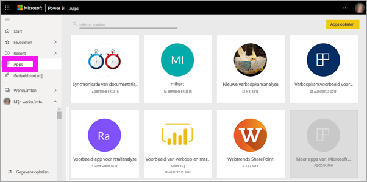
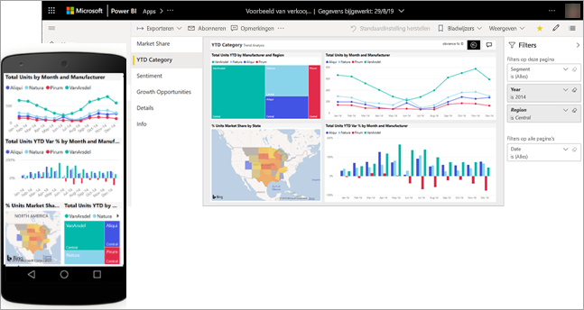
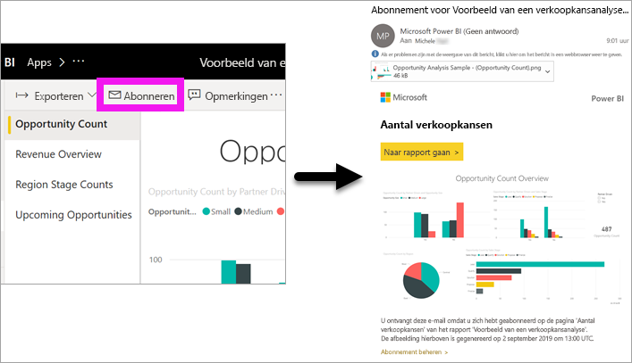
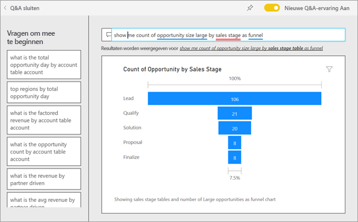
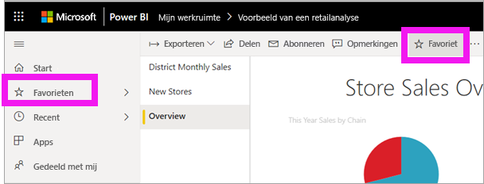
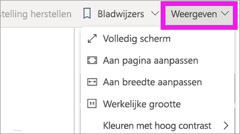
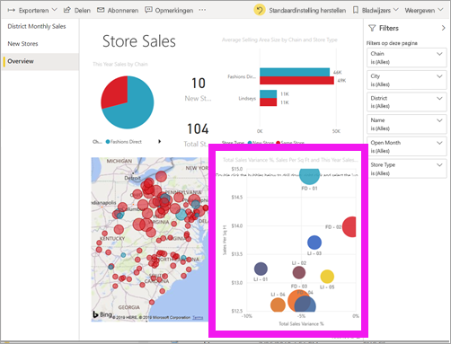
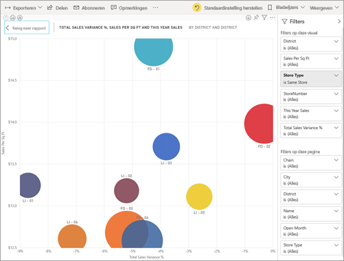
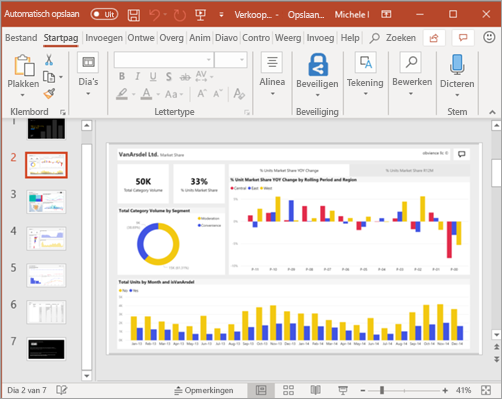

# Snelstart: meer informatie over de mogelijkheden van Power BI voor *gebruikers*
In deze snelstartgids wordt uitgelegd hoe u Power BI kunt gebruiken om op basis van gegevens tot zakelijke inzichten te komen. Dit artikel is niet bedoeld om uitgebreide informatie te bieden, maar is eerder een rondleiding langs de vele acties die beschikbaar zijn voor **gebruikers** van Power BI.

Als u zich niet hebt geregistreerd voor Power BI, kunt u zich hier [aanmelden voor een gratis proefversie](https://app.powerbi.com/signupredirect?pbi_source=web) voordat u begint.

## Wat is Power BI? 
Power BI bestaat uit een verzameling softwareservices, apps en connectors die samenwerken om uw niet-gerelateerde gegevensbronnen om te zetten in coherente, visueel aantrekkelijke en interactieve inzichten. Of uw gegevens nu bestaan uit een eenvoudig Excel-spreadsheet of een verzameling gegevens van verschillende gegevensbronnen, met Power BI kunt u eenvoudig verbinding maken met uw gegevensbronnen, visualiseren (of ontdekken) wat belangrijk is en dat delen met wie u maar wilt. 

## Leesweergave
De leesweergave is beschikbaar in de Power BI-service voor *gebruikers* van rapporten. Wanneer een collega een rapport, dashboard of app met u deelt, kunt u die verkennen en gebruiken in de leesweergave. 

Open gewoon de Power BI-service in een browser of op een mobiel apparaat. U en uw collega's werken vanaf dezelfde vertrouwde apps, dashboards en rapporten die bovendien automatisch worden bijgewerkt en vernieuwd. U werkt dus altijd met de meest actuele inhoud.   

Omdat de inhoud niet statisch is, kunt u hier induiken om trends, inzichten en andere business intelligence te zoeken. Deel de inhoud op in fragmenten en segmenten en stel zelfs vragen in uw eigen bewoording. Of doe het rustig aan en laat uw gegevens zelf interessante inzichten voor u vinden; ontvang meldingen wanneer gegevens worden gewijzigd en krijg e-mailrapporten volgens een door u ingestelde planning. Al uw gegevens via de cloud of on-premises binnen handbereik vanaf elk apparaat, wanneer u maar wilt. 

Lees verder voor meer informatie over deze en andere mogelijkheden.

## Power BI-inhoud
In Power BI verwijst de term 'inhoud' naar rapporten, dashboards en apps. Het zijn de bouwstenen die u gebruikt om uw gegevens te verkennen en zakelijke beslissingen te nemen. 

> [!NOTE]
> Dashboards, rapporten en apps kunnen ook op mobiele apparaten worden bekeken en gedeeld.

###  Apps

Een *app* is een Power BI-inhoudstype waarmee gerelateerde dashboards en rapporten op één locatie worden gecombineerd. Een app kan één of meer dashboards en één of meer rapporten hebben, die allemaal zijn gebundeld. Apps worden gemaakt door Power BI *-ontwerpers* die de apps distribueren en delen met *gebruikers* zoals u. 

U kunt uw apps weergeven door **Apps** te selecteren in het navigatievenster en vervolgens de app te kiezen die u wilt openen.

Zie [Power BI-apps](end-user-apps.md) voor meer informatie over het weergeven van apps

### Rapporten

Een Power BI-rapport biedt vanuit meerdere invalshoeken inzicht in een gegevensset, met visualisaties die andere bevindingen en inzichten uit die gegevensset weergeven. Een rapport kan één visualisatie of pagina's vol visualisaties bevatten. Rapporten worden gemaakt door Power BI-*ontwerpers* die de rapporten distribueren en delen met *gebruikers* zoals u.

Zie [Power BI-rapporten](end-user-reports.md) voor meer informatie over het weergeven van rapporten

### Dashboards

Een Power BI-dashboard bestaat uit één pagina, ook wel een canvas genoemd, die gebruikmaakt van visuals om een verhaal te vertellen. Aangezien het maar één pagina betreft, bevat een goed ontworpen dashboard alleen de belangrijkste elementen van dat verhaal.

De visuals die u op het dashboard ziet, worden tegels genoemd. Ze zijn door *rapportontwerpers* vastgemaakt aan het dashboard. Als u een tegel selecteert, gaat u meestal naar de rapportpagina waar de visual is gemaakt. 

Zie [Power BI-dashboards](end-user-dashboards.md) voor meer informatie over het weergeven van dashboards
 
## Werken in de Power BI-service

### Samenwerken met collega's
Sla het e-mailbericht over. Voeg een persoonlijke opmerking toe of start direct op een dashboard een gesprek over het dashboard met uw collega's. De functie Opmerkingen is slechts een van de manieren waarop u met anderen kunt samenwerken. 

Meer informatie over [opmerkingen plaatsen](end-user-comment.md)

### Laat Power BI het werk voor u doen
Power BI kan aan de hand van abonnementen en waarschuwingen het werk voor u doen. 

#### Abonneren op een dashboard (of een rapport)
U hoeft Power BI niet te openen als u een dashboard wilt controleren.  In plaats daarvan kunt u zich abonneren, zodat u volgens een door u ingesteld schema een momentopname van het desbetreffende dashboard van Power BI ontvangt. 

.

 Meer informatie over [Power BI-abonnementen](end-user-subscribe.md)

#### Een waarschuwing ontvangen wanneer uw gegevens een drempelwaarde bereiken
Uw gegevens zijn live en uw visuals worden automatisch bijgewerkt om dit weer te geven. Met gegevensmeldingen ontvangt u een melding wanneer gegevens boven of onder een door u ingestelde drempelwaarde komen. Meldingen werken voor meters, KPI's en kaarten.    

U ontvangt een e-mailbericht van Power BI wanneer de waarde groter of kleiner is dan de limiet die u hebt ingesteld.  

Meer informatie over [Power BI-waarschuwingen](end-user-alerts.md)

### Q&A gebruiken om in natuurlijke taal vragen te stellen
Soms krijgt u het snelst een antwoord uit uw gegevens wanneer u een vraag stelt in natuurlijke taal. Het Q&A-vragenvak bevindt zich boven aan uw dashboard. Bijvoorbeeld: 'Toon het aantal grote verkoopkansen per verkoopfase als een trechter'. 

Meer informatie over [Power BI Q&A](end-user-q-and-a.md)

### Details weergeven op een visualisatie
Visuals bestaan uit gegevenspunten. U kunt de details bekijken door de muisaanwijzer over een gegevenspunt te bewegen.

### Een dashboard toevoegen aan Favorieten
Wanneer u van inhoud een *favoriet* maakt, kunt u deze inhoud openen via het navigatievenster. Het navigatievenster wordt vrijwel in elk gebied van Power BI weergegeven. Favorieten zijn doorgaans de dashboards, rapportpagina's en apps die u het vaakst bezoekt.

Selecteer in de rechterbovenhoek van de Power BI-service **Favorieten** of, als deze optie niet zichtbaar is, **Meer opties** (...) en selecteer vervolgens **Favorieten** in de vervolgkeuzelijst. 
   

Bekijk de andere acties die beschikbaar zijn in de vervolgkeuzelijst.  Niet alle acties worden in dit artikel behandeld, maar wel in andere artikelen.  Via de Power BI-inhoudsopgave of het veld **Zoeken** kunt u meer informatie vinden over de acties. 

Meer informatie over [favorieten en aanbevolen](end-user-favorite.md)

### De afmetingen van de weergave aanpassen
Rapporten kunnen op verschillende apparaten met verschillende schermgrootten en hoogte-breedteverhoudingen worden weergegeven.  De standaardweergave is mogelijk niet wat u op uw apparaat wilt zien.  

Als u de weergave wilt aanpassen, selecteert u **Beeld** in de bovenste menubalk aan de rechterkant en kiest u een van de weergaveopties. 

### Bekijken hoe alle visuals elementen op een pagina met elkaar zijn verbonden
Markeer en filter de verwante visuals op een rapportpagina kruislings. De visualisaties op één rapportpagina zijn allemaal met elkaar 'verbonden'.  Dit betekent dat als u een of meer waarden in een visualisatie selecteert, andere visualisaties die gebruikmaken van dezelfde waarde op basis van uw selectie worden gewijzigd.

> 

Meer informatie over [visuele interacties](end-user-interactions.md)

<!-- ###  Open the **Selection** pane
Easily navigate between the visualizations on the report page. 

1. Select **View > Selection pane** to open the Selection pane. Toggle **Selection pane** to On.

    

2. The Selection pane opens on your report canvas. Select a visual from the list to make it active.

     -->

### Inzoomen op afzonderlijke visuals
Beweeg de muisaanwijzer over een visual en selecteer het pictogram **Focusmodus**. Wanneer u een visualisatie in de focusmodus bekijkt, wordt deze uitgebreid om het volledige rapportcanvas te vullen zoals hieronder wordt weergegeven.

<!-- To display that same visualization without the distraction of menubars, filter pane, and other chrome -- select the **Full Screen** icon from the top menubar    .

 -->

Meer informatie over [de focusmodus en de modus volledig scherm](end-user-focus.md)

### Een visual sorteren
De visuals op een rapportpagina kunnen worden gesorteerd en opgeslagen met de door u aangebrachte wijzigingen. 

Beweeg de muisaanwijzer over een visual om deze actief te maken en selecteer **Meer opties** (...) om de sorteeropties te openen.

 

Meer informatie over [visuals sorteren](end-user-search-sort.md)

### De gegevens weergeven die worden gebruikt om een visualisatie te maken
Een visual in Power BI wordt opgebouwd met gegevens uit onderliggende gegevenssets. Als u een kijkje achter de schermen wilt nemen, kunt u de gegevens die zijn gebruikt voor het maken van het visuele element *weergegeven* in Power BI. Wanneer u **Gegevens weergeven** selecteert, geeft Power BI de gegevens onder (of naast) de visualisatie weer.

Selecteer voor een actieve visual **Meer opties** (...) en kies **Gegevens weergeven**.
   
   

### Gegevens exporteren naar Excel
Naast het weergeven van de gegevens die worden gebruikt voor het maken van een visual, kunt u deze gegevens ook exporteren en weergeven in Microsoft Excel. Wanneer u naar Excel exporteert, maakt u een afzonderlijk document, een werkblad dat geen deel uitmaakt van Power BI. De wijzigingen die u in het Excel-bestand aanbrengt, zijn niet van invloed op de gegevens in Power BI. Power BI biedt u de flexibiliteit die u nodig hebt, of u de gegevens nu nader wilt bekijken of de gegevens in een andere toepassing of voor een ander doel wilt gebruiken.

<!-- Exporting isn’t limited to individual visuals; you can export entire reports to PowerPoint or PDF to share with your colleagues.

 -->

Dit is slechts een kort overzicht van enkele dingen die *gebruikers* met de Power BI-service kunnen doen.  

## Resources opschonen
- Als u verbinding met een app hebt gemaakt, selecteert u in het navigatievenster **Apps** om de inhoudslijst Apps te openen. Plaats de muisaanwijzer op de app die u wilt verwijderen en selecteer het prullenbakpictogram.

- Als u gegevens hebt geïmporteerd uit of verbinding hebt gemaakt met een voorbeeldrapport van Power BI, opent u via het navigatievenster **Mijn werkruimte**. Gebruik de tabbladen bovenaan om het dashboard, het rapport en de gegevensset te zoeken en selecteer vervolgens het prullenbakpictogram voor elk van deze items.

## Volgende stappen
[Power BI voor gebruikers](end-user-consumer.md)

