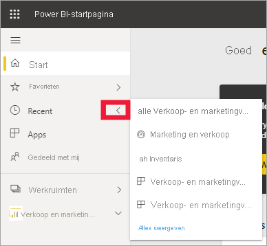
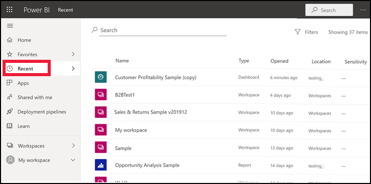
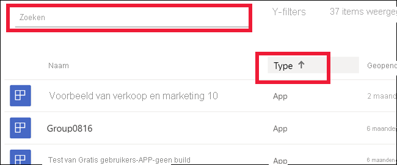

# **Recente** inhoud in de Power BI-service

[!INCLUDE[consumer-appliesto-yyny](../includes/consumer-appliesto-yyny.md)]

**Recente** inhoud bestaat uit de laatste items die u in de Power BI-service hebt bezocht. Dit zijn onder andere dashboards, rapporten, apps en werkmappen. Wanneer u **Recent** selecteert in de navigatiebalk, wordt in Power BI deze inhoud in aflopende volgorde op datum weergegeven.  Als u de sorteervolgorde wilt wijzigen, selecteert u een van de koppen en kiest u oplopend of aflopend.

U ziet dat twee items [favorieten](end-user-favorite.md) zijn: ze hebben een sterpictogram. En één item, het voorbeeld van klantwinstgevendheid, is opgeslagen in [Premium-capaciteit](end-user-license.md).

## De vijf meest recente items bekijken

Selecteer de pijl rechts van **Recent** in het navigatiedeelvenster om alleen de vijf meest recent bezochte items weer te geven.  Selecteer hier de inhoud die u wilt openen. 

## Al uw recente inhoud bekijken

Als u meer dan vijf onlangs bezochte items hebt, selecteert u **Alles bekijken** om het scherm **Recent** te openen. Zoals ook aan het begin van dit artikel is gedaan, kunt u de flyout overslaan en het scherm **Recent** openen door het woord **Recent** of het pictogram  te selecteren in het navigatiedeelvenster.

## Uw lijst met recente inhoud zoeken en sorteren

U kunt, als uw lijsten erg lang worden, [via het zoekveld en door te sorteren vinden wat u nodig hebt](end-user-search-sort.md). Als u wilt weten of een kolom kan worden gesorteerd, wijst u deze aan om te zien of er een pijl wordt weergegeven. Als u in dit voorbeeld **Type** aanwijst, wordt een pijl weergegeven. Uw recente inhoud kan op alfabetische volgorde op inhoudstype worden gesorteerd. 

Bekijk hoe Amanda laat zien hoe de lijsten met **Recente** inhoud van de Power BI-service worden ingevuld, volg daarna de stap-voor-stap instructies onder de video om het zelf uit te proberen.

<iframe width="560" height="315" src="https://www.youtube.com/embed/G26dr2PsEpk" frameborder="0" allowfullscreen></iframe>

> [!NOTE]
> Deze video maakt gebruik van een oudere versie van de Power BI-service.

<!--
## Actions available from the **Recent** content list
The actions available to you will depend on the settings assigned by the content *designer*. Some of your options may include:
* Select the star icon to [favorite a dashboard, report, or app](end-user-favorite.md) .
* Some dashboards and reports can be re-shared  .
* [Open the report in Excel](end-user-export.md)  
* [View insights](end-user-insights.md) that Power BI finds in the data . -->

## Volgende stappen
[Apps voor de Power BI-service](end-user-apps.md)

Hebt u nog vragen? [Misschien dat de Power BI-community het antwoord weet](https://community.powerbi.com/)

