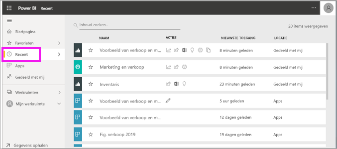
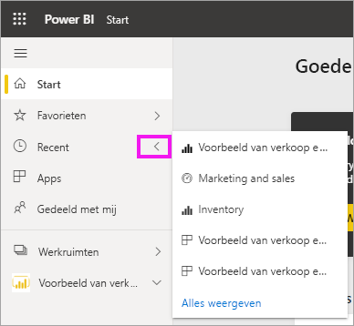
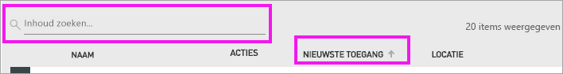

# **Recente** inhoud in de Power BI-service

[!INCLUDE[consumer-appliesto-yyny](../includes/consumer-appliesto-yyny.md)]

Recente inhoud bestaat uit de laatste items, met een maximum van twintig items, die u in de Power BI-service hebt bezocht.  Dit zijn onder andere dashboards, rapporten, apps en werkmappen.

Bekijk hoe Amanda laat zien hoe de lijsten met **Recente** inhoud van de Power BI-service worden ingevuld, volg daarna de stap-voor-stap instructies onder de video om het zelf uit te proberen.

<iframe width="560" height="315" src="https://www.youtube.com/embed/G26dr2PsEpk" frameborder="0" allowfullscreen></iframe>

> [!NOTE]
> Deze video maakt gebruik van een oudere versie van de Power BI-service.

## Recente inhoud weergeven
Selecteer de pijl rechts van **Recent** in het navigatiedeelvenster om de vijf meest recent bezochte items te bekijken.  Hier kunt u recent geopende inhoud selecteren om te openen. Alleen de vijf meest recente items worden weergegeven.

Als u meer dan vijf onlangs bezochte items hebt, selecteert u **Alles bekijken** om het scherm Recent te openen. U kunt ook **Recent** of het pictogram Recent  selecteren in het navigatiedeelvenster.

## Acties die beschikbaar zijn via de inhoudslijst **Recent**
Welke acties voor u beschikbaar zijn, is afhankelijk van de instellingen die worden toegewezen door de *ontwerper* van de inhoud. Mogelijk beschikt u onder andere over de volgende opties:
* Selecteer het sterpictogram om [een dashboard, rapport of app toe te voegen aan uw favorieten](end-user-favorite.md) .
* Sommige dashboards en rapporten kunnen opnieuw worden gedeeld  .
* [Het rapport openen in Excel](end-user-export.md)  
* [Bekijk inzichten](end-user-insights.md) die Power BI in de gegevens vindt .
* Bovendien kunt u, als uw lijsten erg lang worden, [via het zoekveld en door te sorteren vinden wat u nodig hebt](end-user-search-sort.md). Als u wilt weten of een kolom kan worden gesorteerd, wijst u deze aan om te zien of er een pijl wordt weergegeven. Als u in dit voorbeeld **Laatste toegang** aanwijst, wordt een pijl weergegeven. Uw recente inhoud kan op toegangsdatum worden gesorteerd. 

    

## Volgende stappen
[Apps voor de Power BI-service](end-user-apps.md)

Hebt u nog vragen? [Misschien dat de Power BI-community het antwoord weet](https://community.powerbi.com/)

