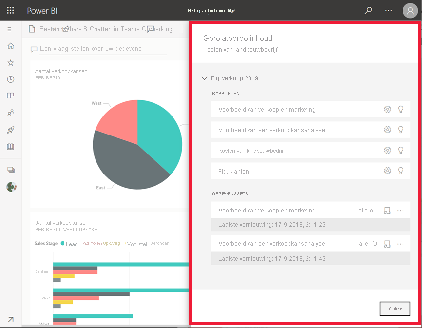

# Gerelateerde inhoud in de Power BI-service bekijken

[!INCLUDE[consumer-appliesto-yyny](../includes/consumer-appliesto-yyny.md)]

[!INCLUDE [power-bi-service-new-look-include](../includes/power-bi-service-new-look-include.md)]

In het deelvenster **Gerelateerde inhoud** ziet u hoe uw Power BI-service-inhoud -- dashboards, rapporten en gegevenssets -- onderling zijn verbonden. Het deelvenster **Gerelateerde inhoud** is ook een startpunt voor het ondernemen van actie. Hier kunt u bijvoorbeeld een dashboard openen, een rapport openen, inzichten genereren, de gegevens analyseren in Excel, enzovoort.  

In de Power BI-service zijn rapporten gebaseerd op gegevenssets, worden visuals van rapporten vastgemaakt aan dashboards, en worden dashboardvisuals teruggekoppeld naar rapporten. Maar hoe weet u op welke dashboards visuals uit uw marketingrapport worden gehost? En hoe kunt u deze dashboards vinden? Maakt uw Inkoop-dashboard gebruik van visuals uit meer dan één gegevensset? Zo ja, hoe worden ze genoemd en hoe kunt u ze openen en bewerken? Wordt uw HR-gegevensset gebruikt in een rapport of op een dashboard? Of kan deze worden verplaatst zonder dat er koppelingen worden verbroken? Vragen als deze kunnen allemaal worden beantwoord op het deelvenster **Gerelateerde inhoud**.  Het deelvenster toont niet alleen de gerelateerde inhoud, maar stelt u ook in staat om actie te ondernemen op de inhoud en eenvoudig te navigeren tussen de gerelateerde content.

> [!NOTE]
> De functie gerelateerde inhoud werkt niet voor het streamen van gegevenssets.
> 
> 

## Gerelateerde inhoud voor een dashboard of rapport bekijken
Bekijk hoe Will gerelateerde inhoud voor een dashboard weergeeft. Volg vervolgens de stapsgewijze instructies onder de video om het zelf te proberen met behulp van het voorbeeld van een inkoopanalyse.

> [!NOTE]
> Deze video is gebaseerd op een vroegere versie van de Power BI-service. 

<iframe width="560" height="315" src="https://www.youtube.com/embed/B2vd4MQrz4M#t=3m05s" frameborder="0" allowfullscreen></iframe>

Selecteer in een geopend dashboard of rapport **Meer opties** (...) in de menubalk en kies **Gerelateerde inhoud zien** in de vervolgkeuzelijst.

Het deelvenster **Gerelateerde inhoud** wordt geopend. Voor een dashboard ziet u hier alle rapporten waarvan visualisaties zijn vastgemaakt aan het dashboard en de bijbehorende gegevenssets. Voor dit dashboard zijn er visualisaties uit maar uit één rapport vastgemaakt en dat rapport is gebaseerd op slechts één gegevensset. Als u de afbeelding aan het begin van dit artikel bekijkt, ziet u gerelateerde inhoud voor een dashboard met visualisaties die zijn vastgemaakt uit vier rapporten en twee gegevenssets.

Vanaf hier kunt u direct met de gerelateerde inhoud aan de slag, afhankelijk van uw machtigingen.  Selecteer bijvoorbeeld de naam van een rapport of dashboard om het item te openen.  Selecteer voor een vermeld rapport een pictogram om de instellingen voor het rapport te openen en te bewerken, [inzicht te krijgen](end-user-insights.md), en meer. U kunt voor een gegevensset de laatste datum/tijd van vernieuwen bekijken, [analyseren in Excel](../collaborate-share/service-analyze-in-excel.md), [inzichten krijgen](end-user-insights.md), vernieuwen, en meer.  

<!-- ## See related content for a dataset
You'll need at least *view* permissions to a dataset to open the **Related content** pane. In this example, we're using the [Procurement Analysis sample](../create-reports/sample-procurement.md).

From the nav pane, locate the **Workspaces** heading and select a workspace from the list. If you have content in a workspace, it will display in the canvas to the right. 

In a workspace, select the **Datasets** tab and locate the **See related** icon .

Select the icon to open the **Related content** pane.

From here, you can take direct action on the related content. For example, select a dashboard or report name to open it.  For any dashboard in the list, select an icon to [share the dashboard with others](../collaborate-share/service-share-dashboards.md) or to open the **Settings** window for the dashboard. For a report, select an icon to [analyze in Excel](../collaborate-share/service-analyze-in-excel.md), [rename](../create-reports/service-rename.md), or [get insights](end-user-insights.md).  -->

## Beperkingen en probleemoplossing
* Als u Gerelateerde items weergeven niet ziet, zoekt u in plaats hiervan naar het . Selecteer het pictogram om het deelvenster **Gerelateerde inhoud** te openen.
* Als u gerelateerde inhoud voor een rapport wilt openen, moet u in de [Leesweergave](end-user-reading-view.md) zijn.
* De functie Gerelateerde inhoud werkt niet voor het streamen van gegevenssets.

## Volgende stappen
* [Aan de slag met Power BI Service](../fundamentals/service-get-started.md)
* Hebt u nog vragen? [Misschien dat de Power BI-community het antwoord weet](https://community.powerbi.com/)
