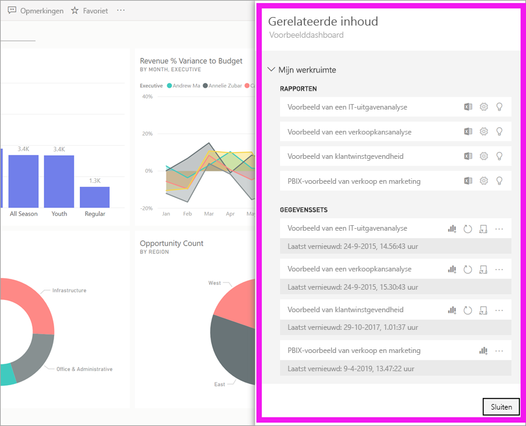
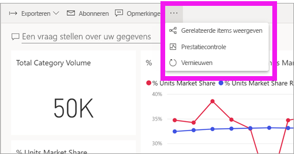
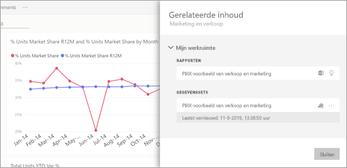
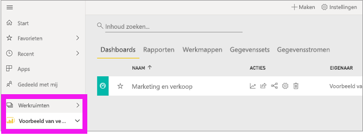
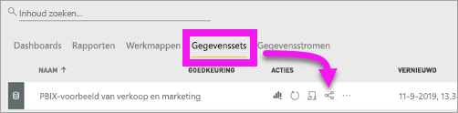
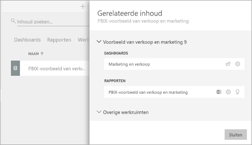

# Gerelateerde inhoud in de Power BI-service bekijken

[!INCLUDE[consumer-appliesto-ynny](../includes/consumer-appliesto-ynny.md)]

[!INCLUDE [power-bi-service-new-look-include](../includes/power-bi-service-new-look-include.md)]

In het deelvenster **Gerelateerde inhoud** ziet u hoe uw Power BI-service-inhoud -- dashboards, rapporten en gegevenssets -- onderling zijn verbonden. Het deelvenster **Gerelateerde inhoud** is ook een startpunt voor het ondernemen van actie. Hier kunt u bijvoorbeeld een dashboard openen, een rapport openen, inzichten genereren, de gegevens analyseren in Excel, enzovoort.  

In Power BI zijn rapporten gebaseerd op gegevenssets, worden visuals van rapporten vastgemaakt aan dashboards, en worden dashboardvisuals teruggekoppeld naar rapporten. Maar hoe weet u op welke dashboards visuals uit uw marketingrapport worden gehost? En hoe kunt u deze dashboards vinden? Maakt uw Inkoop-dashboard gebruik van visuals uit meer dan één gegevensset? Zo ja, hoe worden ze genoemd en hoe kunt u ze openen en bewerken? Wordt uw HR-gegevensset gebruikt in een rapport of op een dashboard? Of kan deze worden verplaatst zonder dat er koppelingen worden verbroken? Vragen als deze kunnen allemaal worden beantwoord op het deelvenster **Gerelateerde inhoud**.  Het deelvenster toont niet alleen de gerelateerde inhoud, maar stelt u ook in staat om actie te ondernemen op de inhoud en eenvoudig te navigeren tussen de gerelateerde content.

> [!NOTE]
> De functie gerelateerde inhoud werkt niet voor het streamen van gegevenssets.
> 
> 

## Gerelateerde inhoud voor een dashboard of rapport weergeven
Bekijk hoe Will gerelateerde inhoud voor een dashboard weergeeft. Volg vervolgens de stapsgewijze instructies onder de video om het zelf te proberen met behulp van de gegevensset van het voorbeeld van een inkoopanalyse.

<iframe width="560" height="315" src="https://www.youtube.com/embed/B2vd4MQrz4M#t=3m05s" frameborder="0" allowfullscreen></iframe>

Selecteer in een geopend dashboard of rapport **Meer opties** (...) in de menubalk en kies **Gerelateerde items weergeven** in de vervolgkeuzelijst.

Het deelvenster **Gerelateerde inhoud** wordt geopend. Voor een dashboard ziet u hier alle rapporten waarvan visualisaties zijn vastgemaakt aan het dashboard en de bijbehorende gegevenssets. Voor dit dashboard zijn er visualisaties uit maar uit één rapport vastgemaakt en dat rapport is gebaseerd op slechts één gegevensset. 

Vanaf hier kunt u direct met de gerelateerde inhoud aan de slag.  Selecteer bijvoorbeeld de naam van een rapport of dashboard om het item te openen.  Selecteer voor een vermeld rapport een pictogram voor [analyseren in Excel](../collaborate-share/service-analyze-in-excel.md) of [verkrijgen van inzichten](end-user-insights.md). Voor een gegevensset kunt u de datum en tijd van de laatste vernieuwing zien, [analyseren in Excel](../collaborate-share/service-analyze-in-excel.md) en [inzichten verkrijgen](end-user-insights.md).  

## Gerelateerde inhoud voor een gegevensset weergeven
U hebt ten minste *weergavemachtigingen* voor een gegevensset nodig om het deelvenster **Gerelateerde inhoud** te openen. In dit voorbeeld gebruiken we het [Voorbeeld van een inkoopanalyse](../create-reports/sample-procurement.md).

Zoek in het navigatievenster de kop **Werkruimten** en selecteer een werkruimte in de lijst. Als u inhoud in een werkruimte hebt, wordt deze weergegeven op het canvas aan de rechterkant. 

Selecteer in een werkruimte het tabblad **Gegevenssets** en selecteer vervolgens het pictogram **Gerelateerde items weergeven**.

Selecteer het pictogram om het deelvenster **Gerelateerde inhoud** te openen.

Vanaf hier kunt u direct met de gerelateerde inhoud aan de slag. Selecteer bijvoorbeeld de naam van een dashboard of rapport om het te openen.  Selecteer een pictogram voor een dashboard in de lijst om [het dashboard te delen met anderen](../collaborate-share/service-share-dashboards.md) of open het venster **Instellingen** voor het dashboard. Selecteer voor een rapport een pictogram voor [analyseren in Excel](../collaborate-share/service-analyze-in-excel.md), [hernoemen](../create-reports/service-rename.md)of [inzichten verkrijgen](end-user-insights.md).  

## Beperkingen en probleemoplossing
* Als u Gerelateerde items weergeven niet ziet, zoekt u in plaats hiervan naar . Selecteer het pictogram om het deelvenster **Gerelateerde inhoud** te openen.
* Als u gerelateerde inhoud voor een rapport wilt openen, moet u in de [Leesweergave](end-user-reading-view.md) zijn.
* De functie Gerelateerde inhoud werkt niet voor het streamen van gegevenssets.

## Volgende stappen
* [Aan de slag met Power BI Service](../fundamentals/service-get-started.md)
* Hebt u nog vragen? [Misschien dat de Power BI-community het antwoord weet](https://community.powerbi.com/)
