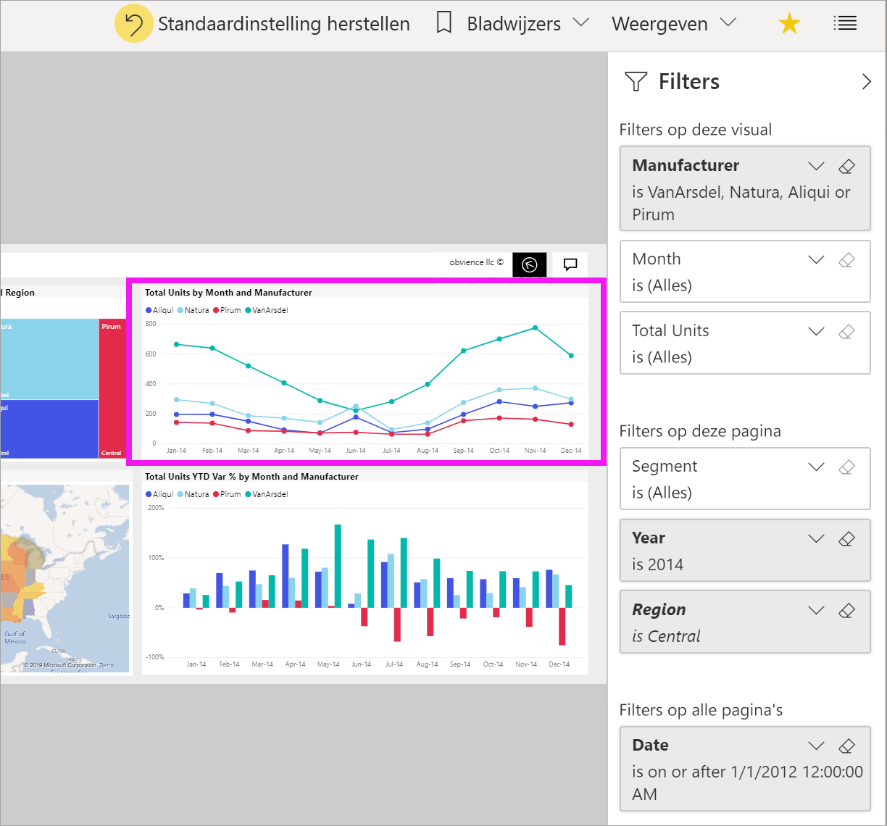
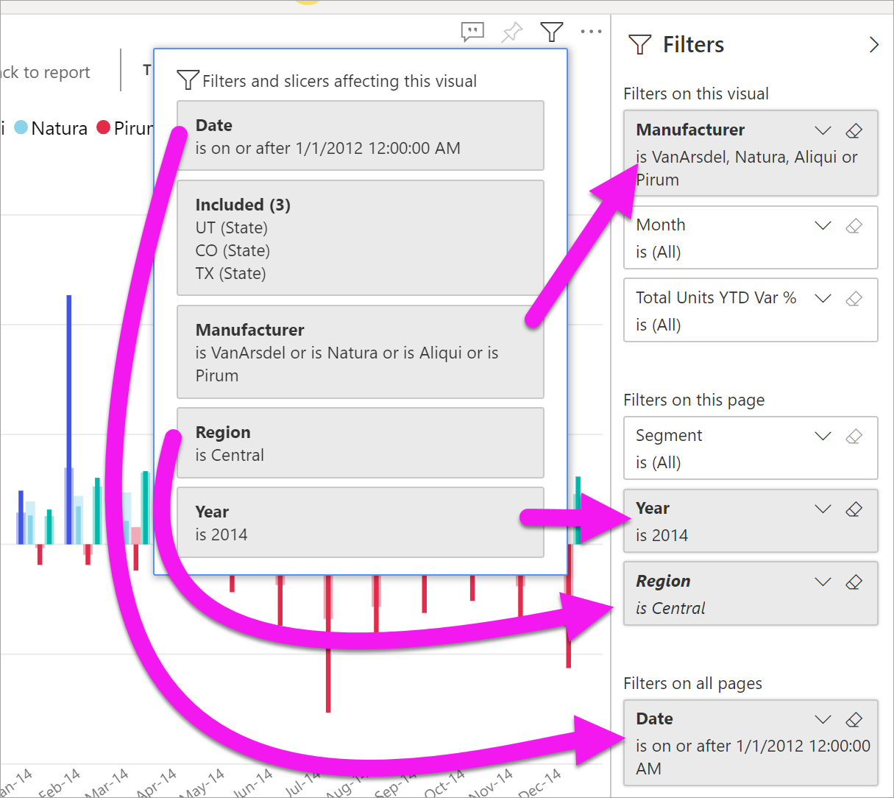
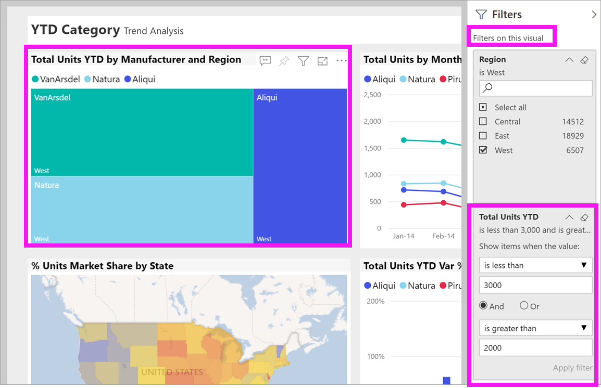

# Rondleiding door het deelvenster Filters van het rapport

[!INCLUDE[consumer-appliesto-yyny](../includes/consumer-appliesto-yyny.md)]

[!INCLUDE [power-bi-service-new-look-include](../includes/power-bi-service-new-look-include.md)]

In dit artikel wordt het rapportvenster **Filters** in Power BI-service besproken. Gebruik de filters om nieuwe inzichten in uw gegevens te ontdekken.

Er zijn veel verschillende manieren om gegevens te filteren in Power BI. Zie [Over filters en markeren in Power BI-rapporten](../power-bi-reports-filters-and-highlighting.md) voor meer informatie over filters.

## Het deelvenster Filters van het rapport gebruiken

Als een collega een rapport met u deelt, bekijk dan het deelvenster **Filters**. Het wordt soms samengevouwen aan de rechterzijde van het rapport. Selecteer het om het uit te breiden.

Het deelvenster **Filters** bevat filters die de rapport*ontwerper* aan het rapport heeft toegevoegd. *Gebruikers* als uzelf kunnen de bestaande filters gebruiken en wijzigingen opslaan, maar geen nieuwe filters aan het rapport toevoegen. In de bovenstaande schermopname heeft de ontwerper bijvoorbeeld drie filters op paginaniveau toegevoegd: **Segment is Alle**, **Jaar is 2014** en **Regio is Centraal**. U kunt deze filters gebruiken en wijzigen, maar u kunt geen vierde filter op paginaniveau toevoegen.

Rapporten in de Power BI-service houden alle wijzigingen bij die u in het deelvenster **Filters** maakt. De service past deze wijzigingen toe op de mobiele versie van het rapport. 

Als u de standaardinstellingen die de ontwerper heeft geconfigureerd voor het deelvenster **Filters** wilt herstellen, selecteert u **Standaardinstellingen herstellen** in de bovenste menubalk.

 

> [!NOTE]
> Als u de optie **Standaardinstellingen opnieuw instellen** niet ziet, is deze mogelijk uitgeschakeld door de rapport*ontwerper*. De *ontwerper* kan tevens specifieke filters vergrendelen, zodat u deze niet kunt wijzigen.

## Alle filters weergeven voor een rapportpagina

Het deelvenster **Filters** toont alle filters die door de ontwerper aan het rapport zijn toegevoegd. In het deelvenster **Filters** kunt u ook informatie over de filters weergeven en deze gebruiken. Sla wijzigingen die u maakt op of gebruik **Standaardinstelling herstellen** om de originele filterinstellingen te herstellen.

Als er wijzigingen zijn die u wilt opslaan, kunt u ook een persoonlijke bladwijzer maken. Raadpleeg [Wat zijn bladwijzers?](end-user-bookmarks.md) voor meer informatie.

Het venster **Filters** toont en beheert verschillende typen rapportfilters: rapport, rapportpagina en visual.

In dit voorbeeld hebben we een visual met drie filters geselecteerd. De rapportagepagina heeft ook filters; deze staan onder de kop **Filters op deze pagina**. Het gehele rapport heeft bovendien een filter voor **Datum**.

Naast sommige filters staat **(Alle)** . **(Alle)**  betekent dat alle waarden in het filter worden opgenomen. In de bovenstaande schermopname informeert **Segment (Alle)** dat deze rapportpagina gegevens bevat over alle productsegmenten. 

Iedereen die dit rapport bekijkt, kan met deze filters werken.

### Alleen filters weergeven die zijn toegepast op een visual

Ga met de muisaanwijzer over de visual om het filterpictogram  weer te geven en beter zicht te krijgen op de filters die op een specifieke visual zijn toegepast. Selecteer dat filterpictogram om een pop-upvenster weer te geven met alle filters, slicers, enz. die invloed hebben op die visual. De filters in de pop-up zijn dezelfde filters die worden weergegeven in het venster **Filters**, plus aanvullende filters die van invloed zijn op de geselecteerde visual.

Dit zijn de typen filters die in deze weergave kunnen worden weergegeven:

- Standaardfilters
- Slicers
- Kruislings markeren
- Kruislings filteren
- Geavanceerde filters
- Top N-filters
- Relatieve datumfilters
- Synchroonslicers
- Opname-/uitsluitingsfilters
- Filters die via een URL zijn doorgegeven

In dit voorbeeld:
1. Met **Inbegrepen** wordt aangegeven dat het visuele element is gefilterd. Dit betekent dat de staten Utah, Colorado en Texas zijn geselecteerd in een van de andere visuals op deze rapportpagina. In dit geval is het de kaart. Door de selectie van die drie staten worden de gegevens van alle andere staten niet weergegeven in het geselecteerde staafdiagram.  

1. **Datum** is een filter dat wordt toegepast op alle pagina's in dit rapport,

1. **Regio is Centraal** en **Jaar is 2014** zijn filters die zijn toegepast op deze rapport pagina en

4. **Fabrikant is VanArsdel, Natura, Aliqui of Pirum** is een filter dat wordt toegepast op de visual.

### Zoeken in een filter

Soms kan een filter een lange lijst waarden hebben. Gebruik het zoekvak om de gewenste waarde te zoeken en selecteren.

### Filtergegevens weergeven

Bekijk de beschikbare waarden en tellingen om een filter te begrijpen.  Bekijk de details van het filter door de pijl naast de naam van het filter aan te wijzen en te selecteren.
  

### Filterselecties wijzigen

Een manier om te zoeken naar inzichten in gegevens, is door de filters te gebruiken. U kunt filterselecties wijzigen via de vervolgkeuzelijst naast de veldnaam.  Afhankelijk van het filter en type gegevens dat Power BI filtert, variëren uw opties van eenvoudige selecties in een lijst tot het identificeren van datum- of cijferbereiken. In het geavanceerde filter hieronder hebben we het filter **Total Units YTD** in de treemap gewijzigd naar 2000 tot 3000. U ziet dat door deze wijziging Pirum uit de treemap wordt verwijderd.
  

> [!TIP]
> Houd de CTRL-toets ingedrukt om meer dan één filterwaarde per keer te selecteren. De meeste filters ondersteunen meervoudige selectie.

### De standaardwaarden van het filter opnieuw instellen

Selecteer **Standaardinstelling herstellen** in de bovenste menubalk als u alle wijzigingen die u in de filters hebt aangebracht wilt terugzetten.  Deze selectie herstelt de oorspronkelijke staat van de filters die door de rapportontwerper werden ingesteld.

### Een filter wissen

Als u een filter wilt herstellen naar (Alle), wist u het filter door de gum naast de naam van het filter te selecteren.

  
<!--  too much detail for consumers

## Types of filters: text field filters
### List mode
Ticking a checkbox either selects or deselects the value. The **All** checkbox can be used to toggle the state of all checkboxes on or off. The checkboxes represent all the available values for that field.  As you adjust the filter, the restatement updates to reflect your choices. 

Note how the restatement now says "is Mar, Apr or May".

### Advanced mode
Select **Advanced Filtering** to switch to advanced mode. Use the dropdown controls and text boxes to identify which fields to include. By choosing between **And** and **Or**, you can build complex filter expressions. Select the **Apply Filter** button when you've set the values you want.  

## Types of filters: numeric field filters
### List mode
If the values are finite, selecting the field name displays a list.  See **Text field filters** &gt; **List mode** above for help using checkboxes.   

### Advanced mode
If the values are infinite or represent a range, selecting the field name opens the advanced filter mode. Use the dropdown and text boxes to specify a range of values that you want to see. 

By choosing between **And** and **Or**, you can build complex filter expressions. Select the **Apply Filter** button when you've set the values you want.

## Types of filters: date and time
### List mode
If the values are finite, selecting the field name displays a list.  See **Text field filters** &gt; **List mode** above for help using checkboxes.   

### Advanced mode
If the field values represent date or time, you can specify a start/end time when using Date/Time filters.  

-->

## Volgende stappen

Leer hoe en waarom [visuals elkaar in een rapport kruislings filteren en markeren](end-user-interactions.md)