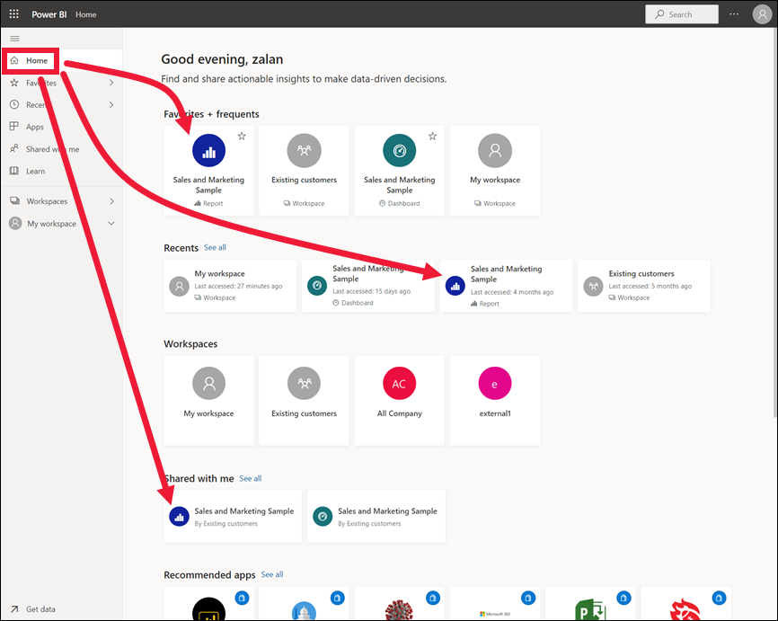
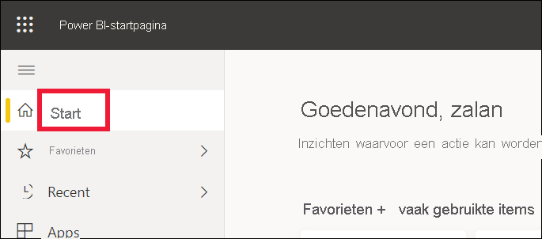
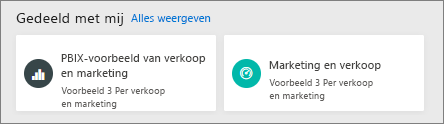
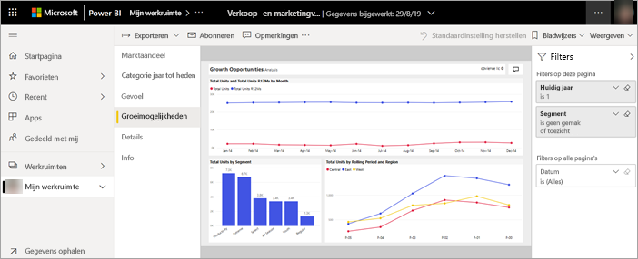
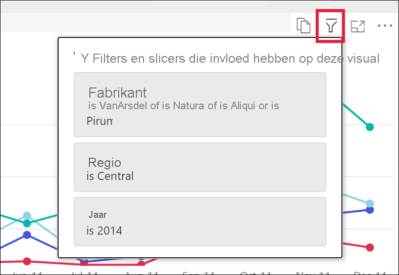
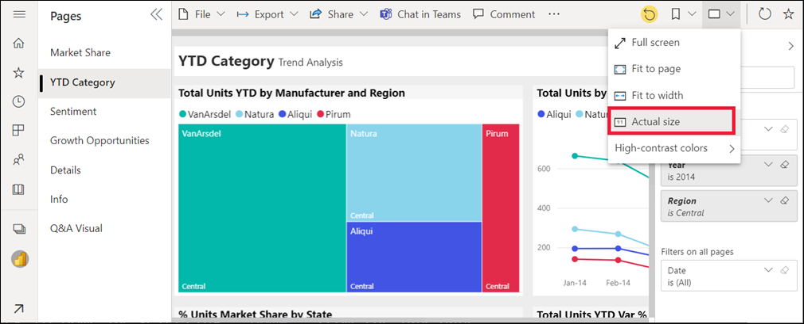
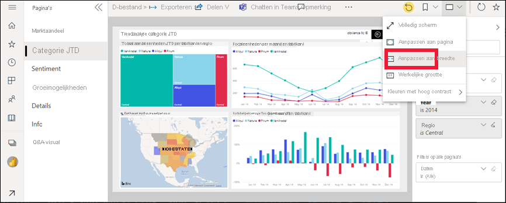
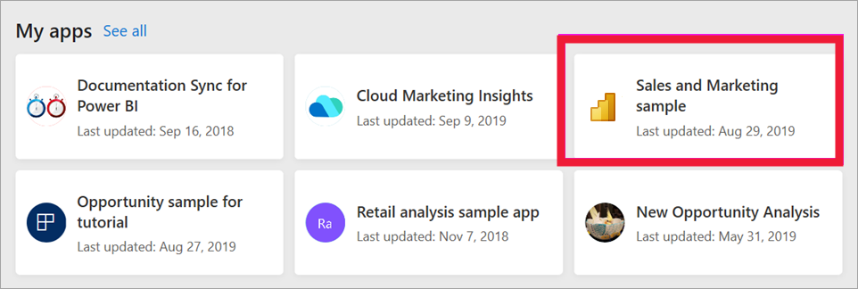

# Een rapport weergeven in de Power BI-service voor *zakelijke gebruikers*

[!INCLUDE[consumer-appliesto-yynn](../includes/consumer-appliesto-yynn.md)]

[!INCLUDE [power-bi-service-new-look-include](../includes/power-bi-service-new-look-include.md)]

Een rapport bestaat uit een of meer pagina's met visuals. Rapporten worden gemaakt door Power BI-*ontwerpers* en [gedeeld met *zakelijke gebruikers*, rechtstreeks](end-user-shared-with-me.md) of als onderdeel van een [app](end-user-apps.md). Als u een rapport wilt openen, hebt u een Power BI Pro-licentie nodig of moet het rapport deel uitmaken van een werkruimte die is opgeslagen in aan Premium toegewezen capaciteit. [Meer informatie over licenties en abonnementen](end-user-license.md)

U kunt een rapport op veel verschillende manieren openen. We laten u twee van deze manieren zien: openen vanaf Home en openen vanaf een dashboard. 

<!-- add art-->

## Een rapport openen vanuit Power BI Home
We gaan eerst een rapport openen dat rechtstreeks met u is gedeeld en vervolgens een rapport dat is gedeeld als onderdeel van een app.

   

### Een rapport openen dat rechtstreeks met u is gedeeld
Power BI-*ontwerpers* kunnen een afzonderlijk rapport rechtstreeks met u delen via een koppeling per e-mail of door het automatisch aan uw Power BI-inhoud toe te voegen. Rapporten die op deze manier worden gedeeld, worden weergegeven in de container **Gedeeld met mij** in het navigatievenster en in de sectie **Gedeeld met mij** van uw startcanvas.

1. Open de Power BI-service (app.powerbi.com).

2. Selecteer **Start** op het navigatievenster om uw startcanvas weer te geven.  

   
   
3. Schuif omlaag totdat u **Gedeeld met mij** ziet. Zoek het . In deze schermopname zien we één dashboard en één rapport. Het rapport heet *Voorbeeld van verkoop en marketing*. 
   
   

4. Selecteer de *rapportkaart* om het bijbehorende rapport te openen.

   

5. Aan de linkerkant ziet u een reeks tabbladen.  Elk tabblad vertegenwoordigt een *pagina* van het rapport. Op dit moment is de pagina *Groeikansen* geopend. Selecteer het tabblad *Categorie Jaar tot nu toe* om in plaats daarvan die rapportpagina te openen. 

   

6. Vouw het deelvenster **Filters** uit langs de rechterzijde. Filters die zijn toegepast op deze rapportpagina of op het hele rapport, worden hier weergegeven. U kunt deze filters wijzigen om de impact op uw visuals en rapporten te bekijken.

   

7. Het menu Acties voor een visual weergeven. Als u de muisaanwijzer over een rapport beweegt, ziet u de acties die u kunt uitvoeren op die visual. Als u deze filters toegepast wilt zien op een bepaalde visual, selecteert u het filterpictogram. Hier hebben we het filterpictogram geselecteerd voor het lijndiagram *Totaalaantal eenheden per maand en fabrikant*.

   

6. U kunt ook de weergave van de rapportpagina wijzigen. Op dit moment wordt de hele rapportpagina weergegeven. Als u de weergave (het zoomniveau) van de pagina wilt wijzigen, selecteert u de vervolgkeuzeoptie **Weergeven** in de rechterbovenhoek en kiest u **Ware grootte** en schakelt u vervolgens over op **Aan breedte aanpassen**. Let op het effect van de verschillende weergaveopties op de weergave van uw rapport.

   

   

U kunt op vele manieren communiceren met een rapport om inzichten te ontdekken en zakelijke beslissingen te nemen.  Gebruik de inhoudsopgave aan de linkerkant om andere artikelen over Power BI-rapporten te lezen. 

### Een rapport openen dat onderdeel is van een app
Als u apps hebt ontvangen van collega's of van AppSource, zijn deze apps beschikbaar in Start en vanuit de containers **Apps** en **Gedeeld met mij** in het navigatievenster. Een [app](end-user-apps.md) is een verzameling dashboards en rapporten die door een Power BI-*ontwerper* voor u zijn gebundeld.

### Vereisten
Er is een Power BI Pro-licentie vereist om apps te openen of de app-werkruimte moet zijn opgeslagen in een Power BI Premium-capaciteit. [Meer informatie over licenties en abonnementen](end-user-license.md)    
    
Download de app Verkoop en marketing om verder te gaan.
1. Ga in uw browser naar appsource.microsoft.com.
1. Schakel het selectievakje **Power Platform** in.
1. Zoek naar 'Verkoop en marketing' en selecteer **Microsoft-voorbeeld - Verkoop en marketing**. Scrol omlaag om de zoekresultaten weer te geven.
1. Selecteer **Nu downloaden** > **Doorgaan** > **Installeren** om de app in uw app-container te installeren. 

U kunt de app openen vanuit de container **Apps** of vanuit **Start**.
1. Ga terug naar Start door **Start** op het navigatievenster te selecteren.

7. Schuif omlaag totdat u **Mijn apps** ziet.

   

8. Selecteer uw nieuwe *Verkoop en marketing*-app om die te openen. Afhankelijk van de opties die de app-*ontwerper* heeft ingesteld, wordt met de app een dashboard of een rapport geopend. Als u deze app opent, wordt er een dashboard weergegeven.  

## Een rapport openen vanaf een dashboard
Rapporten kunnen worden geopend vanaf een dashboard. De meeste [tegels](end-user-tiles.md) voor dashboards zijn *vastgemaakt* vanuit rapporten. Als u een tegel selecteert, wordt het rapport geopend dat is gebruikt om de tegel te maken. 

1. Selecteer een tegel in het dashboard. In dit voorbeeld hebben we de kolomgrafiektegel *Totaal aantal eenheden JTH...* geselecteerd.

    

2.  Het bijbehorende rapport wordt geopend. U ziet dat we op de pagina *Categorie JTH* zijn. Dit is de rapportpagina die de kolomgrafiek bevat die we in het dashboard hebben geselecteerd.

    

> [!NOTE]
> Niet alle tegels leiden naar een rapport. Als u een tegel selecteert die is [gemaakt met V&A](end-user-q-and-a.md), wordt het scherm V&A geopend. Als u een tegel selecteert die [is gemaakt met de dashboardwidget **Tegel toevoegen**](../create-reports/service-dashboard-add-widget.md), kunnen er verschillende dingen gebeuren: er kan een video worden afgespeeld, er kan een website worden geopend, enzovoort.  

##  Nog meer manieren om een rapport te openen
Naarmate u vertrouwder raakt met het navigeren door de Power BI-service, moet u nagaan welke werkstromen het meest voor u geschikt. Enkele andere manieren om rapporten te benaderen:
- Vanuit het navigatievenster via [Favorieten](end-user-favorite.md) of [Recent](end-user-recent.md)    
- [Gerelateerde items weergeven](end-user-related.md) gebruiken    
- In een e-mail wanneer iemand [met u deelt](../collaborate-share/service-share-reports.md) of als u [een waarschuwing hebt ingesteld](end-user-alerts.md)    
- Vanaf uw [Meldingencentrum](end-user-notification-center.md)    
- Vanuit een werkruimte
- en meer

## Volgende stappen
[Een dashboard openen en weergeven](end-user-dashboard-open.md)    
[Rapportfilters](end-user-report-filter.md)

