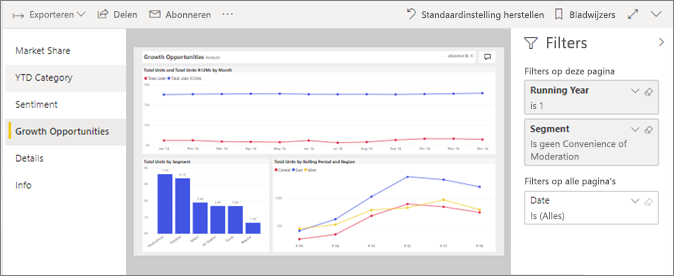

# Een rapport weergeven in de Power BI-service voor *gebruikers*
Een rapport bestaat uit een of meer pagina's met visuals. Rapporten zijn gemaakt door Power BI *ontwerpers* en [met gedeelde *consumenten* rechtstreeks](end-user-shared-with-me.md) of als onderdeel van een [app](end-user-apps.md). 

Er zijn veel verschillende manieren om een rapport te openen en we laten u twee algoritmen: open thuis en uit een dashboard. 

<!-- add art-->

## Open een rapport van Power BI Start
We gaan eerst een rapport openen dat rechtstreeks met u is gedeeld en vervolgens een rapport dat is gedeeld als onderdeel van een app.

   

### Een rapport openen dat met u is gedeeld
Power BI *ontwerpers* kunt u een rapport rechtstreeks met u delen. Inhoud die wordt gedeeld op deze manier wordt weergegeven in de **gedeeld met mij** -container op uw nav balk en in de **gedeeld met mij** sectie van uw startpagina-canvas.

1. Open de Power BI-service (app.powerbi.com).

2. Selecteer in de navigatiebalk **Start** om uw startpagina canvas weer te geven.  

   
   
3. Schuif omlaag totdat u **Gedeeld met mij** ziet. Zoek het . In deze schermafbeelding we hebben één dashboard en rapporten met de naam *verkoop en marketing voorbeeld*. 
   
   

4. Selecteer het rapport *kaart* om het rapport te openen.

   

5. Let op de tabbladen aan de linkerkant.  Elk tabblad vertegenwoordigt een *pagina* van het rapport. Momenteel hebben we de *groei verkoopkans* pagina geopend. Selecteer de *categorie jaar tot heden* tabblad in plaats daarvan deze pagina van het rapport openen. 

   

6. Nu we de volledige rapportpagina zien van rechts. Als u wilt wijzigen van de weergave (Inzoomen) van de pagina, selecteert u de vervolgkeuzelijsten in de rechterbovenhoek ( **>** ) en kies **ware grootte**.

   

   

### Een rapport openen dat onderdeel is van een app
Als u u apps hebt ontvangen van collega's of via AppSource, die apps zijn beschikbaar via Start en van de **Apps** -container op de navigatiebalk. Een [app](end-user-apps.md) is een bundel met dashboards en rapporten.

1. Ga terug naar introductiepagina hiervoor **Start** van de navigatiebalk.

7. Schuif omlaag totdat u **Mijn apps** ziet.

   

8. Selecteer een van de apps om deze te openen. Afhankelijk van de opties die de *ontwerper* van de app heeft ingesteld, wordt met de app een dashboard, een rapport of een lijst met app-inhoud geopend. Als bij het selecteren van de app:
    - het rapport wordt geopend, kunt u direct aan de slag gaan.
    - een dashboard wordt geopend, gaat u hieronder naar ***Een rapport openen vanaf een dashboard***.
    - de lijst met app-inhoud wordt geopend, kunt u onder **Rapporten** een rapport selecteren om het rapport te openen.

## Een rapport openen vanaf een dashboard
Rapporten kunnen worden geopend vanaf een dashboard. De meeste tegels voor dashboards zijn *vastgemaakt* vanuit rapporten. Als u een tegel selecteert, wordt het rapport geopend dat is gebruikt om de tegel te maken. 

1. Selecteer een tegel in het dashboard. In dit voorbeeld hebben we de kolomgrafiektegel 'Totaal aantal eenheden JTD...' geselecteerd.

    

2.  Het bijbehorende rapport wordt geopend. U ziet dat we op de pagina 'Categorie JTD' zijn. Dit is de rapportpagina die de kolomgrafiek bevat die we in het dashboard hebben geselecteerd.

    

> [!NOTE]
> Niet alle tegels leiden naar een rapport. Als u een tegel selecteert die is [gemaakt met V&A](end-user-q-and-a.md), wordt het scherm V&A geopend. Als u een tegel selecteert die [is gemaakt met de dashboardwidget **Tegel toevoegen**](../service-dashboard-add-widget.md), kunnen er verschillende dingen gebeuren.  

##  Nog meer manieren om een rapport te openen
Als u meer vertrouwd navigeren in Power BI-service, kunt u werkstromen die het meest voor u geschikt achterhalen. Enkele andere manieren om rapporten te benaderen:
- In de navigatie van de balk met behulp van **Favorieten** en **Recent**    
- [Gerelateerde items weergeven](end-user-related.md) gebruiken    
- In een e-mail wanneer iemand [met u deelt](../service-share-reports.md) of als u [een waarschuwing hebt ingesteld](end-user-alerts.md)    
- Vanaf uw [Meldingencentrum](end-user-notification-center.md)    
- en meer

## Volgende stappen
Er zijn [veel verschillende manieren om met een rapport te werken](end-user-reading-view.md).  Verkennen door elk tabblad aan de kant van het rapportcanvas te selecteren.

