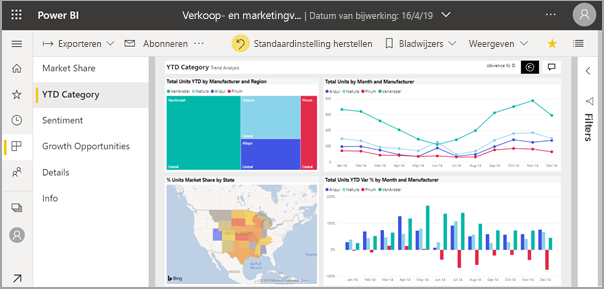
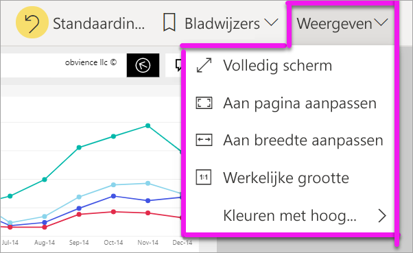
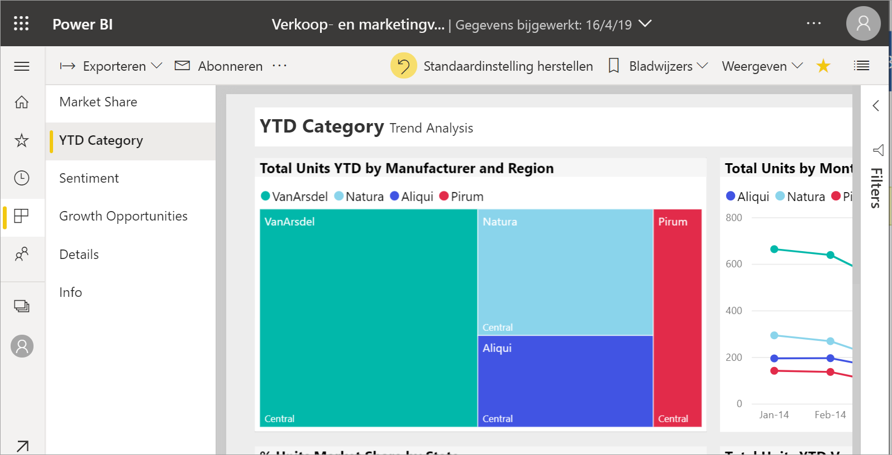
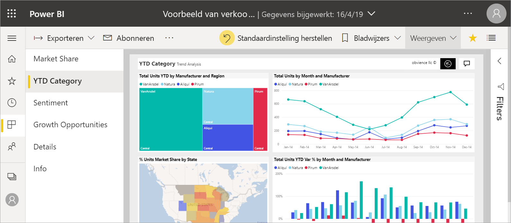
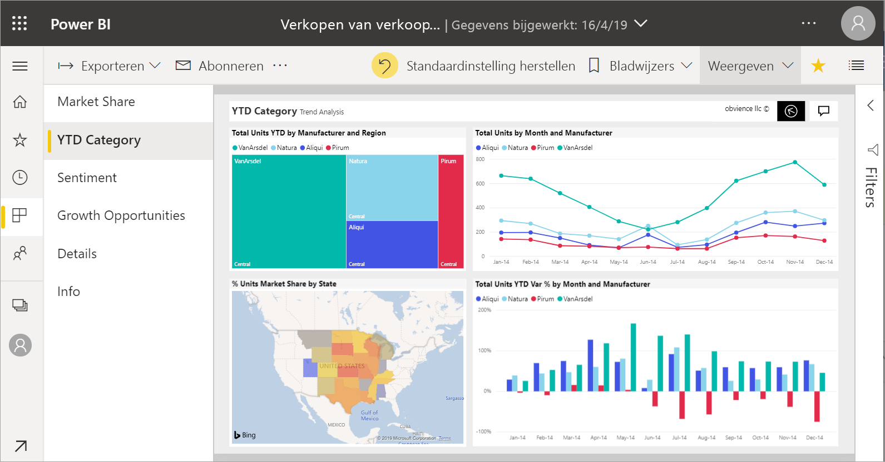
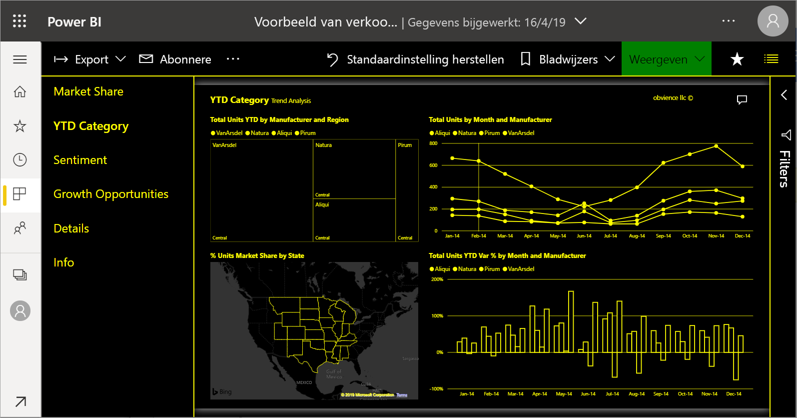
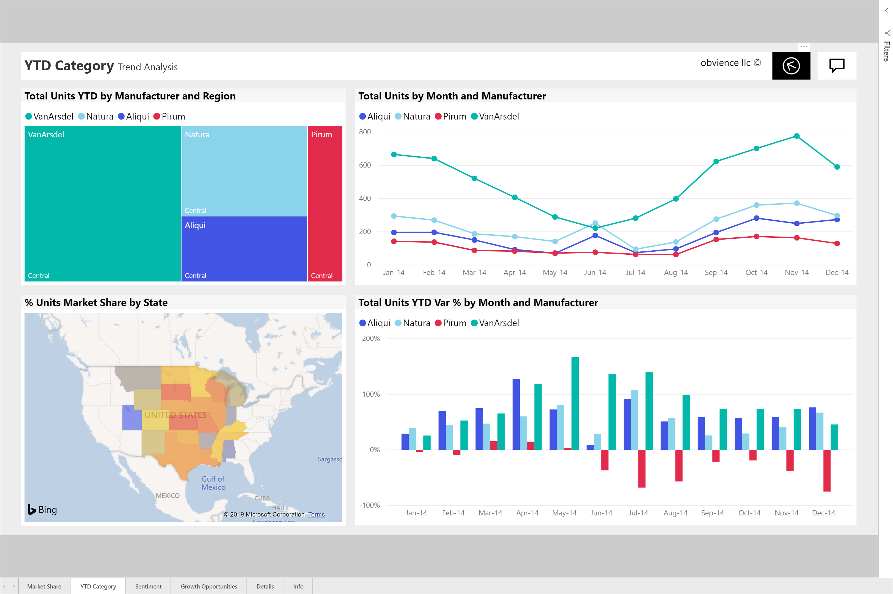

# De weergave van een rapportpagina wijzigen

[!INCLUDE [power-bi-service-new-look-include](../includes/power-bi-service-new-look-include.md)]

Mensen geven rapporten weer op verschillende apparaten met verschillende schermgrootten en hoogte-breedteverhoudingen. Pas de manier waarop een rapportpagina wordt weergegeven aan uw wensen aan.

## Het menu Weergave verkennen

De opties in het menu **Weergave** bieden u flexibiliteit om rapportpagina’s weer te geven met de door u gekozen afmetingen en breedte:

- Stel dat u een rapport op een klein apparaat weergeeft en moeilijk titels en legenda’s kunt zien.  Selecteer **Weergave** > **Ware grootte** om de rapportpagina groter te maken. Gebruik de schuifbalken om door het rapport te navigeren.

    

- Een andere optie is om het rapport aan uw schermbreedte aan te passen door **Passend in breedte** te selecteren. Omdat deze optie alleen de breedte en niet de hoogte instelt, moet u mogelijk nog wel de verticale schuifbalk gebruiken.

  

- Selecteer **Passend op pagina** als u geen schuifbalken wilt, maar wel uw schermgrootte optimaal wilt gebruiken.

   

- U kunt ook kiezen uit vier **kleuren met hoog contrast**: Hoog contrast 1, Hoog contrast 2, Hoog contrast zwart en Hoog contrast wit. Dit is een toegankelijkheidsfunctie, die u kunt gebruiken zodat slechtziende personen de rapporten beter kunnen zien. Het voorbeeld hieronder is hoog contrast 1. 

    

- De laatste optie, **Volledig scherm**, geeft uw rapportpagina weer zonder menubalken en koptitels. Volledig scherm kan een goede keuze zijn voor kleine schermen, waarop details moeilijk te zien zijn.  Volledig scherm kan ook een goede keuze zijn wanneer u rapportpagina’s projecteert op grote schermen, zodat anderen deze wel kunnen zien, maar geen interactie hebben.  

    

Als u het rapport afsluit, worden uw instellingen voor **Weergave** niet opgeslagen, maar worden de standaardinstelling weer ingesteld. Gebruik [bladwijzers](end-user-bookmarks.md) als u het belangrijk vindt om deze instellingen op te slaan.

## Volgende stappen

* [Rondleiding door het deelvenster Filters van het rapport](end-user-report-filter.md)