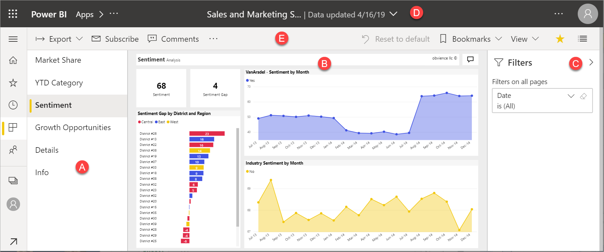
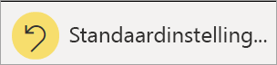

# Rapporten in Power BI

[!INCLUDE[consumer-appliesto-yynn](../includes/consumer-appliesto-yyn.md)]

[!INCLUDE [power-bi-service-new-look-include](../includes/power-bi-service-new-look-include.md)]

Een Power BI-rapport biedt vanuit meerdere invalshoeken inzicht in een gegevensset, met visualisaties die andere bevindingen en inzichten uit die gegevensset weergeven.  Een rapport kan één visualisatie of pagina's vol visualisaties bevatten. Afhankelijk van uw functie kunt u mogelijk de rol hebben voor het *ontwerpen* van rapporten. U kunt ook een *zakelijke gebruiker* zijn die rapporten *verbruikt* of gebruikt. Dit artikel is gericht op *zakelijke gebruikers*.

## De onderdelen van een rapport

A. Dit rapport bevat zes pagina’s (of tabbladen) en u bekijkt momenteel de pagina **Gevoel**.    
B. Deze pagina bevat vijf verschillende visualisaties en een paginatitel.    
C. Het deelvenster *Filters* toont ons één filter dat wordt toegepast op alle rapportpagina's. Selecteer de pijl ( **>** ) om het deelvenster Filters samen te vouwen.    
D. De Power BI-banner geeft de naam van het rapport en de datum waarop het rapport het laatst is bijgewerkt weer. Selecteer de pijl om een menu te openen dat ook de naam van de rapporteigenaar weergeeft.    
E. De actiebalk bevat acties die u kunt uitvoeren in dit rapport.  U kunt bijvoorbeeld een opmerking toevoegen, een bladwijzer bekijken of gegevens uit het rapport exporteren.  Selecteer **Meer opties** (...) om een lijst aanvullende rapportfunctionaliteit weer te geven.    

Als u geen ervaring hebt met Power BI kunt u een goede basis leggen door [Basisconcepten voor zakelijke gebruikers van de Power BI-service](end-user-basic-concepts.md) te lezen. Rapporten kunnen worden weergegeven, gedeeld en gebruikt om aantekeningen te maken op mobiele apparaten. Raadpleeg [Rapporten verkennen in de mobiele Power BI-apps](mobile/mobile-reports-in-the-mobile-apps.md) voor meer informatie.

## Voordelen van rapporten

Een rapport in Power BI is gebaseerd op één gegevensset. Rapport*ontwerpers* maken de visuals in een rapport die blokken gegevens vertegenwoordigen. De visuele elementen zijn niet statisch.  Ze worden bijgewerkt zodra de onderliggende gegevens veranderen. U kunt interacties met de visuele elementen en filters aangaan terwijl u in de gegevens duikt om in inzichten te ontdekken en antwoorden te zoeken. Net als een dashboard, maar dan in grotere mate, is een rapport erg interactief, met veel aanpassingsmogelijkheden. Wat u allemaal met een rapport kunt doen, is afhankelijk van de rol en de machtigingen die zijn toegewezen door de *ontwerper* van het rapport.

### Veilig omgaan met inhoud

U kunt de rapporten niet kapot maken wanneer u uw inhoudt verkent en interacties toepast, zoals filteren, slicen, abonneren en exporteren. Uw werk heeft geen invloed op de onderliggende gegevensset of het oorspronkelijk gedeelde inhoud. Dit geldt voor dashboards, rapporten en apps.

> [!NOTE]
> Denk eraan dat u uw gegevens niet kunt schaden. De Power BI-service is een fantastische plek om dingen te verkennen en te experimenteren zonder dat u zich zorgen hoeft te maken dat u iets verkeerd doet.

### Sla uw wijzigingen op of stel de standaardinstellingen opnieuw in

Dat betekent niet dat u uw wijzigingen niet kunt opslaan. Dat kunt u wel, maar deze wijzigingen zijn alleen van invloed op uw weergave van de inhoud. Selecteer **Standaardinstelling herstellen** om terug te keren naar de standaardweergave van het rapport.

## Dashboards versus rapporten

[Dashboards](end-user-dashboards.md) worden vaak verward met rapporten omdat dit ook canvassen zijn die zijn gevuld met visualisaties. Er zijn echter enkele belangrijke verschillen.  

| **Mogelijkheid** | **Dashboards** | **Rapporten** |
| --- | --- | --- |
| Pagina's |Eén pagina |Een of meer pagina's |
| Gegevensbronnen |Een of meer rapporten en een of meer gegevenssets per dashboard |Eén gegevensset per rapport |
| Filteren |U kunt niet filteren of segmenteren |Er zijn verschillende manieren voor filteren, markeren en segmenteren |
| Waarschuwingen instellen |U kunt waarschuwingen aanmaken die per e-mail naar u worden verzonden als het dashboard aan bepaalde voorwaarden voldoet |Nee |
| Functie |U kunt één dashboard instellen als uw aanbevolen dashboard |U kunt geen aanbevolen rapport maken |
| U kunt onderliggende tabellen en velden van de gegevensset bekijken |Aantal U kunt gegevens exporteren maar de tabellen en velden van de gegevensset niet in het dashboard zelf zien |Ja. U kunt tabellen en velden van gegevenssets zien en waarden waarvoor u bent gemachtigd bent om deze te zien |
| Aanpassen |Nee  |U kunt filteren, exporteren, gerelateerde inhoud weergeven, bladwijzers toevoegen, QR-codes genereren, analyseren in Excel en meer |

<!--| Available in Power BI Desktop |No |Yes, can create and view reports in Desktop |
| Pinning |Can pin existing visuals (tiles) only from current dashboard to your other dashboards |Can pin visuals (as tiles) to any of your dashboards. Can pin entire report pages to any of your dashboards. | -->

## Ontwerpers en gebruikers van rapporten

Afhankelijk van uw rol bent u mogelijk een *ontwerper*, iemand die rapporten maakt voor uw eigen gebruik of om te delen met collega's. U wilt mogelijk meer informatie over het maken en delen van rapporten.

Of misschien bent u een *zakelijke gebruiker*, iemand die rapporten van anderen ontvangt. U wilt mogelijk meer informatie over het begrijpen en communiceren met de rapporten. Raadpleeg de volgende koppelingen als u een *zakelijke gebruiker* van een rapport bent:

* Begin met een [rondleiding door de Power BI-service](end-user-basic-concepts.md), zodat u weet waar u rapporten en hulpprogramma's voor rapporten kunt vinden.
* Meer informatie over hoe u [een rapport opent](end-user-report-open.md) en alle [interacties die voor zakelijke gebruikers beschikbaar zijn](end-user-reading-view.md).
* Raak vertrouwd met rapporten door het bekijken van een van onze [voorbeelden](../create-reports/sample-tutorial-connect-to-the-samples.md).  
* Raadpleeg *Gerelateerde inhoud weergeven in de Power BI-service* om te kijken welke gegevensset door het rapport wordt gebruikt en welke dashboards visuals uit het rapport weergeven ([pins](end-user-related.md)).

> [!TIP]
> Gebruik, als u hier niet hebt gevonden wat u zoekt, de inhoudsopgave links om door alle artikelen over *rapporten* te bladeren.

## Volgende stappen

[Een rapport openen en weergeven](end-user-report-open.md)    
[Dashboards in de Power BI-service](end-user-dashboards.md)

