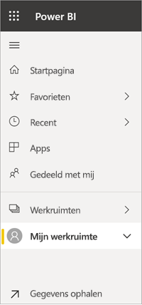
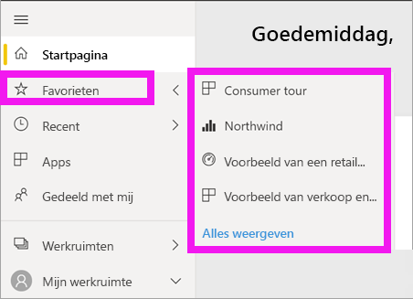

# Navigatie: inhoud zoeken en sorteren in de Power BI-service

[!INCLUDE [power-bi-service-new-look-include](../includes/power-bi-service-new-look-include.md)]

Er zijn veel manieren om door uw inhoud in de Power BI-service te bladeren. In uw werkruimte wordt de inhoud ingedeeld in typen: dashboards en rapporten.  De inhoud wordt ook ingedeeld per gebruik: Favorieten, Recent, Apps, Gedeeld met mij en Aanbevolen. Omdat u op de *Startpagina* van Power BI alle inhoud op één pagina kunt vinden, is het de centrale plek voor navigatie. Via deze verschillende paden naar uw inhoud kunt u snel vinden wat u nodig hebt in de Power BI-service.  

## Navigatie in werkruimten

Power BI-*gebruikers* hebben meestal maar één werkruimte: **Mijn werkruimte**. **Mijn werkruimte** bevat alleen inhoud als u Microsoft-voorbeelden hebt gedownload of als u uw eigen dashboards, rapporten of apps hebt gemaakt of gedownload.  

Binnen **Mijn werkruimte** in de Power BI-service wordt de inhoud van uw werkruimte gescheiden per type: dashboards, rapporten, werkmappen en gegevenssets. U ziet deze organisatie wanneer u een werkruimte selecteert. In dit voorbeeld bevat **Mijn werkruimte** één dashboard, één rapport, geen werkmappen en één gegevensset.

________________________________________
## Navigatie met behulp van het veld Zoeken
Gebruik de inhoudsweergave van **Mijn werkruimte** om uw inhoud te zoeken, te filteren en te sorteren. Typ in het veld Zoeken de volledige of gedeeltelijke naam van een dashboard, rapport, werkmap of eigenaar.  

Als u nog niet veel inhoud hebt, is zoeken en sorteren niet nodig.  Als u echter lange lijsten met dashboards en rapporten hebt, is zoeken en sorteren wellicht zeer nuttig. De onderstaande lijst met rapporten bevat bijvoorbeeld 83 items. 

U kunt de inhoud ook sorteren op naam of eigenaar. Let op de pijl-omhoog rechts van **Naam**. Er worden momenteel 83 items alfabetisch op naam gesorteerd, oplopend. Als u de sorteervolgorde wilt wijzigen in aflopend, selecteert u **Naam**. De pijl-omhoog verandert in een pijl-omlaag.

Niet alle kolommen kunnen worden gesorteerd. Beweeg de muisaanwijzer over de kolomkoppen om te zien welke kolommen kunnen worden gesorteerd.

___________________________________________________________________
## Navigeren met behulp van het navigatiedeelvenster
Het navigatiedeelvenster classificeert uw inhoud zodanig dat u snel kunt vinden wat u nodig hebt.  

- Inhoud die met u wordt gedeeld, is beschikbaar in **Gedeeld met mij**.
- Uw laatst bekeken inhoud is beschikbaar in **Recent**. 
- U kunt uw apps vinden door **Apps** te selecteren.
- **Startpagina** is een weergave met één pagina met daarop uw belangrijkste inhoud en suggesties voor inhoud en onderwijsbronnen.

Bovendien kunt u inhoud labelen als [favoriet](end-user-favorite.md) en [aanbevolen](end-user-featured.md) . Kies één dashboard of rapport dat u verwacht het meeste weer te geven en stel dit in als uw *aanbevolen* inhoud. Steeds wanneer u de Power BI-service opent, wordt uw aanbevolen dashboard als eerste weergegeven. Hebt u enkele dashboards en apps die u vaak bezoekt? Wanneer u deze instelt als favorieten, zijn ze altijd beschikbaar via de linkernavigatiebalk.

.

## Aandachtspunten en probleemoplossing
* Voor gegevenssets is **sorteren op** eigenaar niet beschikbaar.

## Volgende stappen
[Visuals sorteren in rapporten](end-user-change-sort.md)

Hebt u nog vragen? [Misschien dat de Power BI-community het antwoord weet](http://community.powerbi.com/)
