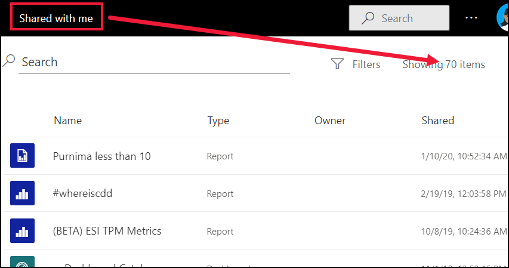

# Navigatie voor zakelijke Power BI-gebruikers: algemene zoekopdracht

[!INCLUDE[consumer-appliesto-yyny](../includes/consumer-appliesto-yyny.md)]

[!INCLUDE [power-bi-service-new-look-include](../includes/power-bi-service-new-look-include.md)]

Wanneer u de Power BI-service voor het eerst gebruikt, is de inhoud nog te overzien (een paar dashboards, rapporten en apps). Maar als collega's inhoud met u gaan delen en u zelf apps gaat downloaden, kunt u uiteindelijk lange lijsten met inhoud hebben. Dan is een functie voor zoeken en sorteren heel handig.

## Zoeken naar inhoud
 In bijna elk deel van de Power BI-service kunt u zoekacties uitvoeren. U gebruikt gewoon het zoekvak of het pictogram met een vergrootglas .

 Typ in het zoekveld de volledige of gedeeltelijke naam van een dashboard, rapport, werkmap, werkruimte, app of eigenaar. Power BI doorzoekt al uw inhoud. 

  

 In sommige gebieden van Power BI, zoals werkruimten, zijn twee verschillende zoekvelden beschikbaar. Met het zoekveld in de menubalk doorzoekt u al uw inhoud, terwijl het zoekveld op het canvas in de werkruimte alleen bedoeld is om te zoeken in die werkruimte.

  

## Inhoudslijsten sorteren

Als u nog niet veel inhoud hebt, is sorteren waarschijnlijk niet nodig.  Maar wanneer u lange lijsten met dashboards en rapporten hebt, kunt u met sorteren snel vinden wat u nodig hebt. Deze inhoudslijst **Gedeeld met mij** bevat bijvoorbeeld 70 items. 

Op dit moment wordt deze inhoudslijst alfabetisch gesorteerd op naam, van Z tot A. Als u de sorteercriteria wilt wijzigen, selecteert u de pijl rechts van **Naam (A-Z)** .

Sorteren is ook beschikbaar in werkruimten. In dit voorbeeld is de inhoud gesorteerd op **Vernieuwd**. Als u sorteercriteria wilt instellen voor werkruimten, selecteert u kolomkoppen en selecteert u deze opnieuw om de sorteerrichting te wijzigen. 

Niet alle kolommen kunnen worden gesorteerd. Beweeg de muisaanwijzer over de kolomkoppen om te zien welke kolommen kunnen worden gesorteerd.

## Inhoudslijsten filteren
Een andere manier om snel inhoud te vinden, is door gebruik te maken van de inhoudslijst **Filters**. Geef de filters weer door **Filters** in de rechterbovenhoek te selecteren. Welke filters beschikbaar zijn, is afhankelijk van uw locatie in de Power BI-service.  Het onderstaande voorbeeld heeft betrekking op een **recente** inhoudslijst.  Hiermee kunt u de lijst filteren op inhoudstype.  In een **Gedeeld met mij**-inhoudslijst bevatten de beschikbare **filters** zowel Eigenaar als Inhoudstype.

## Volgende stappen
[Visuals sorteren in rapporten](end-user-change-sort.md)

[Gegevens sorteren in visuals](end-user-change-sort.md)

Hebt u nog vragen? [Misschien dat de Power BI-community het antwoord weet](https://community.powerbi.com/)
