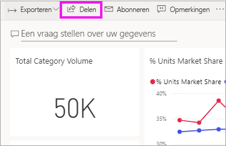
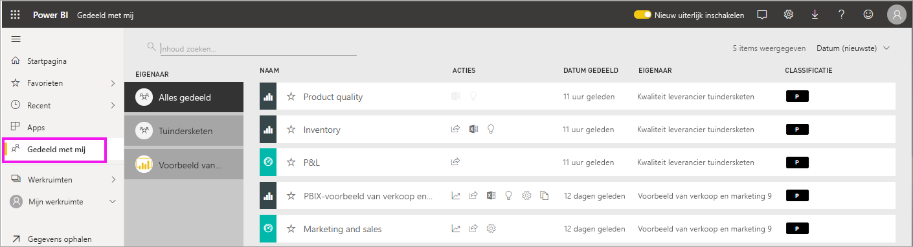
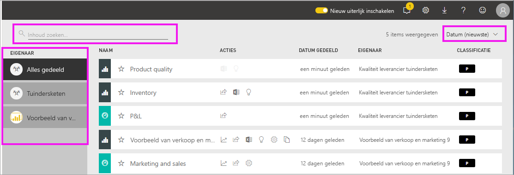

# De dashboards en rapporten weergeven die met mij zijn gedeeld

[!INCLUDE[consumer-appliesto-yyny](../includes/consumer-appliesto-yyny.md)]

[!INCLUDE [power-bi-service-new-look-include](../includes/power-bi-service-new-look-include.md)]

Wanneer een collega inhoud met u deelt via de knop **Delen**, wordt deze inhoud weergegeven in de container **Gedeeld met mij**. Het dashboard of rapport is alleen beschikbaar vanuit **Gedeeld met mij** en niet vanuit **Apps**.

Kijk hoe Amanda de inhoudslijst **Gedeeld met mij** uitlegt en demonstreert hoe u naar de lijst navigeert en deze filtert. Volg vervolgens de stapsgewijze instructies onder de video om het zelf te proberen. Als u met u gedeelde dashboards wilt weergeven, moet u beschikken over een Power BI Pro-licentie. Lees [Wat is Power BI Premium?](../admin/service-premium-what-is.md) voor meer informatie.
    

> [!NOTE]
> Deze video maakt gebruik van een oudere versie van de Power BI-service.
    

<iframe width="560" height="315" src="https://www.youtube.com/embed/G26dr2PsEpk" frameborder="0" allowfullscreen></iframe>

## Interactie met gedeelde inhoud

U krijgt opties om met het gedeelde dashboard en de rapporten te communiceren, afhankelijk van de machtigingen die de *ontwerper* u heeft gegeven. Hierbij zijn de mogelijkheden inbegrepen om kopieën van het dashboard te maken, het rapport [in leesweergave](end-user-reading-view.md) te openen en opnieuw te delen met andere collega's.

### Acties die beschikbaar zijn via de container **Gedeeld met mij**
Welke acties voor u beschikbaar zijn, is afhankelijk van de instellingen die worden toegewezen door de *ontwerper* van de inhoud. U kunt onder andere het volgende kiezen:
* Selecteer het sterpictogram om [een dashboard of rapport toe te voegen aan de favorieten](end-user-favorite.md) .
* Een dashboard of rapport verwijderen  .
* Sommige dashboards en rapporten kunnen opnieuw worden gedeeld  .
* [Het rapport openen in Excel](end-user-export.md)  
* [Bekijk inzichten](end-user-insights.md) die Power BI in de gegevens vindt .
  
  > [!NOTE]
  > Voor informatie over EGRC-classificaties selecteert u de **classificatieknop** of [gaat u naar Classificatie van dashboardgegevens](../create-reports/service-data-classification.md).
  > 

## Gedeelde dashboards zoeken en sorteren
Als uw lijst inhoud lang wordt, zijn er verschillende mogelijkheden om te vinden wat u zoekt. U kunt het zoekveld gebruiken, sorteren op datum en een selectie maken uit de kolom **Eigenaar**.    

