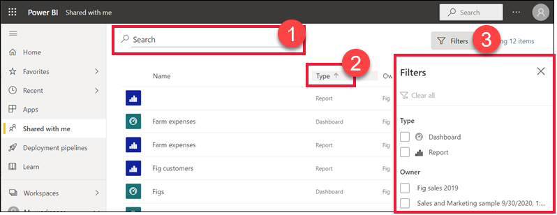

# De dashboards en rapporten weergeven die met mij zijn gedeeld

[!INCLUDE[consumer-appliesto-yyny](../includes/consumer-appliesto-yyny.md)]

[!INCLUDE [power-bi-service-new-look-include](../includes/power-bi-service-new-look-include.md)]

Wanneer een collega een dashboard of rapport met u deelt, wordt de inhoud daarvan weergegeven in de container **Gedeeld met mij**. Wanneer een collega een app met u deelt, wordt de app weergegeven in uw **Apps**-container. De rapporten en dashboards van de app ziet u in de container **Gedeeld met mij**.   

Kijk hoe Amanda de inhoudslijst **Gedeeld met mij** uitlegt en demonstreert hoe u naar de lijst navigeert en deze filtert. Volg vervolgens de stapsgewijze instructies onder de video om het zelf te proberen. Als u met u gedeelde dashboards wilt weergeven, moet u beschikken over een Power BI Pro-licentie. Lees [Wat is Power BI Premium?](../admin/service-premium-what-is.md) voor meer informatie.
    

> [!NOTE]
> Deze video maakt gebruik van een oudere versie van de Power BI-service.
    

<iframe width="560" height="315" src="https://www.youtube.com/embed/G26dr2PsEpk" frameborder="0" allowfullscreen></iframe>

## Interactie met gedeelde inhoud

U krijgt opties om met het gedeelde dashboard en de rapporten te communiceren, afhankelijk van de machtigingen die de *ontwerper* u heeft gegeven. Hierbij zijn de mogelijkheden inbegrepen om kopieën van het dashboard te maken, te abonneren, het rapport [in leesweergave](end-user-reading-view.md) te openen en opnieuw te delen met andere collega's. Selecteer een dashboard of rapport om het te openen.

## Gedeelde dashboards en rapporten zoeken en sorteren
Als uw inhoudslijst **Gedeeld met mij** te lang wordt, zijn er verschillende mogelijkheden om te vinden wat u zoekt. Gebruik het zoekveld (1), sorteer op een van de kolommen (2) of gebruik het deelvenster Filters. Open het deelvenster Filters door **Filters** in de rechterbovenhoek te selecteren.    

