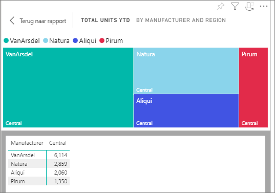
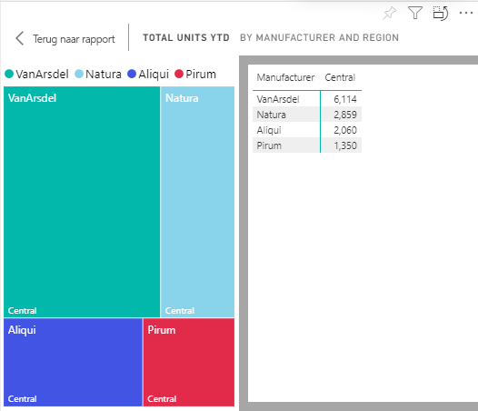

# Gegevens weergeven met Power BI

[!INCLUDE [power-bi-service-new-look-include](../includes/power-bi-service-new-look-include.md)]

Een visual in Power BI wordt opgebouwd met gegevens uit onderliggende gegevenssets. Als u een kijkje achter de schermen wilt nemen, kunt u met de Power BI-service de gegevens *weergeven* die worden gebruikt voor het maken van een visual in een rapport. Wanneer u **Gegevens weergeven** selecteert, geeft Power BI de gegevens onder (of naast) de visual weer.

Als u de onderliggende gegevens op een dashboard wilt bekijken, gebruikt u [Exporteren naar Excel](end-user-export.md)

## De gegevens weergeven die worden gebruikt voor het maken van een visual in een rapport
1. [Open een rapport](end-user-report-open.md) in de Power BI-service en selecteer een visual.  
2. Selecteer **Meer opties** (...) en kies **Gegevens weergeven** als u de gegevens achter de visual wilt weergeven.
   
   
3. Standaard worden de gegevens weergegeven onder het visuele element.
   
   

4. Als u de afdrukstand wilt wijzigen, selecteert u verticale indeling  in de rechterbovenhoek van de visualisatie.
   
   

## Volgende stappen
[Visuals in Power BI-rapporten](../visuals/power-bi-report-visualizations.md)    
[Power BI-rapporten](end-user-reports.md)    
