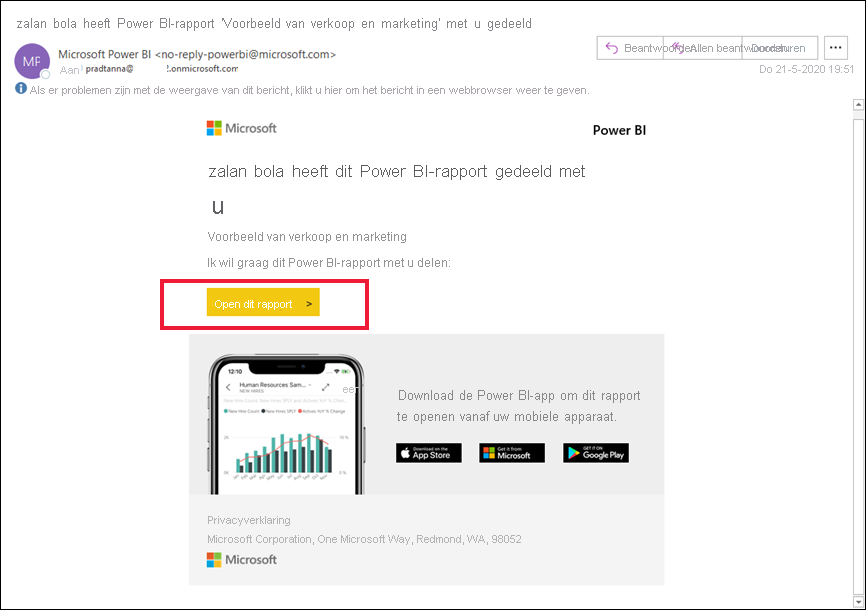
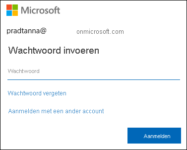
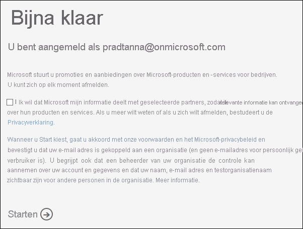
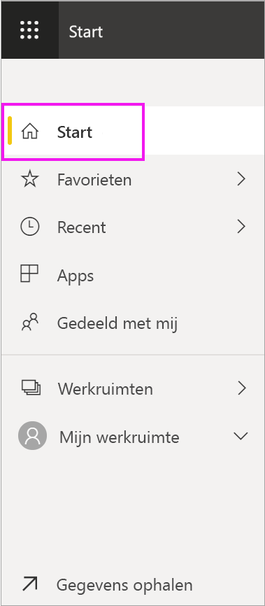
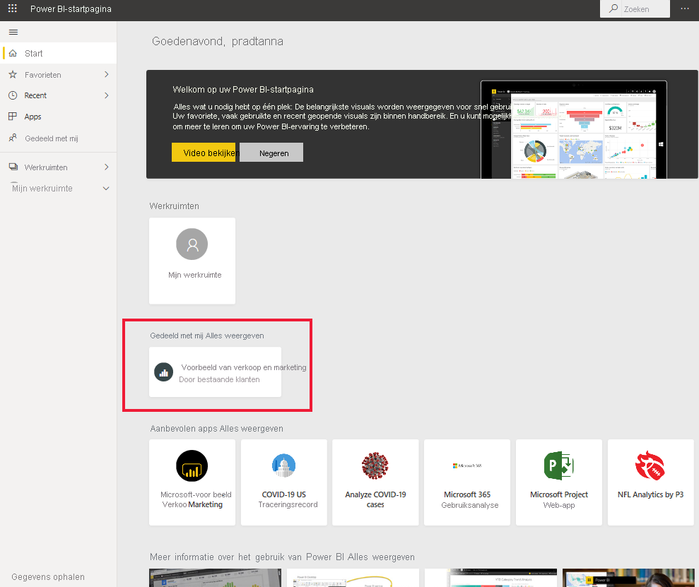

# Aanmelden bij de Power BI-service

[!INCLUDE[consumer-appliesto-yynn](../includes/consumer-appliesto-yynn.md)]

## Power BI-accounts
Voordat u zich bij Power BI kunt aanmelden, hebt u een account nodig. U kunt op twee manieren een Power BI-account krijgen. De eerste is wanneer uw organisatie Power BI-licenties voor zijn medewerkers koopt. En de tweede is wanneer [personen zich registreren voor gratis proefversies of persoonlijke licenties](../fundamentals/service-self-service-signup-for-power-bi.md). In dit artikel wordt het eerste scenario behandeld.

## Voor de eerste keer aanmelden

### Stap 1: de Power BI-service openen
De Power BI-service wordt in een browser uitgevoerd. 

- Als u een e-mail hebt ontvangen van een collega, met een koppeling naar een dashboard of rapport, selecteert u de koppeling **Dit rapport openen** of **Dit dashboard openen**.

        

- Anders opent u uw favoriete browser en typt u **app.powerbi.com**.

        

### Stap 2: uw e-mailadres invoeren
De eerste keer dat u zich aanmeldt, controleert Microsoft of u al een Microsoft 365-account hebt. In het onderstaande voorbeeld heeft Pradtanna al een licentie voor andere Microsoft-services. 

Voer uw wachtwoord in. Dit is het wachtwoord van uw Microsoft 365-account. Gebruik het e-mailadres en wachtwoord dat u ook gebruikt voor andere Microsoft-producten, zoals Outlook en Office.  Afhankelijk van hoe uw account is ingesteld, wordt u mogelijk ook gevraagd om een code in te voeren die naar uw e-mailadres of mobiele apparaat is verzonden.   

Soms wijst de globale beheerder een licentie aan u toe en dan krijgt u een e-mail met deze gegevens. Kijk of u in uw Postvak IN een welkomstbericht ziet en volg de instructies om u voor de eerste keer aan te melden. Gebruik dit zelfde e-mailaccount voor uw aanmelding. 
 
### Stap 3: de voorwaarden lezen
Neem de voorwaarden door en schakel het selectievakje in en kies **Starten** als u akkoord gaat.

### Stap 4: uw startpagina controleren
Bij uw eerste bezoek wordt de **Power BI-startpagina** geopend. Als de **startpagina** niet wordt geopend, selecteert u deze in het navigatievenster. 

Op de startpagina ziet u alle inhoud die u gemachtigd bent om te gebruiken. In het begin staat er misschien niet veel inhoud, maar wees gerust: dit verandert wanneer u Power BI begint te gebruiken met uw collega's. Weet u nog dat een collega per e-mail een rapport met u heeft gedeeld? Dat rapport staat op uw startpagina onder het kopje **Gedeeld met mij**.

Als u niet wilt dat Power BI op uw startpagina wordt geopend, kunt u [een **aanbevolen** dashboard of rapport](end-user-featured.md) instellen dat in plaats daarvan wordt geopend. 

## Veilig omgaan met inhoud
Als ***consument*** delen anderen inhoud met u en gaat u werken met die inhoud om de gegevens te verkennen en zakelijke beslissingen te nemen.  Wees gerust als u filtert, segmenteert, u abonneert, exporteert en de grootte wijzigt: uw werk is niet van invloed op de onderliggende gegevensset of de oorspronkelijke gedeelde inhoud (dashboards en rapporten). Power BI is een veilige ruimte voor u om te verkennen en te experimenteren. Dat betekent niet dat u uw wijzigingen niet kunt opslaan: dat kunt u wel. Maar deze wijzigingen zijn alleen van invloed op **uw** weergave van de inhoud. En om terug te keren naar de oorspronkelijke standaardweergave is eenvoudig: u hoeft slecht te klikken op een knop.

## Meld u af bij de Power BI-service
Wanneer u Power BI afsluit of u afmeldt bij Power BI, worden uw wijzigingen opgeslagen, zodat u verder kunt gaan waar u bent gestopt.

Sluit het browsertabblad waarop u werkt om Power BI af te sluiten. 

 

Als u een computer deelt, wordt u aangeraden om u af te melden telkens wanneer u Power BI afsluit.  Als u wilt afmelden, selecteert u uw profielafbeelding in de rechterbovenhoek en kiest u **Afmelden**.  

 

## Probleemoplossing en aandachtspunten
- Als u zich hebt aangemeld voor Power BI als afzonderlijke gebruiker, meldt u zich aan met het e-mailadres dat u hebt gebruikt om u te registreren.

- Sommige personen gebruiken Power BI met meer dan één account. Als dat het geval is, wordt u gevraagd een account in een lijst te selecteren. 

## Volgende stappen
[Een Power BI-app weergeven](end-user-app-view.md)
