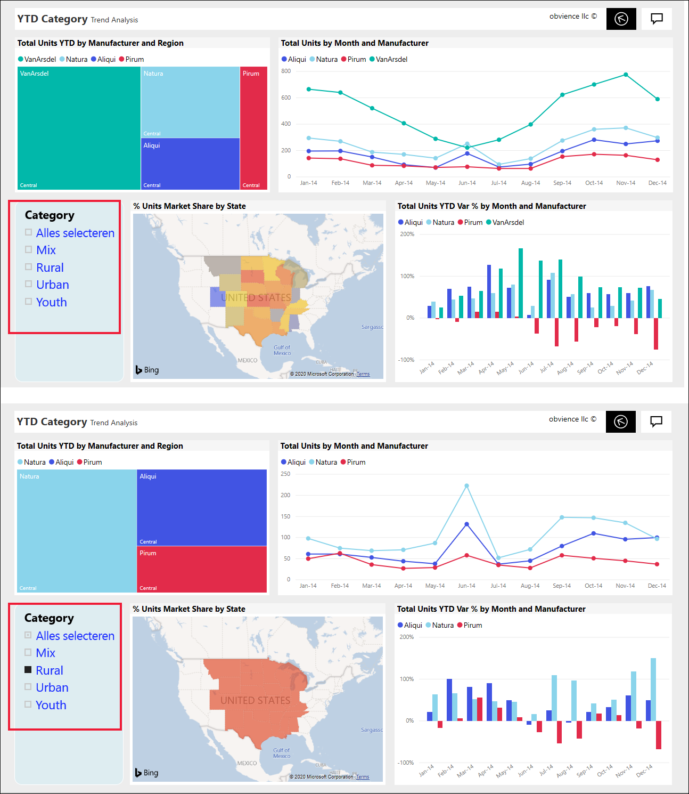
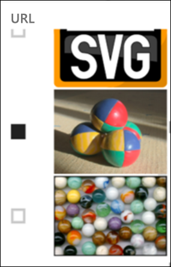
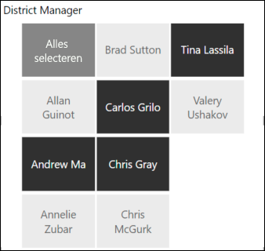
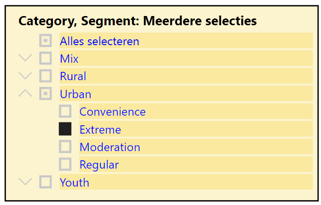
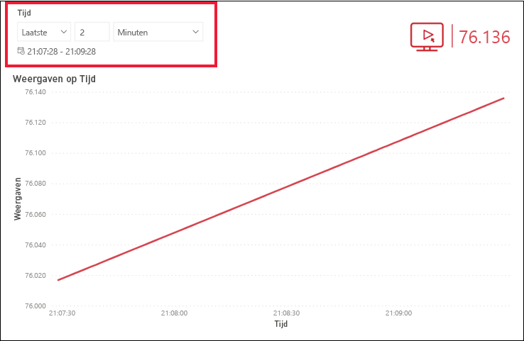
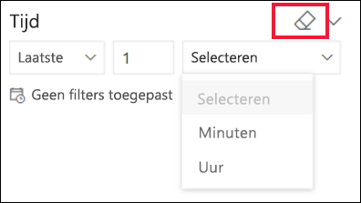

# Slicers in de Power BI-service

[!INCLUDE[consumer-appliesto-ynnn](../includes/consumer-appliesto-yynn.md)]

Een slicer is een type visual waarmee de andere visuals op een rapportpagina worden gefilterd. Wanneer u Power BI-rapporten gebruikt, zult u met veel typen slicers kennismaken. Op de afbeelding hierboven ziet u dezelfde slicer, maar met verschillende selecties. U kunt zien hoe door elke selectie alle andere visuals op de pagina worden gefilterd.  

## Slicers gebruiken
Bij het maken van rapporten voegen *ontwerpers* slicers toe om een verhaal te verduidelijken en om u de hulpmiddelen te geven waarmee u uw gegevens kunt verkennen.

### Slicer voor numeriek bereik
 De slicer voor numeriek bereik hierboven helpt u bij het in kaart brengen van de totale omzet per geografisch gebied, per voorraadeenheid en per besteldatum. Gebruik de grepen om een bereik te selecteren. 

### Eenvoudige verticale slicer voor selectievakje

Schakel in een van de eenvoudige slicers voor selectievakjes een of meer selectievakjes in om te zien welk effect dat heeft op de andere visuals op de pagina. Als u er meer dan één wilt selecteren, gebruikt u CTRL terwijl u een selectie maakt. Soms heeft de rapport*ontwerper* de slicer zo ingesteld dat u maar één waarde per keer kunt selecteren. 

### Slicers voor afbeeldingen en vormen
Wanneer de opties voor de slicer afbeeldingen of vormen zijn, is het maken van selecties vergelijkbaar met het gebruik van selectievakjes. U kunt een of meer afbeeldingen of vormen kiezen als u de slicer wilt toepassen op de andere visuals op de pagina. 

    

    

### Hiërarchieslicer

Gebruik in een slicer met een hiërarchie de dubbele punthaken om de hiërarchie uit te vouwen en samen te vouwen. De header wordt bijgewerkt om uw selecties weer te geven.

### Slicer voor relatieve tijd
Met de snelle opkomst van scenario's waarin snel vernieuwen is vereist, kan de mogelijkheid om te filteren op een kleinere tijdperiode erg nuttig zijn.
Met de slicer voor relatieve tijd kunt u op tijd gebaseerde filters toepassen op alle datum- of tijdgegevens in uw rapport. U kunt de slicer voor relatieve tijd bijvoorbeeld gebruiken om alleen videoweergaven voor de afgelopen 2 dagen, uren of zelfs minuten weer te geven. 

## Een slicer deactiveren
Selecteer het gumpictogram als u een slicer wilt deactiveren.

## Volgende stappen
Raadpleeg voor meer informatie de volgende artikelen:

[Visualization types in Power BI](end-user-visualizations.md) (Typen visualisaties in Power BI)

