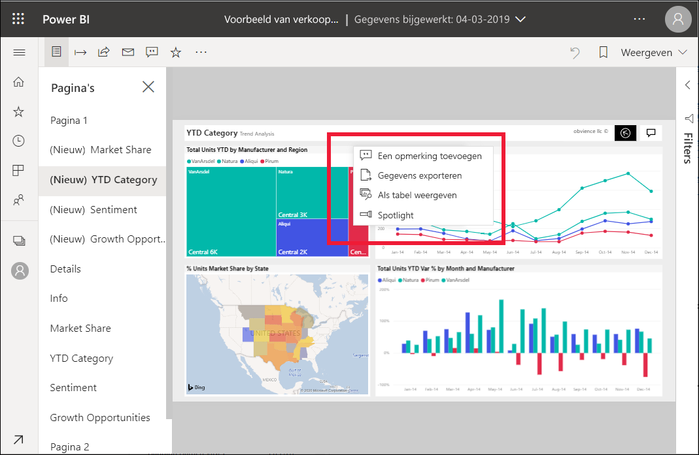
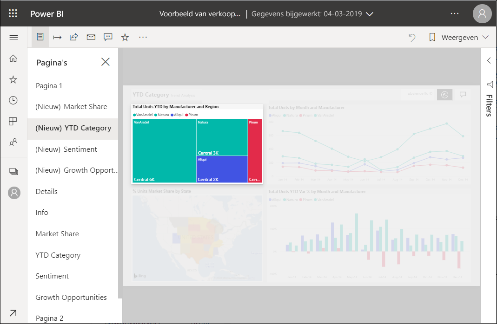

# Spotlights toevoegen aan Power BI-rapporten

[!INCLUDE[consumer-appliesto-yyny](../includes/consumer-appliesto-yyny.md)]

Met een spotlight kunt u de aandacht vestigen op een specifieke visual op een rapportpagina.  Als de spotlightmodus is geselecteerd wanneer u een bladwijzer toevoegt, blijft die modus bewaard in de bladwijzer.

## Een spotlight toevoegen

1. [Open een rapport](end-user-report-open.md) in de Power BI-service.

2. Bepaal welke visual u op de rapportpagina wilt markeren. Selecteer de vervolgkeuzelijst **Meer acties (...)** .  

    

3. Kies de optie voor **Spotlight**. De geselecteerde visual is gemarkeerd, waardoor alle andere visuals op de pagina naar bijna transparantie vervagen. 

    

## Volgende stappen

* [Een dashboardtegel of rapportvisual weergeven in de focusmodus](end-user-focus.md)

