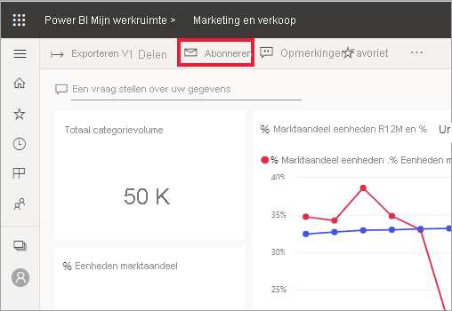
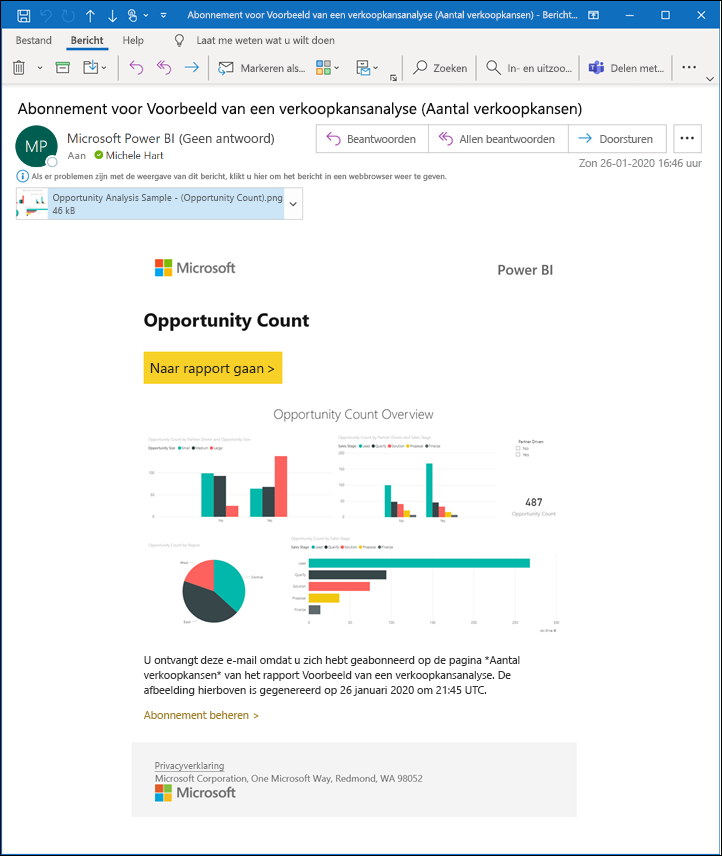
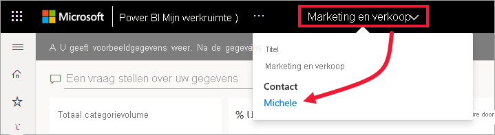
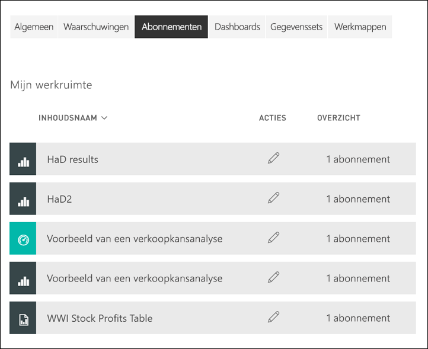

# Uzelf abonneren op een rapport of dashboard in de Power BI-service 

[!INCLUDE[consumer-appliesto-ynny](../includes/consumer-appliesto-ynny.md)]

[!INCLUDE [power-bi-service-new-look-include](../includes/power-bi-service-new-look-include.md)]

Het is nog nooit zo eenvoudig geweest om op de hoogte blijven van uw belangrijkste dashboards en rapporten. Abonneer u op de rapportpagina's en dashboards die voor u het belangrijkst zijn, zodat u een e-mail van Power BI in uw postvak ontvangt met een momentopname. U vertelt Power BI hoe vaak u de e-mailberichten wilt ontvangen: dagelijks, wekelijks, of wanneer de gegevens worden vernieuwd. U kunt ook een specifiek tijdstip instellen waarop Power BI de e-mailberichten verzendt of deze nu laten uitvoeren.  Alles bij elkaar kunt u maximaal 24 verschillende abonnementen per rapport of dashboard instellen.

De e-mail en momentopname gebruiken de taal die is ingesteld in de instellingen van Power BI (zie [Ondersteunde talen en landen/regio's voor Power BI](../fundamentals/supported-languages-countries-regions.md)). Als er geen taal is gedefinieerd, valt Power BI Engels terug op Engels. Als u uw voorkeurstaal wilt bekijken of instellen, selecteert u het tandwielpictogram  > **Instellingen > Algemeen > Taal**. 

Wanneer u de e-mail ontvangt, bevat deze een koppeling om naar het rapport of dashboard te gaan. Wanneer deze koppeling wordt geselecteerd op een mobiel apparaat waarop Power BI-apps zijn geïnstalleerd, wordt de app in plaats van het rapport of het dashboard op de website van Power BI (standaardacties) geopend.

## Vereisten
Om een abonnement voor uzelf te **maken**, hebt u een bepaalde [licentie](end-user-license.md) nodig. Als u geen abonnement kunt maken, neemt u contact op met uw Power BI-beheerder. **Anderen abonneren** is alleen beschikbaar voor de eigenaar van het dashboard of rapport. Het abonneren op gepagineerde rapporten is enigszins anders. Zie [Uzelf en anderen abonneren op gepagineerde rapporten in Power BI-service](paginated-reports-subscriptions.md) voor meer informatie. 

## Abonneren op een dashboard of een rapportpagina
Het proces voor het abonneren op een dashboard of een rapport is vergelijkbaar. U kunt u met dezelfde knop abonneren op dashboards en rapporten van de Power BI-service.
 
.

1. Open het dashboard of het rapport.
2. Selecteer in de bovenste menubalk **Abonneren** of selecteer het enveloppictogram .
   

   
    
    Het scherm aan de linkerkant wordt weergegeven wanneer u zich op het dashboard bevindt en u **Abonneren** selecteert. Het scherm aan de rechterkant wordt weergegeven wanneer u zich op de rapportpagina bevindt en u **Abonneren** selecteert. 
    
    a. Als u zich op meer dan één pagina in een rapport wilt abonneren, selecteert u **Nog een abonnement toevoegen** en selecteert u een andere pagina in de vervolgkeuzelijst bovenaan.

    b. Gebruik de gele schuifregelaar om het abonnement in of uit te schakelen.  Als u de schuifregelaar instelt op Uit, wordt het abonnement niet verwijderd. Selecteer het prullenbakpictogram om het abonnement te verwijderen.

    c. Voeg optioneel gegevens voor het onderwerp en de berichttekst van de e-mail in. 

    d. Selecteer een **frequentie** voor uw abonnement.  U kunt voor Dagelijks, Wekelijks, of Nadat gegevens zijn vernieuwd (dagelijks) kiezen.  Als u het e-mailbericht van het abonnement alleen op bepaalde dagen wilt ontvangen, selecteert u **wekelijks** en kiest u de dagen waarop u het wilt ontvangen.  Als u bijvoorbeeld het e-mailbericht van het abonnement alleen op werkdagen wilt ontvangen, selecteert u **Wekelijks** als frequentie en schakelt u de selectievakjes voor Za en Zo uit. Als u **Maandelijks** selecteert, voert u de dag(en) van de maand in waarop u de abonnementsmail wilt ontvangen.   

    e. Als u Dagelijks, Elk uur, Maandelijks of Wekelijks kiest, kunt u ook een geplande tijd voor het abonnement kiezen. U kunt de verzending op het hele uur of om 15, 30 of 45 minuten erna laten uitvoeren. Selecteer ochtend (AM) of middag/avond (PM). U kunt ook de tijdzone opgeven. Als u Elk uur kiest, selecteert u de geplande tijd waarop u het abonnement wilt starten. Het abonnement wordt vervolgens elk uur daarna uitgevoerd.  

    f. Plan de begin- en einddatum door datums in de datumvelden in te voeren. De begintijd voor uw abonnement is standaard de datum waarop die u deze hebt gemaakt en de einddatum is één jaar later. U kunt deze op elk gewenst moment wijzigen in ongeacht welke datum in de toekomst (tot het jaar 9999) voordat het abonnement afloopt. Wanneer een abonnement een einddatum heeft bereikt, wordt het stopgezet tenzij u het opnieuw inschakelt.  U ontvangt vóór de geplande einddatum melding/meldingen met de vraag of u het abonnement wilt verlengen.     

    bijvoorbeeld Selecteer **Nu uitvoeren** om uw abonnement te beoordelen en testen.  Hiermee wordt het e-mailbericht meteen naar u verzonden. 

3. Selecteer **Opslaan en sluiten** om het abonnement op te slaan als alles er goed uitziet. U ontvangt een e-mailbericht en een momentopname van het dashboard of rapport volgens de planning die u instelt. Voor alle abonnementen waarbij de frequentie is ingesteld op **Nadat gegevens zijn vernieuwd**, wordt alleen een e-mailbericht verzonden na de eerste geplande vernieuwing op die dag.
   
   
   
    Als u de rapportpagina vernieuwt, wordt de gegevensset niet vernieuwd. Alleen de eigenaar van een gegevensset kan de gegevensset vernieuwen. Als u de naam van de eigenaar van de onderliggende gegevensset(s) wilt opzoeken, selecteert u de vervolgkeuzelijst in de menubalk of zoekt u de oorspronkelijke abonnements-e-mail op.
   
    

## Uw abonnementen beheren
U kunt alleen de abonnementen beheren die u zelf maakt. Selecteer **Abonneren** opnieuw en kies **Alle abonnementen beheren** in de linkerbenedenhoek (zie schermafbeeldingen hierboven). Welke abonnementen worden weergegeven, is afhankelijk van de werkruimte die op dat moment actief is. Als u alle abonnementen voor alle werkruimten allemaal in één keer wilt weergeven, moet u ervoor zorgen dat **Mijn werkruimte** actief is. Zie [Werkruimten in Power BI](end-user-workspaces.md) voor meer informatie over werkruimten. 

Een abonnement wordt beëindigd als de Pro-licentie is verlopen, het dashboard of rapport door de eigenaar wordt verwijderd of het gebruikersaccount wordt verwijderd dat is gebruikt om het abonnement te maken.

## Aandachtspunten en probleemoplossing
* Als u wilt voorkomen dat e-mails over uw abonnement in uw map met ongewenste e-mail terechtkomen, voegt u de e-mailalias van Power BI (no-reply-powerbi@microsoft.com) toe aan uw contactpersonen. Als u Microsoft Outlook gebruikt, klikt u met de rechtermuisknop op de alias en selecteert u **Toevoegen aan Outlook-contactpersonen**. 
* Dashboards met meer dan 25 vastgemaakte tegels of vier vastgemaakte live-rapportpagina’s worden mogelijk niet volledig weergegeven in naar gebruikers verzonden e-mailberichten voor het abonnement. Het is raadzaam om contact op te nemen met de ontwerper van het dashboard om hem of haar te vragen om het aantal vastgemaakte tegels terug te brengen tot minder dan 25 en vastgemaakte live-rapporten tot minder dan vier om ervoor te zorgen dat het e-mailbericht correct wordt weergegeven.  
* Als voor e-mailabonnementen in een dashboard beveiliging op rijniveau (RLS) is toegepast op een of meer tegels, worden deze tegels niet weergegeven.  
* Als de koppelingen in uw e-mailbericht (naar de inhoud) niet meer werken, is er mogelijk inhoud verwijderd. U kunt in het e-mailbericht onder de schermopname zien of u zich hebt geabonneerd of dat iemand anders u heeft geabonneerd. Als iemand anders dit heeft gedaan, vraagt u deze medewerker om de e-mailberichten te annuleren of u opnieuw te abonneren.
* Voor dashboardabonnementen worden bepaalde soorten tegels nog niet ondersteund. Hierbij gaat het om: streamingtegels, videotegels, tegels voor aangepaste webinhoud. 
* Abonnementen op rapportpagina’s zijn gekoppeld aan de naam van de rapportpagina. Als u zich abonneert op een rapportpagina en de naam ervan wordt gewijzigd, moet u uw abonnement opnieuw maken.
* Als u de abonnementsfunctie niet kunt gebruiken, moet u contact opnemen met uw systeembeheerder. Deze functie is mogelijk uitgeschakeld door uw organisatie.  
* E-mailabonnementen bieden geen ondersteuning voor de [aangepaste visuals](../developer/visuals/power-bi-custom-visuals.md).  De uitzondering hierop vormen de aangepaste Power BI-visuals die zijn [gecertificeerd](../developer/visuals/power-bi-custom-visuals-certified.md).    
* E-mailabonnementen worden verzonden met de standaard filter- en slicerstatus voor het rapport. De wijzigingen die u aanbrengt in de standaardwaarden nadat u zich abonneert, worden niet weergegeven in het e-mailbericht. Gepagineerde rapporten ondersteunen deze mogelijkheid wel en bieden de mogelijkheid om de specifieke parameterwaarden te configureren per abonnement.  
* E-mailabonnementen bieden op dit moment geen ondersteuning voor de Power BI-visuals.  
* Voor dashboardabonnementen geldt dat bepaalde soorten tegels nog niet worden ondersteund.  Hierbij gaat het om: streamingtegels, videotegels, tegels voor aangepaste webinhoud.     
* Mogelijk kunt u zich vanwege de maximale e-mailgrootte niet abonneren op dashboards of rapporten met extreem grote afbeeldingen.    
* Wanneer dashboards of rapporten langer dan twee maanden niet worden bezocht, wordt de vernieuwing van de bijbehorende gegevenssets automatisch door Power BI onderbroken.  Als u echter een abonnement aan een dashboard of rapport toevoegt, wordt het dashboard of rapport niet onderbroken, ook niet als het niet wordt bezocht.
* Onthoud dat net als bij andere BI-producten, de tijd waarop u uw abonnement instelt, de tijd is waarop de verwerking van het abonnement begint.  Als de verwerking van het rapport is voltooid, wordt het abonnement in de wachtrij geplaatst en naar de ontvangers van het e-mailbericht verzonden.  Hoewel we ernaar om alle abonnementen zo snel mogelijk te verwerken en te leveren, zijn er piekmomenten waardoor het mogelijk is dat u langer moet wachten als gevolg van het aantal abonnementen dat tegelijk kan worden verzonden.  Voor de meeste klanten zal de vertraging bij het verwerken en verzenden van hun rapporten niet meer bedragen dan 15 minuten, maar het kan op bepaalde momenten en voor bepaalde tenants met een aanzienlijk gebruik maximaal 30 minuten duren.  De verwachting is dat de levering nooit met een vertraging van meer dan 60 minuten te maken krijgt vanaf het moment dat het abonnement wordt gepland.  Als uw klanten een vertraging van deze duur ondervinden, moeten ze eerst controleren of het adres no-reply-powerbi@microsoft.com op uw lijst met veilige verzenders staat en niet wordt geblokkeerd door uw e-mailprovider.  Als het e-mail bericht niet wordt geblokkeerd, moeten ze contact opnemen met Power BI-ondersteuning voor hulp.

## Volgende stappen

[Inhoud zoeken en sorteren](end-user-search-sort.md)
