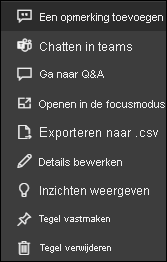

# Dashboardtegels in Power BI

[!INCLUDE[consumer-appliesto-yyny](../includes/consumer-appliesto-ynny.md)]

Een tegel is een momentopname van uw gegevens en wordt door een *ontwerper* vastgemaakt aan een dashboard. *Ontwerpers* kunnen tegels maken van een rapport, gegevensset, dashboard, het Q&A-vragenvak, Excel, SQL Server Reporting Services (SSRS) en meer.  Deze schermopname laat verschillende tegels zien die zijn vastgemaakt aan een dashboard.

Afgezien van tegels die vanuit rapporten zijn vastgemaakt, kunnen *ontwerpers* rechtstreeks zelfstandige tegels aan het dashboard toevoegen met **Tegel toevoegen**. Zelfstandige tegels bevatten: tekstvakken, afbeeldingen, video's, streaminggegevens en webinhoud.

Hulp nodig om de bouwstenen van Power BI te begrijpen?  Zie [Power BI - Basisconcepten](end-user-basic-concepts.md).

## Interactie met tegels op een dashboard

1. Beweeg de muisaanwijzer over de tegel om de weglatingstekens weer te geven.
   
    
2. Selecteer de weglatingstekens om het actiemenu van de tegel te openen. De beschikbare opties variëren per machtigingen, type visual en de methode die is gebruikt om de tegel te maken. De menu-items die beschikbaar zijn voor tegels die zijn vastgemaakt vanuit Q&A zijn bijvoorbeeld anders dan de tegels die zijn vastgemaakt vanuit een rapport. Hier ziet u een actiemenu voor een tegel die is gemaakt met Q&A.

   
    

   
    Enkele voorbeelden van acties die beschikbaar zijn via deze menu's:
   
   * [Het rapport openen waarmee de tegel is gemaakt ](end-user-reports.md)   
   
   * [De Q&A-vraag openen die is gebruikt om de tegel te maken ](end-user-reports.md)   
   

   * [Het werkblad openen waarmee de tegel is gemaakt ](end-user-reports.md)   
   * [De tegel bekijken in de focusmodus ](end-user-focus.md)   
   * [Inzichten weergeven](end-user-insights.md) 
   * [Een opmerking toevoegen en een discussie starten](end-user-comment.md) 
   * [Waarschuwingen beheren die zijn ingesteld voor een dashboardtegel](end-user-alerts.md) 
   * [De gegevens openen in Excel](end-user-export.md) 

3. Selecteer een leeg gebied op het canvas om het actiemenu te sluiten.

### Selecteer (klik op) een tegel
Als u een tegel selecteert, hangt wat er daarna gebeurt af van de manier waarop de tegel is aangemaakt en of deze een [aangepaste koppeling](../create-reports/service-dashboard-edit-tile.md) heeft. Als de tegel een aangepaste koppeling heeft, wordt de koppeling geopend als u de tegel selecteert. Anders gaat u door het selecteren van de tegel naar het rapport, het Excel Online werkmap, het SSRS-rapport dat on-premises is of naar de Q&A-vraag die werd gebruikt om de tegel te maken.

> [!NOTE]
> De uitzondering hierop zijn videotegels die door *ontwerpers* worden toegevoegd aan dashboards. Als u een videotegel selecteert (die op deze manier is gemaakt), wordt de video direct op het dashboard afgespeeld.   
> 
> 

## Aandachtspunten en probleemoplossing
* Als er niets gebeurt wanneer u een tegel selecteert (erop klikt) of als er een foutbericht verschijnt, zijn dit mogelijke oorzaken:
  - Het rapport dat is gebruikt om de visualisatie te maken, is niet opgeslagen of is verwijderd.
  - De tegel is gemaakt vanuit een werkmap in Excel Online en u beschikt niet over ten minste leesmachtigingen voor die werkmap.
  - Als de tegel is gemaakt vanuit SSRS en u geen machtigingen hebt voor het SSRS-rapport of als u geen toegang hebt tot het netwerk waarin de SSRS-server zich bevindt.
* Voor tegels die direct op het dashboard zijn gemaakt met behulp van **Tegel toevoegen**, wordt als een aangepaste hyperlink is ingesteld, de URL geopend wanneer u de titel, subtitel en/of tegel selecteert.  Het selecteren van een van deze tegels die direct op het dashboard zijn gemaakt voor een afbeelding, webcode of tekstvak, leidt anders standaard niet tot een actie.
* Als de oorspronkelijke visualisatie waarmee de tegel is gemaakt wijzigt, verandert de tegel niet.  Als de *ontwerper* bijvoorbeeld een lijndiagram uit een rapport heeft vastgemaakt en het lijndiagram vervolgens wijzigt in een staafdiagram, blijft de dashboardtegel een lijndiagram weergeven. De gegevens worden vernieuwd, maar het visualisatietype niet.

## Volgende stappen
[Gegevens vernieuwen](../connect-data/refresh-data.md)

[Power BI - basisconcepten](end-user-basic-concepts.md)

