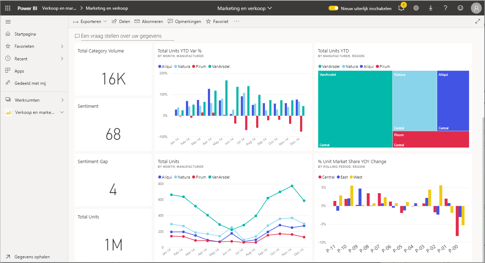

# Werken met visuals in rapporten, dashboards en apps

In de meest eenvoudige vorm is een ***visualisatie*** (of *visual*) een type diagram dat is samengesteld door Power BI-*ontwerpers* met behulp van de gegevens in rapporten en gegevenssets. 

Visuals bevinden zich op dashboards, in rapporten en kunnen met Power BI Q&A snel worden gemaakt. Wanneer een ontwerper een visual in een rapport maakt, kan hij of zij deze visual aan een dashboard *vastmaken*. Een [visual op een dashboard wordt een *tegel*](end-user-tiles.md) genoemd. dit dashboard heeft acht tegels. 

> [!TIP]
> We raden u aan om eerst het overzichtsonderwerp [Power BI-basisconcepten voor *gebruikers*](end-user-basic-concepts.md) te lezen voordat u deze meer gedetailleerde inhoud leest.

## Wat kan ik doen met visuals?

Visuals worden gemaakt door *ontwerpers* van rapporten en dashboards en gedeeld met *gebruikers*. Als gebruiker hebt u vele opties voor het werken met visuals om inzichten te onthullen en om zakelijke beslissingen te nemen die zijn gebaseerd op gegevens. De meeste van deze opties worden in de onderstaande tabel vermeld met koppelingen naar stapsgewijze instructies.

Voor veel van deze opties kan uw beheerder of de *ontwerper* de mogelijkheid om deze functies te bekijken of te gebruiken voor u uitschakelen. En sommige van deze functies werken alleen voor specifieke visuals.  Als u vragen hebt, neemt u contact op met uw beheerder of de eigenaar van het rapport of dashboard. Als u de eigenaar wilt zoeken, selecteert u het dashboard of de vervolgkeuzelijst van het rapport. 

> [!IMPORTANT]
> Maar eerst iets over Q&A. Q&A is het zoekhulpprogramma voor natuurlijke taal van Power BI. U typt een vraag in natuurlijke taal en met Q&A wordt de vraag beantwoord in de vorm van een visual. Q&A biedt gebruikers een manier om hun eigen visuals te maken. De visuals die u maakt met Q&A, kunnen echter niet worden opgeslagen. Maar als er iets specifieks is dat u wilt leren van de gegevens, en de ontwerper deze info niet heeft opgenomen in een rapport of dashboard, is Q&A een goede optie. Zie [Q&A voor gebruikers](end-user-q-and-a.md) voor meer informatie over Q&A.

|Taak  |Op een dashboard  |In een rapport  | In Q&A
|---------|---------|---------|--------|
|[Opmerkingen voor uzelf toevoegen aan een visual of een gesprek beginnen met collega’s over de visual](end-user-comment.md).     |  ja       |   ja      |  nee  |
|[Het rapport openen en verkennen waarin de visual is gemaakt](end-user-tiles.md).     |    ja     |   nb      |  nee |
|[Een lijst met filters en slicers weergeven die van invloed zijn op de visual](end-user-report-filter.md).     |    nee     |   ja      |  ja |
|[Een visual in Q&A openen en verkennen (als de *ontwerper* Q&A heeft gebruikt om de visual te maken)](end-user-q-and-a.md).     |   ja      |   nb      |  nb  |
|[Een visual maken in Q&A (voor het verkennen kunt u deze niet opslaan) ](end-user-q-and-a.md).     |   ja      |   als ontwerper Q&A aan het rapport heeft toegevoegd      |  ja  |
|[Power BI vragen om voor u te zoeken naar interessante feiten of trends](end-user-insights.md) in de gegevens van de visual.  Deze automatisch gegenereerde visuals worden *inzichten* genoemd.     |    ja     |  voor het hele rapport, niet per visual       | nee   |
|[Slechts één visual tegelijk weergeven met behulp van de *focusmodus*](end-user-focus.md).     | ja        |   ja      | nb  |
|[Opzoeken wanneer de visual de laatste keer is vernieuwd](end-user-fresh.md).     |  ja       |    ja     | nb  |
|[Slechts één visual tegelijk weergeven, zonder randen of navigatiebalken, met behulp van *volledig scherm* of *focus*modus](end-user-focus.md).     |   ja      |  ja       | standaard  |
|[Afdrukken](end-user-print.md).     |  ja       |   ja      | nee  |
|[Dieper ingaan op de visual door filters voor visuals toe te voegen en te wijzigen.](end-user-report-filter.md)     |    nee     |   ja      | nee  |
|Een visual aanwijzen om aanvullende details en knopinfo weer te geven.     |    ja     |   ja      | ja  |
|[Andere visuals op de pagina kruislings filteren en kruislings markeren.](end-user-interactions.md)    |   nee      |   ja      | nb  |
|[De gegevens weergeven die worden gebruikt om de visual te maken](end-user-show-data.md).     |  nee       |   ja      | nee  |
| [De manier wijzigen waarop de visual is gesorteerd](end-user-change-sort.md). | nee  | ja  | kan sortering wijzigen door de vraag opnieuw te verwoorden  |
| Een spotlight toevoegen aan een visual. | nee  | ja  |  nee |
| [Exporteren naar Excel.](end-user-export.md) | ja | ja | nee|
| [Maak een melding](end-user-alerts.md) om u te waarschuwen wanneer een waarde hoger is dan de drempelwaarde die u hebt ingesteld.  | ja  | nee  | nee |
| [De andere visuals op de pagina kruislings filteren en kruislings markeren](end-user-report-filter.md).  | nee      | ja  | nee  |
| [Details weergeven van een visual met een hiërarchie](end-user-drill.md).  | nee  | ja   | nee |

## Volgende stappen
Terug naar de [Basisconcepten voor gebruikers](end-user-basic-concepts.md)    
[Een visual selecteren om een rapport te openen](end-user-report-open.md)    
[Typen visuals die beschikbaar zijn in Power BI](end-user-visual-type.md)