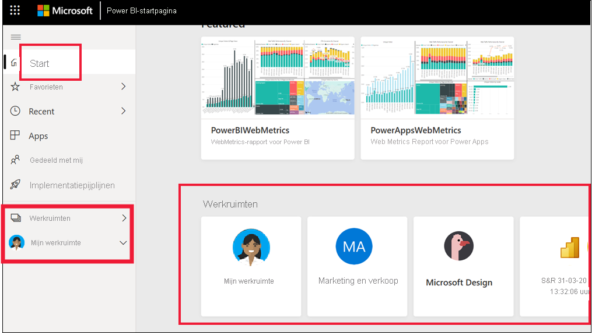
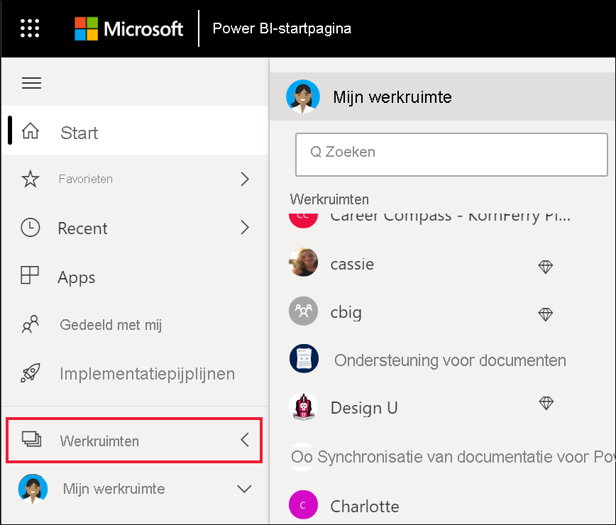

# Samenwerken in werkruimten

 *Werkruimten* worden geplaatst om met collega's samen te werken aan specifieke inhoud. Werkruimten worden door Power BI-*ontwerpers* gemaakt om verzamelingen dashboards en rapporten te bundelen. De ontwerper kan de werkruimte vervolgens delen met collega's. Ontwerpers kunnen een verzameling dashboards en rapporten ook bundelen in een *app* en deze distribueren naar de hele community, naar hun organisatie of naar specifieke personen of groepen. Bepaalde typen apps, die *sjabloon-apps worden genoemd*, maken een werkruimte wanneer de app wordt geïnstalleerd. [Meer informatie over apps](end-user-apps.md). 

 Iedereen die de Power BI-service gebruikt, heeft ook een **Mijn werkruimte**.  Mijn werkruimte is uw persoonlijke sandbox waarin u inhoud voor uzelf kunt maken.

 U kunt uw werkruimten bekijken via **Start** in Power BI of door **Werkruimten** te selecteren in het navigatievenster.

 

## Soorten werkruimten
Alle inhoud waarvan u de eigenaar bent en die u maakt, wordt opgeslagen in **Mijn werkruimte**. Deze werkruimte kunt u beschouwen als een persoonlijke sandbox of persoonlijk werkgebied voor uw eigen inhoud. Bij veel *zakelijke gebruikers* van Power BI blijft **Mijn werkruimte** leeg omdat het maken van nieuwe inhoud niet een van hun taken is. Zoals de naam al zegt, verbruiken *zakelijke gebruikers* gegevens die door anderen zijn gemaakt, en gebruiken ze deze gegevens om zakelijke beslissingen te nemen. Als u wel inhoud maakt, kunt u [de Power BI-artikelen voorontwerpers](../create-reports/index.yml) raadplegen.

**Werkruimten** bevatten alle inhoud voor een specifieke app. Wanneer *ontwerpers* een app maken, bundelen ze alle inhoud die voor het gebruik van de app nodig is. De inhoud kan onder andere bestaan uit dashboards, rapporten en gegevenssets. Niet alle apps bevatten deze drie elementen. Het is mogelijk dat een app slechts één dashboard of drie van elk inhoudselement bevat, of zelfs twintig rapporten. Dit is geheel afhankelijk van wat de *ontwerper* in de app wil opnemen. App-werkruimten die worden gedeeld met *zakelijke gebruikers*, bevatten meestal niet de gegevenssets.

De onderstaande werkruimte over de vijgenverkoop bevat drie rapporten en één dashboard. 

## Machtigingen in de werkruimten

Toegangsmachtigingen bepalen wat u kunt doen in een werkruimte, zodat teams kunnen samenwerken.  Bij het verlenen van toegang tot een nieuwe werkruimte, voegen *ontwerpers* personen of groepen aan een van de volgende werkruimterollen toe: **Viewer**, **Lid**, **Inzender** of **Beheerder**. 

Als *zakelijke gebruiker* van Power BI gebruikt u meestal de rol **Kijker** in werkruimten. Een *ontwerper* kan aan u echter ook de rol **Lid** of **Inzender** toewijzen. Met de rol Kijker kunt u inhoud (dashboards, rapporten en apps) bekijken en gebruiken die door anderen zijn gemaakt en met u zijn gedeeld. En omdat iemand met de rol Kijker geen toegang kan krijgen tot de onderliggende gegevensset, is het een veilige manier om te communiceren met inhoud en hoeft u zich geen zorgen te maken dat de onderliggende gegevens worden gewijzigd.

Zie [Power BI-functies voor zakelijke gebruikers](end-user-features.md) voor een gedetailleerde lijst van wat u als *zakelijke gebruiker* met de rol Kijker kunt doen.

### Machtigingen en rollen voor werkruimten

Dit zijn de mogelijkheden van de vier rollen: Beheerders, leden, inzenders en viewers. Al deze mogelijkheden, met uitzondering van bekijken en ermee werken, vereisen een Power BI Pro-licentie.

[!INCLUDE[power-bi-workspace-roles-table](../includes/power-bi-workspace-roles-table.md)]

## Licenties, werkruimten en capaciteit
Licenties spelen ook een rol bij het bepalen wat u wel en niet kunt doen in een werkruimte. Voor veel functies moet de gebruiker een Power BI *Pro*-licentie hebben of moet de werkruimte zijn opgeslagen in een Premium-capaciteit. 

*Zakelijke gebruikers* werken vaak met een gratis licentie. [Meer informatie over licenties](end-user-license.md). Als de inhoud niet is opgeslagen in een Premium-capaciteit, heeft de zakelijke gebruiker geen toegang.

Als de werkruimte is opgeslagen in een Premium-capaciteit, kunnen *zakelijke gebruikers* de inhoud in die werkruimte bekijken en ermee werken. Werkruimten en apps die zijn opgeslagen in een Premium-capaciteit worden aangegeven met een ruitvormig pictogram.

 Zie [Welke licentie heb ik?](end-user-license.md) voor meer informatie.

## Volgende stappen
* [Apps in Power BI](end-user-apps.md)    

* Vragen? [Misschien dat de Power BI-community het antwoord weet](https://community.powerbi.com/)

