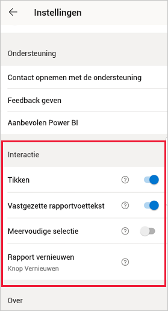
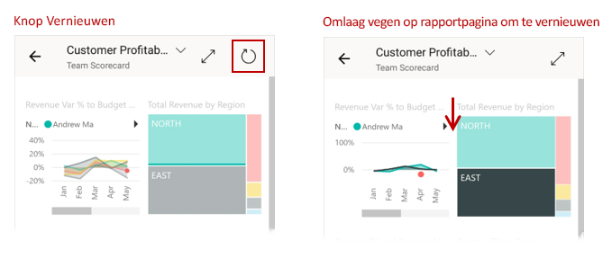
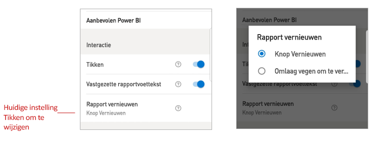

# Interactie-instellingen ten aanzien van rapporten configureren

## Overzicht

De mobiele Power BI-app heeft een aantal configureerbare interactie-instellingen waarmee u kunt bepalen hoe u met uw gegevens omgaat en hoe sommige elementen in de mobiele app van Power BI zich gedragen. In de volgende tabel ziet u de instellingen voor de interactie die momenteel beschikbaar zijn en de apparaten die deze hebben.

|| Android-telefoon | iPhone | Android-tablet  | iPad |
|-|:-:|:-:|:-:|:-:|
| [Interactie van tikken versus dubbeltikken op rapportvisuals](#single-tap) |✔|✔|||
| [Meervoudige selectie versus enkelvoudige selectie van gegevenspunten in rapportvisuals](#multi-select) |✔|✔|✔|✔|
| [Gedokte versus dynamische rapportvoettekst](#docked-report-footer) |✔|✔|||
| [Rapporten vernieuwen via een knop versus de actie Slepen om te vernieuwen](#report-refresh) |✔||||
|

Als u de interactie-instellingen wilt weergeven, tikt u op uw profielafbeelding om het [zijpaneel](./mobile-apps-home-page.md#header) te openen, kiest u **Instellingen** en gaat u naar de sectie **Interactie**.

De interactie-instellingen worden beschreven in de volgende secties.

## Interactie-instellingen

### Tikken
Als u de Power BI Mobile-app downloadt, is deze ingesteld voor interactie met één tik. Dit betekent dat als u in een visual tikt om een actie uit te voeren, zoals het selecteren van een slicer-item, kruislings markeren, klikken op een koppeling of knop, enzovoort, zowel de visual wordt geselecteerd als de gewenste actie wordt uitgevoerd.

Als u wilt, kunt u interactie via tikken uitschakelen. U krijgt dan interactie via dubbeltikken. Bij interactie met dubbeltikken tikt u eerst op een visual om het te selecteren. Daarna tikt u nogmaals op de visual om uw gewenste actie uit te voeren.

### Meervoudige selectie

Met de optie voor meervoudige selectie kunt u meerdere gegevenspunten tegelijk op een rapportpagina selecteren. Als meervoudige selectie is ingeschakeld, wordt elk gegevenspunt waarop u tikt, toegevoegd aan de andere geselecteerde gegevenspunten. De gecombineerde resultaten worden automatisch gemarkeerd in alle visuals op de pagina. Als u op een gegevenspunt tikt wanneer meervoudige selectie is uitgeschakeld, wordt de huidige selectie gewist wanneer u op een ander gegevenspunt tikt.

U heft de selectie van een gegevenspunt op door erop te tikken.

>[!NOTE]
>Meervoudige selectie wordt niet ondersteund in Power BI-visuals.
>
>De modus voor meervoudige selectie wordt ondersteund op Power BI Report Server in de volgende versie van Report Server.

### Vastgezette rapportvoettekst

Met de instelling voor gedokte voettekst van rapporten bepaalt u of de voettekst van rapporten onderaan het rapport gedokt blijft (dat wil zeggen: vast en altijd zichtbaar), of wordt verborgen en opnieuw wordt weergegeven op basis van uw acties in het rapport, zoals schuiven.

Op Android-telefoons is de instelling voor gedokte voettekst van rapporten standaard **ingeschakeld**, wat inhoudt dat de voettekst van rapporten gedokt is en altijd zichtbaar is onderaan het rapport. Schakel de instelling **uit** als u de voorkeur geeft aan een dynamische rapportvoettekst die wordt weergegeven en verdwijnt afhankelijk van uw acties in het rapport.

### Rapport vernieuwen

De instelling voor het vernieuwen van rapporten bepaalt hoe u het vernieuwen van rapporten start. U kunt ervoor kiezen om het rapport te vernieuwen via een knop voor vernieuwen op alle rapportkopteksten of via de actie Slepen om te vernieuwen (licht slepen van boven naar beneden) op de rapportpagina. In de afbeelding hieronder kunt u de twee alternatieven zien. 

Op Android-telefoons wordt de knop Vernieuwen standaard toegevoegd.

Als u de instelling voor het vernieuwen van het rapport wilt wijzigen, gaat u naar het item Rapport vernieuwen in de interactie-instellingen. De huidige instelling wordt weergegeven. Tik op de waarde om een pop-up te openen waarin u een nieuwe waarde kunt kiezen.

## Externe configuratie

Interacties kunnen ook extern worden geconfigureerd door een beheerder met behulp van een MDM-hulpprogramma met een app-configuratiebestand. Op deze manier is het mogelijk om de interactie-ervaring met rapporten in de hele organisatie of voor specifieke groepen gebruikers in de organisatie te standaardiseren. Zie [Interactie configureren met behulp van Mobiele apparaten beheren](./mobile-app-configuration.md) voor meer informatie.

## Volgende stappen
* [Interactie met rapporten](./mobile-reports-in-the-mobile-apps.md#interact-with-reports)
* [Interactie configureren met behulp van Mobiele apparaten beheren](./mobile-app-configuration.md)
