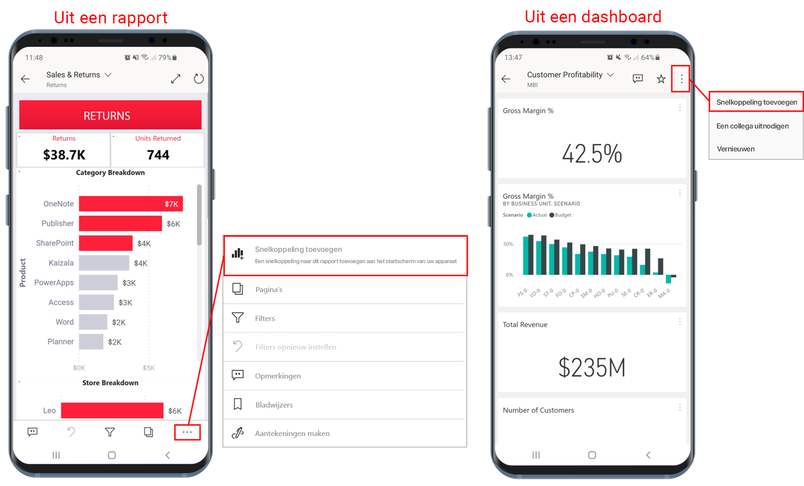
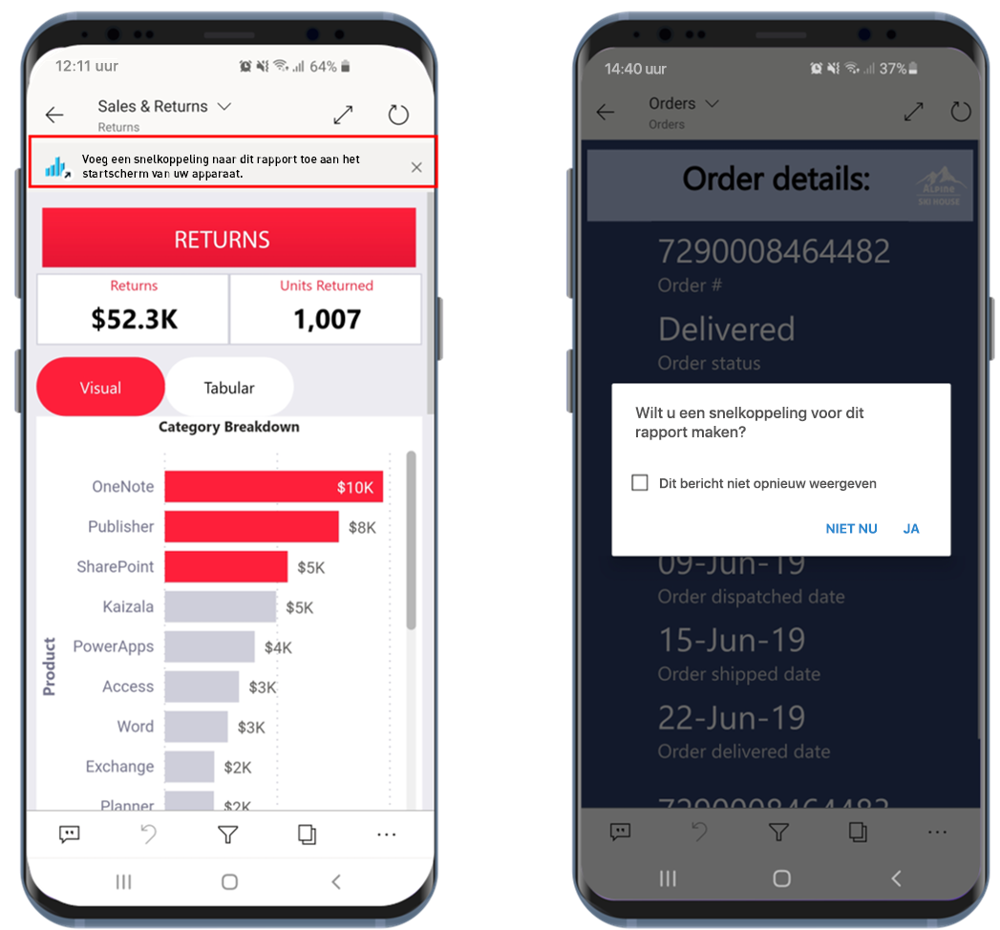
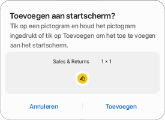
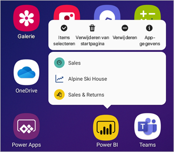

# Snelkoppelingen voor Android-apps gebruiken in de Power BI-app voor Android

Van toepassing op:

|  |  |
|:--- |:--- |
| Android-telefoons |Android-tablets |

De mobiele Power BI-app voor Android biedt twee eenvoudige manieren om rechtstreeks naar de rapporten of dashboards te gaan die u nodig hebt, zonder dat u door de app hoeft te navigeren: **snelkoppelingen op het startscherm van het apparaat** en **snelkoppelingen in het startprogramma voor apps**.
 * **Snelkoppelingen op het startscherm van het apparaat**: U kunt een snelkoppeling naar elk rapport of dashboard maken en deze vastmaken aan het startscherm van uw apparaat. Het rapport of dashboard hoeft zich niet in een van uw werkruimten te bevinden. U kunt ook snelkoppelingen maken naar rapporten en dashboards die zich in apps bevinden, of zelfs naar rapporten of dashboards die zich op een externe tenant (B2B) bevinden.
 * **Snelkoppelingen in het startprogramma voor apps**: U kunt rechtstreeks naar vaak weergegeven rapporten en dashboards gaan door lang te tikken op het pictogram voor het startprogramma voor apps op het startscherm van uw apparaat om het startprogramma voor apps te openen. Een menu voor snelle toegang bevat snelkoppelingen naar drie vaak weergegeven items. Deze items veranderen van tijd tot tijd. In de mobiele Power BI-app wordt bijgehouden wat u vaak weergeeft en worden de snelkoppelingen dienovereenkomstig gewijzigd.

 >[!NOTE]
 >De snelkoppelingen voor Android-apps zijn beschikbaar in Android 8 en hoger.

## Een snelkoppeling naar een rapport of dashboard maken

U kunt snelkoppelingen maken naar elk rapport of dashboard.

1. Tik in het menu Acties op **Meer opties...** en selecteer **Snelkoppeling toevoegen**. Tik in een dashboard op **Snelkoppeling toevoegen** in het menu Acties.

   

   Als in de Power BI-app wordt geregistreerd dat u een item vaak opent, krijgt u het voorstel een snelkoppeling naar het item te maken. Dit gebeurt op twee manieren:
   * In vaak weergegeven rapporten en dashboards wordt de optie **Snelkoppeling toevoegen** weergegeven in een banner wanneer u het item opent.
   * Als u regelmatig een koppeling gebruikt om een rapport op te halen (bijvoorbeeld vanuit een gedeelde e-mail of aantekening), wordt er, als u deze koppeling enkele keren hebt gebruikt, een venster geopend waarin u wordt gevraagd of u een snelkoppeling wilt maken. Met **Ja** opent u het dialoogvenster **Snelkoppeling toevoegen** (zie hieronder) en met **Niet nu** gaat u door naar het item dat u wilde openen.
   
   Deze twee ervaringen worden hieronder geïllustreerd.

   

 1. Er wordt een dialoogvenster **Snelkoppeling toevoegen** geopend met als optie de naam van uw item. U kunt de naam desgewenst bewerken. Wanneer u klaar bent, klikt u op **TOEVOEGEN**.

    

1. U wordt gevraagd om te bevestigen dat u de snelkoppeling wilt toevoegen. Tik op **TOEVOEGEN** om de snelkoppeling toe te voegen aan het startscherm van uw apparaat.

   

   Er wordt een snelkoppelingsdashboard of rapportpictogram toegevoegd aan het startscherm van uw apparaat met de naam die u hebt ingevoerd.

   

## De naam van de snelkoppeling bewerken

Als u de naam van een snelkoppeling vanuit een rapport wilt bewerken, tikt u in het menu Acties op **Meer opties...** en kiest u vervolgens **De naam van de snelkoppeling bewerken**. Tik in een dashboard op **Snelkoppeling toevoegen**. Het dialoogvenster **De naam van de snelkoppeling bewerken** wordt weergegeven.

 

## Het startprogramma voor mobiele apps van Power BI gebruiken voor toegang tot vaak weergegeven inhoud

U kunt het startprogramma voor mobiele apps van Power BI gebruiken om rechtstreeks toegang te krijgen tot items die vaak worden gebruikt.

Tik lang op het startprogramma voor apps om een menu voor snelle toegang tot vaak weergegeven items weer te geven. Tik vervolgens op een snelkoppeling om het gewenste item te openen.

U kunt een permanente snelkoppeling maken naar een van de items in de lijst door het gewenste snelkoppelingspictogram naar het startscherm van uw apparaat te slepen.

## Volgende stappen
* [Uw inhoud zoeken en openen met Google Zoeken](mobile-app-find-access-google-search.md)
* Als u iOS gebruikt en op zoek bent naar Siri-snelkoppelingen, raadpleegt u [Siri-snelkoppelingen gebruiken in de mobiele Power BI-app voor iOS](mobile-apps-ios-siri-shortcuts.md).
* [Favorieten in de mobiele Power BI-apps](mobile-apps-favorites.md)
