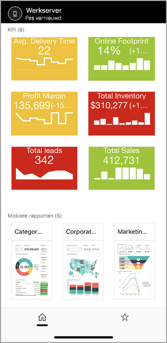
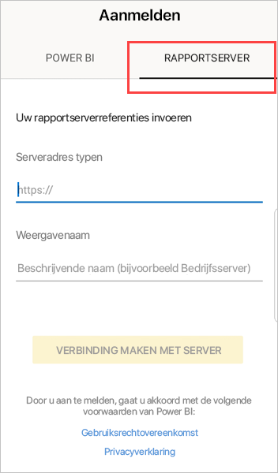
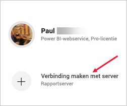
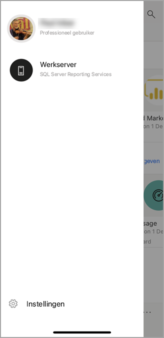
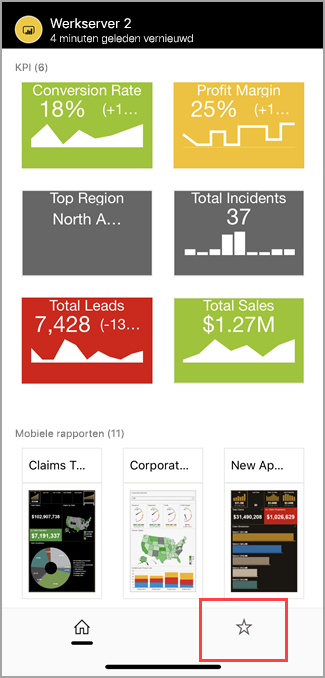
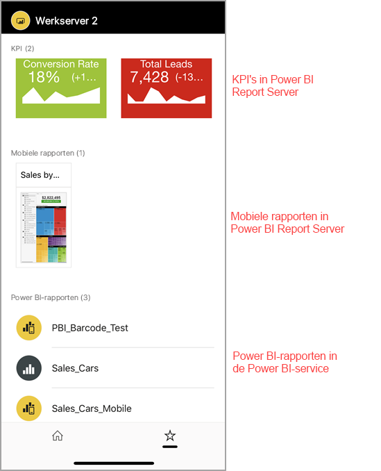

# On-premises rapportserverrapporten en KPI's weergeven in de mobiele Power BI-apps

Met de mobiele Power BI-apps hebt u live en mobiel via aanraking toegang tot uw on-premises bedrijfsgegevens in Power BI Report Server en SQL Server 2016 Reporting Services (SSRS).

Van toepassing op:

|  |  |  |  |
|:--- |:--- |:--- |:--- |
| iPhones |iPads |Android-telefoons |Android-tablets |

## Om te beginnen
**In de mobiele apps geeft u Power BI-inhoud weer. U maakt de inhoud daar niet.**

* U en andere rapportmakers in uw organisatie [maken Power BI-rapporten met Power BI Desktop. Vervolgens publiceert u deze naar de webportal van Power BI Report Server](../../report-server/quickstart-create-powerbi-report.md). 
* U kunt [rechtstreeks in de webportal KPI's maken](/sql/reporting-services/working-with-kpis-in-reporting-services), deze ordenen in mappen en uw favorieten markeren, zodat u ze eenvoudig kunt terugvinden. 
* U kunt [mobiele Reporting Services-rapporten maken](/sql/reporting-services/mobile-reports/create-mobile-reports-with-sql-server-mobile-report-publisher) met SQL Server 2016 Enterprise Edition Mobile Report Publisher en deze publiceren naar de [Reporting Services-webportal](/sql/reporting-services/web-portal-ssrs-native-mode).  

Vervolgens kunt u in de mobiele Power BI-apps verbinding maken met maximaal vijf rapportservers om de Power BI-rapporten en -KPI's weer te geven, geordend in mappen of verzameld als favorieten. 

## De voorbeelden in de mobiele apps verkennen zonder serververbinding
Ook als u geen toegang hebt tot een Reporting Services-webportal, kunt u de functies van mobiele Reporting Services-rapporten en -KPI's bekijken. 

1. Tik op uw profielafbeelding in de linkerbovenhoek en tik vervolgens op **Instellingen** in het deelvenster Accounts dat wordt weergegeven.

2. Tik op de instellingenpagina die wordt geopend op **Reporting Services-voorbeelden** en blader om de voorbeeld-KPI's en de voorbeelden van mobiele rapporten te gebruiken.
   
   

## Verbinding maken met een on-premises rapportserver
Met de mobiele Power BI-apps kunt u on-premises Power BI-rapporten, mobiele Reporting Services-rapporten en KPI's weergeven in de mobiele Power BI-apps. 

1. Open de Power BI-app op uw mobiele apparaat.
2. Als u zich nog niet hebt aangemeld bij Power BI, tikt u op **Report Server**.
   
   
   
   Als u zich al bij de Power BI-app hebt aangemeld, tikt u op uw profielafbeelding in de linkerbovenhoek en vervolgens op **Instellingen** in het deelvenster Accounts dat wordt weergegeven.
3. Tik op de instellingenpagina die wordt geopend op **Verbinding maken met de server**.
   
    

    De mobiele app moet op een bepaalde manier toegang hebben tot de server. Dit kan op een aantal manieren worden verkregen:
     * Het is het gemakkelijkst door hetzelfde netwerk/VPN te gebruiken.
     * Het is mogelijk een Web Application Proxy te gebruiken om verbinding te maken van buiten de organisatie. Zie [OAuth gebruiken om verbinding met Reporting Services te maken](mobile-oauth-ssrs.md) voor meer informatie.
     * Open een verbinding (poort) in de firewall.

4. Vul het serveradres in en geef de server een beschrijvende naam, indien gewenst. Gebruik deze notatie voor het adres van de server:
   
     `https://<servername>/reports`
   
     OF
   
     `https://<servername>/reports`
   
   Voeg **http** of **https** toe aan het begin van de verbindingsreeks.
   
    
5. Nadat u het serveradres en de optionele beschrijvende naam hebt ingevoerd, tikt u op **Verbinding maken** en vult u uw gebruikersnaam en wachtwoord in wanneer u hierom wordt gevraagd.
6. De server (in dit voorbeeld 'Werkserver' genoemd) wordt nu weergegeven in het deelvenster Accounts.
   
   

## Verbinding maken met een on-premises rapportserver in iOS of Android

Als u Power BI bekijkt in de mobiele iOS- of Android-app, heeft uw IT-beheerder mogelijk een app-configuratiebeleid gedefinieerd. Als dit het geval is, kunt u gestroomlijnd verbinding maken met de rapportserver en hoeft u niet zoveel informatie op te geven wanneer u verbinding maakt met een rapportserver. 

1. U ziet een bericht dat uw mobiele app is geconfigureerd met een rapportserver. Tik op **Aanmelden**.

    

2.  Op de pagina **Verbinding maken met server** zijn de details over de rapportserver al ingevuld. Tik op **Verbinding maken**.

    

3. Voer een wachtwoord in om een verificatie uit te voeren en tik vervolgens op **Aanmelden**. 

    

U kunt nu KPI's en Power BI-rapporten zien en gebruiken die zijn opgeslagen op de rapportserver.

## Power BI-rapporten en -KPI's weergeven in de Power BI-app
Power BI-rapporten en mobiele Reporting Services-rapporten worden weergegeven in de mappen waarin ze zijn opgeslagen op de Reporting Services-webportal. 

* Tik op een Power BI-rapport . Het rapport wordt geopend in de liggende stand. U kunt met het rapport werken in de Power BI-app.

    > [!NOTE]
  > In- en uitzoomen is momenteel niet ingeschakeld in Power BI-rapporten op een Power BI Report Server.
  
    
* In Power BI Desktop kunnen rapporteigenaren [een rapport optimaliseren](../../create-reports/desktop-create-phone-report.md) voor de mobiele Power BI-apps. Geoptimaliseerde rapporten hebben een speciaal pictogram, , en een speciale indeling.
  
    
* Tik op een KPI om deze weer te geven in de focusmodus.
  
    

## Uw favoriete KPI's en rapporten weergeven
U kunt KPI's en rapporten op het webportal markeren als favorieten en ze vervolgens weergeven in één handige map op uw mobiele apparaat, samen met uw favoriete Power BI-dashboards en -rapporten.

* Tik op **Favorieten** op de navigatiebalk.
  
   
  
   Uw favoriete KPI's en rapporten van de webportal bevinden zich allemaal op deze pagina, samen met de Power BI-dashboards in de Power BI-service:
  
   

## Een verbinding met een rapportserver verwijderen
1. Open het deelvenster Accounts en tik op **Instellingen**.
2. Tik op de naam van de server waarmee u geen verbinding wilt maken.
3. Tik op **Server verwijderen**.

## Volgende stappen
* [Wat is Power BI?](../../fundamentals/power-bi-overview.md)  
* Vragen? [Misschien dat de community van Power BI het antwoord weet](https://community.powerbi.com/).