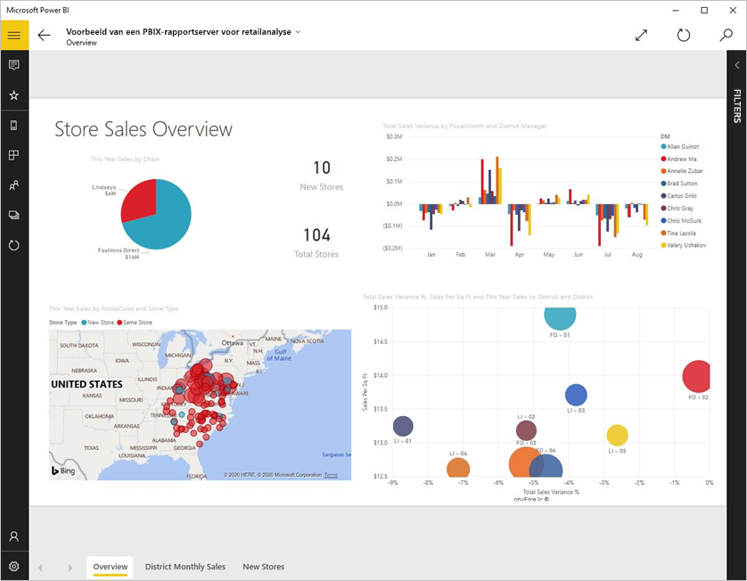
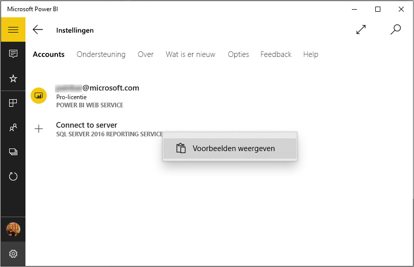
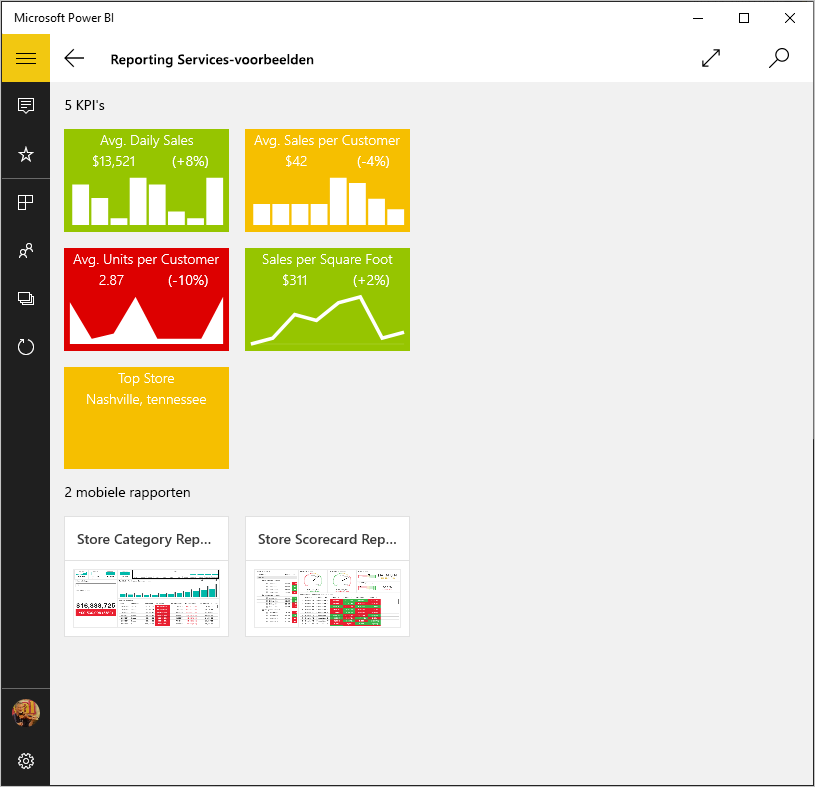
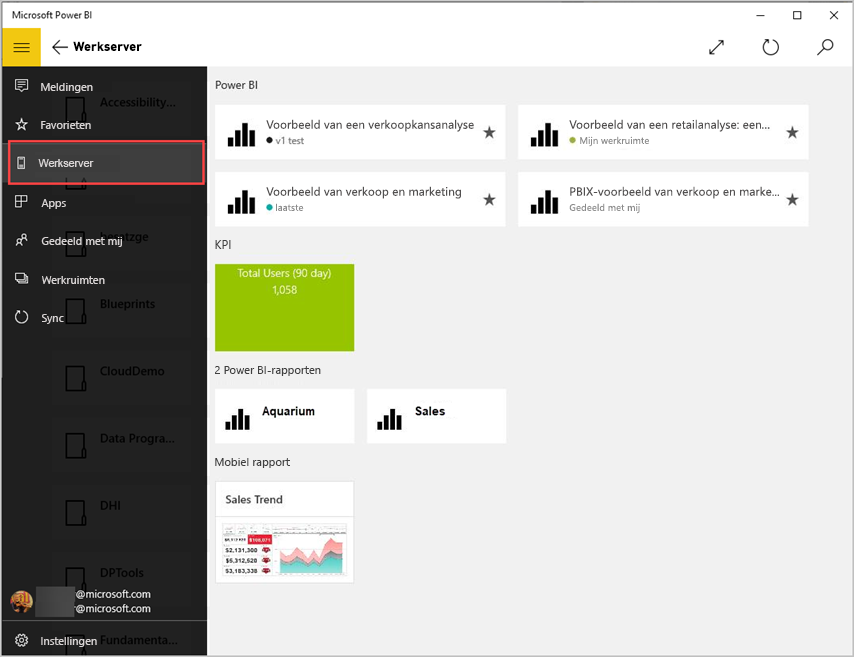
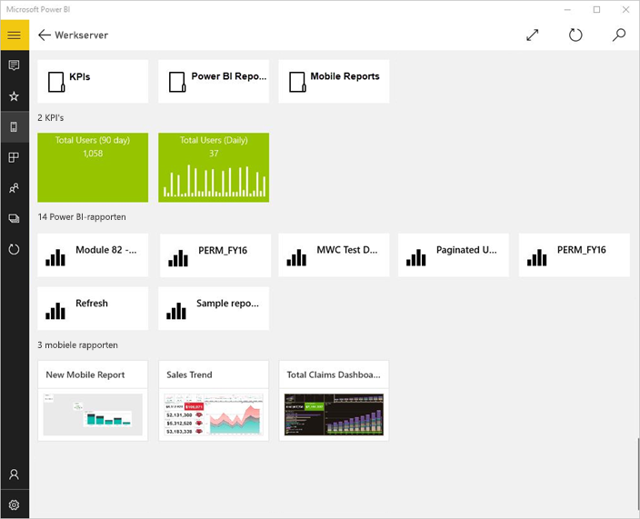
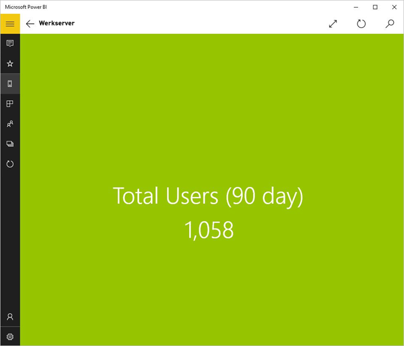
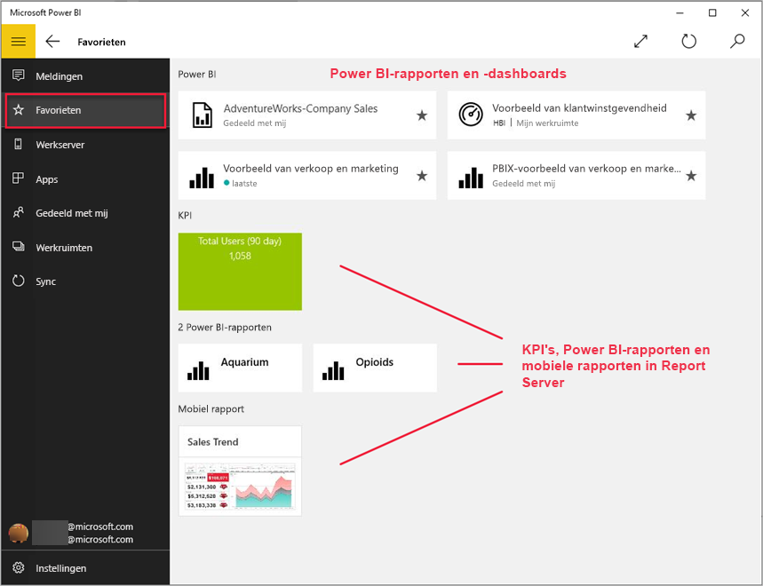
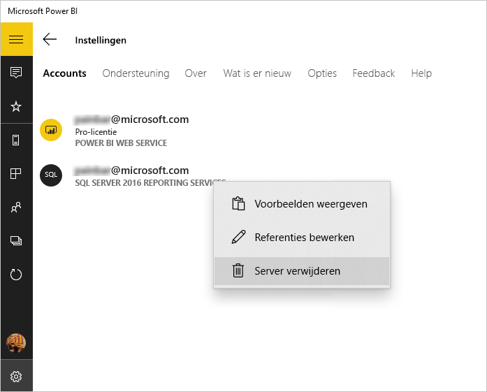

# On-premises rapporten en KPI's weergeven in de Power BI Windows-app
De Power BI-app voor Windows 10 biedt op uw mobiele apparaat via aanraking live toegang tot uw belangrijke on-premises zakelijke informatie in SQL Server 2016 Reporting Services. 

## Om te beginnen
[U kunt mobiele rapporten van Reporting Services maken](https://msdn.microsoft.com/library/mt652547.aspx) met SQL Server 2016 Enterprise Edition Mobile Report Publisher en deze publiceren naar de [Reporting Services-webportal](https://msdn.microsoft.com/library/mt637133.aspx). Maak KPI's rechtstreeks in de webportal. Orden ze in mappen en markeer uw favorieten, zodat u ze gemakkelijk kunt terugvinden. 

Bekijk vervolgens in de Power BI-app voor Windows 10 de KPI's, mobiele rapporten en Power BI-rapporten, geordend in mappen of verzameld als favorieten. 

> [!NOTE]
> Uw apparaat moet Windows 10 gebruiken. De app werkt het beste op apparaten met ten minste 1 GB RAM en 8 GB interne opslag.
> 
> 

## Voorbeelden verkennen zonder een SQL Server 2016 Reporting Services-server
Ook als u geen toegang hebt tot een Reporting Services-webportal, kunt u de functies van mobiele rapporten van Reporting Services bekijken.

1. Open de Power BI-app op uw Windows 10-apparaat.
2. Tik op de algemene navigatieknop  in de linkerbovenhoek.
3. Tik op het pictogram **Instellingen**, klik met de rechtermuisknop op **Verbinding maken met server** (of tik erop en houd vast) en tik op **Voorbeelden weergeven**.
   
   
4. Open de map Retail Reports of Sales Reports om die KPI's en mobiele rapporten te verkennen.
   
   

Blader in de voorbeelden en voer bewerkingen uit met KPI's en mobiele rapporten.

## Verbinding maken met een Reporting Services-rapportserver
1. Tik onderaan het navigatievenster op **Instellingen** 
2. Tik op **Verbinding maken met server**.
3. Vul het adres van de server en uw gebruikersnaam en wachtwoord in. Gebruik deze notatie voor het adres van de server:
   
     `https://<servername>/reports` OF  `https://<servername>/reports`
   
   > [!NOTE]
   > Voeg **http** of **https** toe aan het begin van de verbindingsreeks.
   > 
   > 
   
    Tik op **Geavanceerde optie** om de server desgewenst een naam te geven.
4. Tik op het vinkje om verbinding te maken. 
   
   Nu ziet u de server in het navigatievenster.
   
   
   
   >[!TIP]
   >Tik op elk moment op de algemene navigatieknop  om te schakelen tussen mobiele rapporten van Reporting Services en uw dashboards in de Power BI-service. 
   > 

## KPI's en mobiele rapporten van Reporting Services weergeven in de Power BI-app
KPI's in Microsoft SQL Server Reporting Services, mobiele rapporten en Power BI-rapporten (preview) worden weergegeven in de mappen waarin ze zijn opgeslagen in de Reporting Services-webportal.

* Tik op een KPI om deze te zien in de focusmodus.
  
    
* Tik op een mobiel rapport om dit te openen en te gebruiken in de Power BI-app.
  
    

## Uw favoriete KPI's en rapporten weergeven
U kunt KPI's, mobiele rapporten en Power BI-rapporten in uw Microsoft SQL Server Reporting Services-webportal markeren als favorieten en ze vervolgens in één handige map op uw Windows 10-apparaat weergeven, samen met uw favoriete Power BI-dashboards en -rapporten.

* Tik op **Favorieten**.
  
   
  
   Uw favorieten uit de webportal staan allemaal op deze pagina.
  
Lees meer over [favorieten in de mobiele Power BI-apps](mobile-apps-favorites.md).

## Een verbinding met een rapportserver verwijderen
Vanuit uw mobiele Power BI-app kunt u verbinding maken met slechts één rapportserver tegelijk. Als u verbinding wilt maken met een andere server, moet u de huidige verbinding verbreken.

1. Tik onderaan het navigatievenster op **Instellingen** .
2. Tik op de naam van de server waarmee u de verbinding wilt verbreken en houd vast.
3. Tik op **Server verwijderen**.
   
    

## Mobiele rapporten en KPI's van Reporting Services maken
U maakt KPI's en mobiele rapporten van Reporting Services niet in de mobiele Power BI-app. U maakt ze in SQL Server Mobile Report Publisher en een SQL Server 2016 Reporting Services-webportal.

* [Uw eigen mobiele rapporten van Reporting Services maken](https://msdn.microsoft.com/library/mt652547.aspx) en deze publiceren naar een Reporting Services-webportal.
* [KPI's maken op een Reporting Services-webportal](https://msdn.microsoft.com/library/mt683632.aspx)

## Volgende stappen
* [Aan de slag met de mobiele Power BI-app voor Windows 10](mobile-windows-10-phone-app-get-started.md)  
* [Wat is Power BI?](../../fundamentals/power-bi-overview.md)  
* Vragen? [Misschien dat de Power BI-community het antwoord weet](https://community.powerbi.com/)

