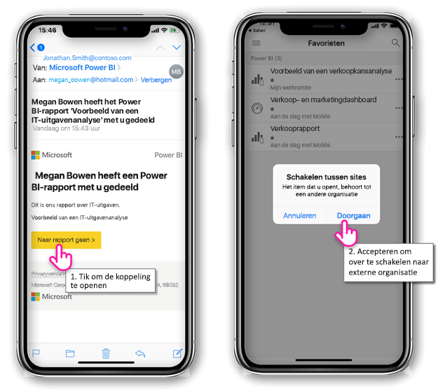
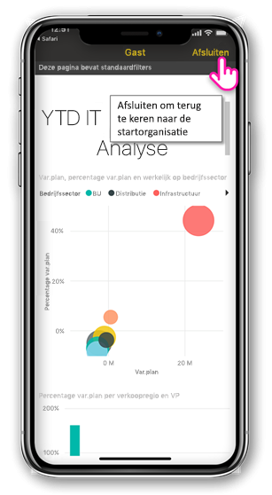
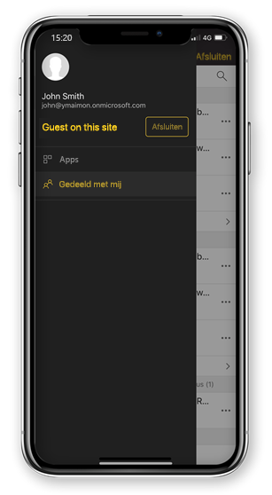

# Power BI-inhoud bekijken die met u is gedeeld vanuit een externe organisatie

Power BI kan worden geïntegreerd met Azure actieve Directory Business-to-business (Azure AD B2B) voor een veilige distributie van Power BI-inhoud naar gastgebruikers buiten uw organisatie. En externe gastgebruikers kunnen de mobiele Power BI-app gebruiken voor toegang tot die met hun gedeelde Power BI-inhoud. 

Van toepassing op:

|  |  |  |  |
|:--- |:--- |:--- |:--- |
| iPhones |iPads |Android-telefoons |Android-tablets |

## Toegang tot gedeelde inhoud

**Eerst moet iemand een item met u delen vanuit een externe organisatie.** Wanneer iemand [een item met u deelt](../../service-share-dashboards.md), ofwel vanuit dezelfde organisatie of vanuit een externe organisatie, ontvangt u een e-mail met een koppeling naar dat gedeelde item. Als u die koppeling op uw mobiele apparaat volgt, wordt de mobiele Power BI-app geopend. Als de app herkent dat het item is gedeeld vanuit een externe organisatie, maakt de app opnieuw verbinding met die organisatie met uw identiteit. Vervolgens worden alle items geladen die vanuit die organisatie met u zijn gedeeld.

> [!NOTE]
> Als dit het eerste item is dat met u als een externe gastgebruiker is gedeeld, moet u de uitnodiging in een browser claimen. U kunt de uitnodiging niet claimen in de Power BI-app.

Zolang u bent verbonden met een externe organisatie, wordt een zwarte header in de app weergegeven. Deze header geeft aan dat u niet verbonden bent met uw thuisorganisatie. Als u opnieuw verbinding wilt maken met uw thuisorganisatie, moet u de gastmodus afsluiten.

Zelfs als u een koppeling naar Power BI-artefacten nodig hebt om verbinding te maken met een externe organisatie, kunt u, zodra uw app is omgeschakeld, toegang krijgen tot alle items die met u zijn gedeeld (niet alleen het item dat u vanuit de e-mail hebt geopend). Als u alle items wilt weergeven waartoe u toegang hebt in de externe organisatie, gaat u naar het app-menu en selecteert u **Gedeeld met mij**. Onder **Apps** vindt u apps die u ook kunt gebruiken.

## Beperkingen

- Gebruikers moeten over een actief Power BI-account en een starttenant beschikken.
- Gebruikers moeten bij hun Power BI-starttenant zijn aangemeld voordat ze toegang kunnen krijgen tot de inhoud die met ze is gedeeld vanuit een externe tenant.
- Voorwaardelijke toegang en andere Intune-beleidsregels worden niet ondersteund in Azure AD B2B en in Power BI Mobile. Dat betekent dat de app de beleidsregels van de thuisorganisatie afdwingt, als deze bestaan.
- Pushmeldingen worden alleen vanuit de thuisorganisatiesite ontvangen (zelfs wanneer de gebruiker als gast met een externe organisatie is verbonden). Als u de melding opent, wordt de app opnieuw verbonden met de thuisorganisatiesite van de gebruiker.
- Als de gebruiker de app uitschakelt en opnieuw opent, maakt de app automatisch verbinding met de thuisorganisatie van de gebruiker.
- Wanneer er een verbinding met een externe organisatie is gemaakt, zijn een aantal acties uitgeschakeld: favoriete items, gegevenswaarschuwingen, opmerkingen en delen.
- Offlinegegevens zijn niet beschikbaar wanneer u met een externe organisatie bent verbonden.
- Als u de bedrijfsportal-app hebt geïnstalleerd op uw apparaat, dan moet uw apparaat worden ingeschreven.
