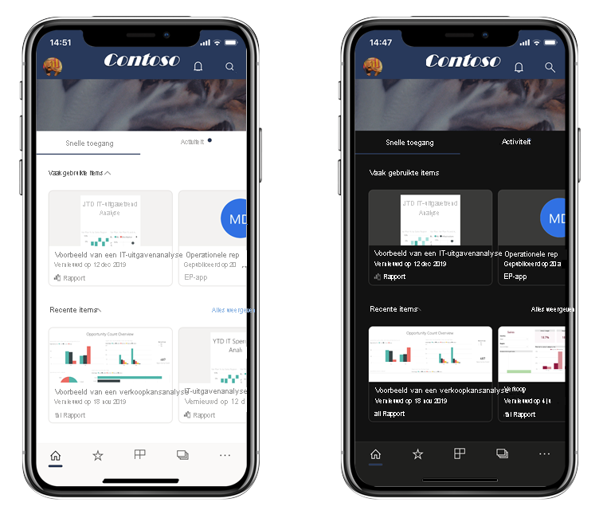
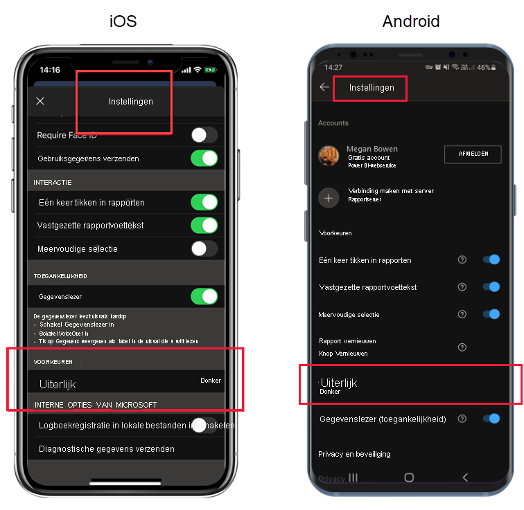

# Donkere modus

Voor de afzonderlijke weergave-voorkeuren ondersteunt de mobiele app van Power BI voor iOS zowel de modus licht als donker scherm. De donkere modus vermindert de helderheid van het scherm, waardoor u uw inhoud gemakkelijker kunt zien.

 In de donkere modus worden alle app-ervaringen weergegeven met een donkere achtergrond. Power BI-inhoud wordt echter niet beïnvloed. Uw rapporten, dashboards en apps worden altijd weergegeven zoals de ontwerpers het bedoeld hebben.
 
 Uw mobiele Power BI-app gebruikt standaard de instellingen van uw apparaat om te bepalen welk schermweergave wordt weergegeven. Als uw apparaat is geconfigureerd voor de donkere modus, wordt de app in de donkere modus weergegeven.
 
 Als u wilt schakelen tussen de lichte en donkere modus, of als u wilt dat apparaatinstellingen de modus bepalen, gaat u naar **Instellingen > Voorkeuren** en tikt u op **Uiterlijk** om de gewenste modus te kiezen.

