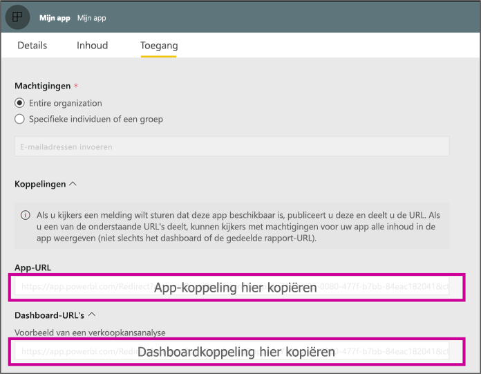

# <a name="create-a-link-to-a-specific-location-in-the-power-bi-mobile-apps"></a>Maak een koppeling naar een specifieke locatie in de Power BI - Mobiel-apps
U kunt koppelingen gebruiken om rechtstreeks toegang te krijgen tot specifieke items in Power BI: Rapport, Dashboard en Tegel.

Er zijn hoofdzakelijk twee scenario's voor het gebruik van koppelingen in Power BI - Mobiel: 

* Power BI kan **van buiten de app** worden geopend, waarna u bij specifieke inhoud belandt (een rpaport/dashboard/app). Dit is meestal een integratiescenario, waarin u Power BI - Mobiel wilt openen vanuit een andere app. 
* Door te **navigeren** in Power BI. Dit is meestal als u een aangepaste navigatie wilt maken in Power BI.


## <a name="use-links-from-outside-of-power-bi"></a>Koppelingen van buiten Power BI gebruiken
Als u een koppeling van buiten de Power BI-app gebruikt, moet u zorgen dat deze door de app zal worden geopend en de gebruiker aanbieden de app te installeren als deze nog niet op het apparaat is geïnstalleerd. We hebben een speciale koppelingsindeling gemaakt om precies dat te ondersteunen. Deze koppelingsindeling zorgt dat het apparaat de app gebruikt om de koppeling te openen en dat de gebruiker wordt aangeboden naar de store te gaan en de app te downloaden als deze nog niet op het apparaat is geïnstalleerd.

De koppeling moet beginnen met het volgende  
```html
https://app.powerbi.com/Redirect?[**QUERYPARAMS**]
```

> [!IMPORTANT]
> Als uw inhoud wordt gehost in een speciaal datacentrum, zoals Overheid, China, enz. Deze koppeling moet beginnen met het juiste Power BI-adres, zoals `app.powerbigov.us` of `app.powerbi.cn`.   
>


De **QUERY-PARAMETERS** zijn:
* **action** (verplicht) = OpenApp / OpenDashboard / OpenTile / OpenReport
* **appId** = als u een rapport of dashboard wilt openen dat onderdeel is van een app 
* **groupObjectId** = als u een rapport of dashboard wilt openen dat onderdeel is van een werkruimte (maar niet mijn werkruimte)
* **dashboardObjectId** = id van dashboardobject (als de actie OpenDashboard of OpenTile is)
* **reportObjectId** = id van rapportobject (als de actie OpenReport is)
* **tileObjectId** = id van tegelobject (als de actie OpenTile is)
* **reportPage** = als u een specifiek deel van een rapport wilt openen (als de actie OpenReport is)
* **ctid** = id van itemorganisatie (relevant voor B2B-scenario. Deze kan worden weggelaten als het item tot de organisatie van de gebruiker behoort.)

**Voorbeelden:**

* Koppeling om app te openen 
  ```html
  https://app.powerbi.com/Redirect?action=OpenApp&appId=appidguid&ctid=organizationid
  ```

* Een dashboard openen dat onderdeel is van een app 
  ```html
  https://app.powerbi.com/Redirect?action=OpenDashboard&appId=**appidguid**&dashboardObjectId=**dashboardidguid**&ctid=**organizationid**
  ```

* Een rapport openen dat onderdeel is van een werkruimte
  ```html
  https://app.powerbi.com/Redirect?Action=OpenReport&reportObjectId=**reportidguid**&groupObjectId=**groupidguid**&reportPage=**ReportSectionName**
  ```

### <a name="how-to-get-the-right-link-format"></a>De juiste indeling van de koppeling verkrijgen

#### <a name="links-of-apps-and-items-in-app"></a>Koppelingen naar apps en items in een app

De gemakkelijkste manier om een koppeling te verkrijgen voor **apps en rapporten en dashboards die onderdeel zijn van een app** is door naar de werkruimte te gaan en ‘App bijwerken’ te kiezen. Hiermee wordt de ervaring ‘App publiceren’ geopend. Op het tabblad ‘Toegang’ vindt u een sectie **Koppelingen**. Wanneer u die sectie uitvouwt, ziet u de lijst van de app en alle inhoudskoppelingen die kunnen worden gebruikt om rechtstreeks toegang te krijgen.



#### <a name="links-of-items-not-in-app"></a>Koppelingen naar items die niet in de app zitten 

Voor rapporten en dashboards die geen onderdeel van een app zijn, moet u de id’s extraheren uit de URL van het item.

Ga bijvoorbeeld naar het specifieke dashboard in de Power BI-service om de id van 36 tekens voor het **dashboard**object te vinden 

```html
https://app.powerbi.com/groups/me/dashboards/**dashboard guid comes here**?ctid=**organization id comes here**`
```

Ga naar het specifiek rapport in de Power BI-service om de id van 36 tekens voor het **rapport**object op te halen.
Dit is een voorbeeld van een rapport uit 'Mijn werkruimte'

```html
https://app.powerbi.com/groups/me/reports/**report guid comes here**/ReportSection3?ctid=**organization id comes here**`
```
De bovenstaande URL bevat ook een specifieke rapportpagina **‘ReportSection3’** .

Dit is een voorbeeld van een rapport uit een werkruimte (niet Mijn werkruimte)

```html
https://app.powerbi.com/groups/**groupid comes here**/reports/**reportid comes here**/ReportSection1?ctid=**organizationid comes here**
```

## <a name="use-links-inside-power-bi"></a>Koppelingen gebruiken in Power BI

Koppelingen in Power BI werken net zo in de mobiele apps als in de Power BI-service.

Als u aan uw rapport een koppeling wilt toevoegen die naar een ander Power BI-item verwijst, kunt u gewoon de URL van dat item kopiëren in de adresbalk van de browser. Lees meer over het [toevoegen van een hyperlink aan een tekstvak in een rapport](https://docs.microsoft.com/power-bi/service-add-hyperlink-to-text-box).

## <a name="use-report-url-with-filter"></a>Rapport-URL met filter gebruiken
Power BI - Mobiel-apps ondersteunen, net als Power BI-service, rapport-URL’s die een parameter voor een filterquery bevatten. U kunt een rapport in de Power BI - Mobiel-app openen en deze filteren op een specifieke status. Deze URL opent bijvoorbeeld het verkooprapport en filtert dit op Gebied

```html
https://app.powerbi.com/groups/me/reports/**report guid comes here**/ReportSection3?ctid=**organization id comes here**&filter=Store/Territory eq 'NC'
```

Lees meer over [het opstellen van queryparameters om rapporten te filteren](https://docs.microsoft.com/power-bi/service-url-filters).

## <a name="next-steps"></a>Volgende stappen
Op basis van uw feedback kunnen we bepalen wat in de toekomst moet worden geïmplementeerd. Vergeet dus niet op andere functies te stemmen die u graag in de mobiele Power BI-apps zou willen zien. 

* [Power BI-apps voor mobiele apparaten](mobile-apps-for-mobile-devices.md)
* Volg @MSPowerBI op Twitter
* Deelnemen aan conversaties in de [Power BI-community](https://community.powerbi.com/)
* [Wat is Power BI?](../../fundamentals/power-bi-overview.md)

