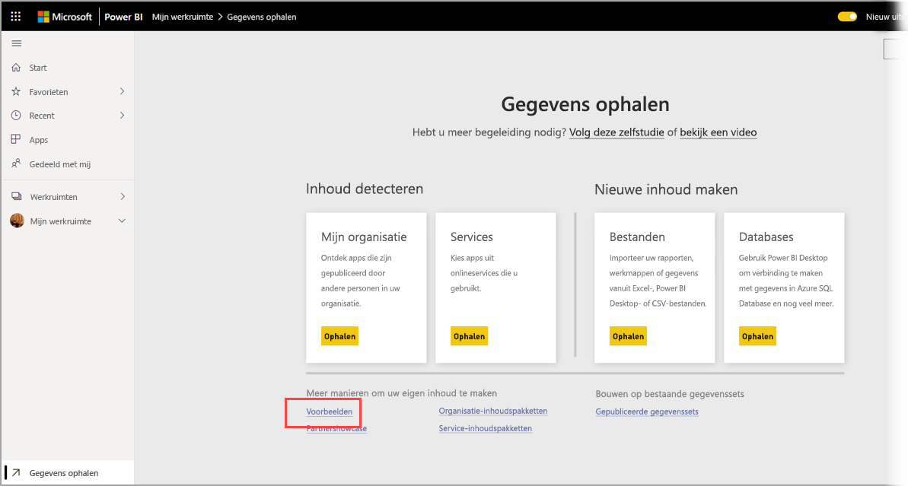

# Voorbeelden downloaden naar Mijn werkruimte in de Power BI-service

In sommige documentatie voor mobiele apps die hier beschikbaar is, wordt gebruik gemaakt van voorbeeldgegevens die worden weergegeven. Als u dit op uw apparaat wilt toepassen, kunt u de voorbeeldgegevens downloaden naar uw Power BI-serviceaccount, waar u deze vervolgens kunt weergeven vanuit de mobiele Power BI-app op uw apparaat. In dit artikel wordt beschreven hoe u de voorbeeldgegevens downloadt naar uw Power BI-serviceaccount. 

## Vereisten

U moet over een Power BI-serviceaccount beschikken om gegevens te kunnen downloaden. Als u zich nog niet hebt geregistreerd voor Power BI, kunt u zich hier [aanmelden voor een gratis proefversie](https://app.powerbi.com/signupredirect?pbi_source=web) voordat u begint.

## Een voorbeeld downloaden

1. Open de [Power BI-service](https://app.powerbi.com) in uw browser en meld u aan.

2. Selecteer **Gegevens ophalen** in de linkerbenedenhoek van het navigatiedeelvenster. Als het navigatiedeelvenster verborgen is en de koppeling Gegevens ophalen niet wordt weergegeven, geeft u het deelvenster weer door op het pictogram voor het weergeven/verbergen van het navigatiedeelvenster  te klikken.  
   
    

3. Selecteer de koppeling **Voorbeelden** op de pagina Gegevens ophalen.
   
   

4. Selecteer een voorbeeld dat u wilt downloaden. Kies het voorbeeld dat u voor de zelfstudie, snelstartgids of het artikel moet gebruiken. Nadat u dit hebt geselecteerd, klikt u op **Verbinding maken**.
  
   
   
5. Het voorbeeld wordt geïmporteerd in Power BI en er wordt een nieuw dashboard, een nieuw rapport en een nieuwe gegevensset aan Mijn werkruimte toegevoegd.
   
   
  
U kunt de voorbeelden nu weergeven op uw mobiele apparaat.

## Volgende stappen
* [Snelstartgids](mobile-apps-quickstart-view-dashboard-report.md)
* Vragen? Raadpleeg het [gedeelte over mobiele apps in de Power BI-community](https://go.microsoft.com/fwlink/?linkid=839277)
