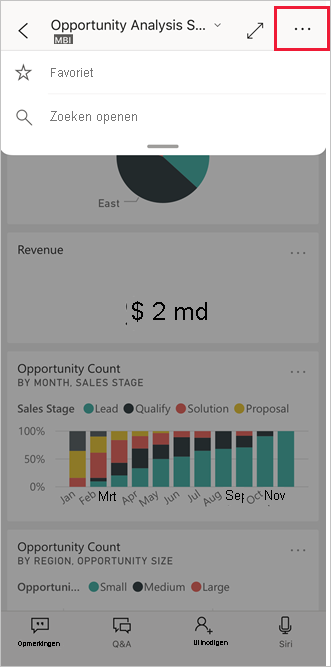
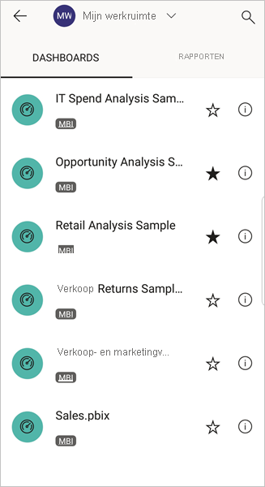

# Favorieten maken en bekijken in de mobiele Power BI-apps
Van toepassing op:

|  |  |  |  |  |
|:--- |:--- |:--- |:--- |:--- |
| iPhones |iPads |Android-telefoons |Android-tablets |Windows 10-apparaten |

>[!NOTE]
>Power BI-ondersteuning voor mobiele apps voor **telefoons met Windows 10 Mobile** wordt stopgezet op 16 maart 2021. [Meer informatie](/legal/powerbi/powerbi-mobile/power-bi-mobile-app-end-of-support-for-windows-phones)

Meer informatie over het maken en bekijken van uw favoriete Power BI-dashboards, -rapporten en -apps, samen met uw favoriete KPI's en rapporten van on-premises Power BI Report Server en Reporting Services in de mobiele apps.

Wanneer u iets aan uw favorieten toevoegt in de mobiele Power BI-apps, ziet u deze op de pagina Favorieten in de [Power BI-service](https://powerbi.com) en op al uw mobiele apparaten.

Als u de pagina Favorieten wilt weergeven, tikt u op het pictogram Favorieten op de navigatiebalk:

U kunt ook [Power BI-dashboards en -apps markeren als favoriet in de Power BI-service](../end-user-favorite.md). Deze ziet u dan op de pagina Favorieten in de mobiele app.

U kunt KPI's en rapporten markeren als favorieten op een Power BI Report Server of de Reporting Services-webportal en ze vervolgens weergeven in één handige map op uw mobiele apparaat, samen met uw favoriete Power BI-dashboards.

## Een app markeren als favoriet
1. Tik op het pictogram Apps op de onderste navigatiebalk om de pagina Apps weer te geven.

2. Tik op een iOS-apparaat op de knop Info rechts van de naam van de app die u als favoriet wilt toevoegen. Op Android-apparaten wordt in plaats van de knop Info de optie Meer opties (...) weergegeven. 

3. Tik in de sectie met app-gegevens op de ster.
   
    
   
    De app wordt nu weergegeven op de pagina Favorieten, samen met uw andere favoriete dashboards, rapporten en apps.
   
## Een dashboard of rapport aan uw favorieten toevoegen in mobiele iOS- en Windows 10-apps
U kunt een Power BI-dashboard of -rapport aan uw favorieten toevoegen vanuit de lijst met dashboards of rapporten, of vanuit het dashboard of rapport zelf.

* Tik in de lijst met dashboards of rapporten in de mobiele app op de lege ster naast de naam . De ster wordt zwart .
  
    
* Als u zich in een dashboard of rapport bevindt, tikt u op **Meer opties** (...) in de kop en tikt u vervolgens op de lege ster  in het menu dat wordt weergegeven. De ster wordt zwart .
  
    

## Een dashboard of rapport toevoegen aan uw favorieten in mobiele Android-apps
U kunt een dashboard of rapport aan uw favorieten toevoegen vanuit de lijst met dashboards of rapporten, of vanuit het dashboard of rapport zelf.

* Tik in de lijst met dashboards of rapporten in de mobiele app op de ster naast de naam van het rapport of het dashboard om het item als favoriet te selecteren of om dit ongedaan te maken.
  
    

* Wanneer u zich in een dashboard of rapport bevindt, tikt u op **Meer opties (...)** en selecteert u **Favoriet**.
  
    

## Favoriete Power BI Report Server- en Reporting Server-rapporten en -KPI's maken
U kunt uw favoriete Power BI Report Server- en Reporting Server-rapporten en -KPI's bekijken in de mobiele Power BI-apps. U kunt deze echter niet als favoriet markeren in de mobiele apps. U [labelt ze als favorieten in de webportal](../../report-server/tutorial-explore-report-server-web-portal.md#tag-your-favorites). 

## Volgende stappen
* [Favoriete dashboards in de Power BI-service](../end-user-favorite.md) 
* Vragen? [Misschien dat de Power BI-community het antwoord weet](https://community.powerbi.com/)