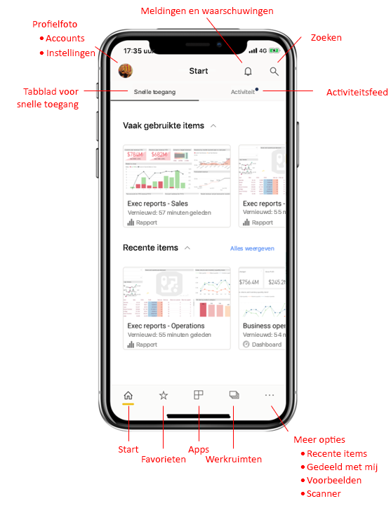
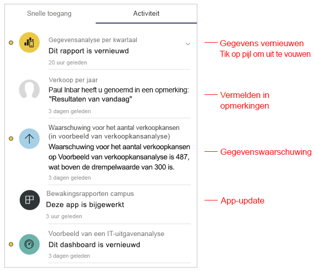
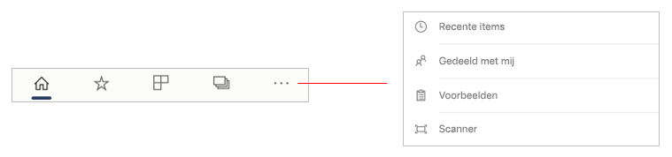
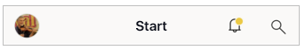
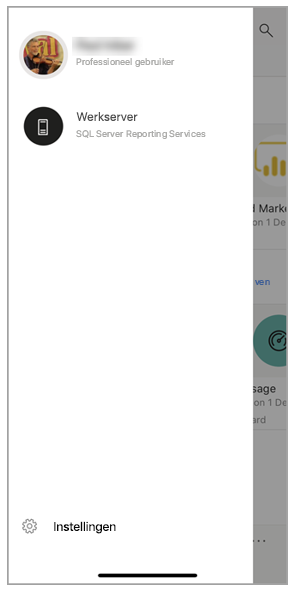
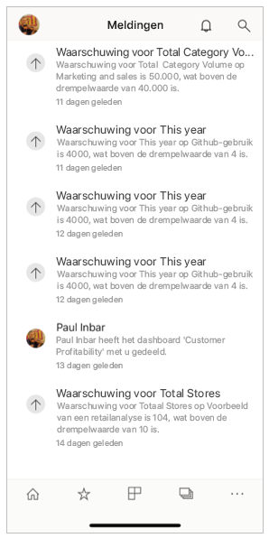
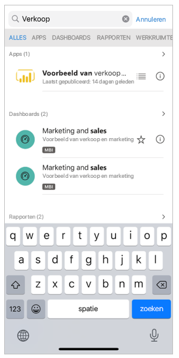

# Een korte rondleiding door de startpagina voor de mobiele app
In deze rondleiding maakt u kennis met de startpagina van de mobiele Power BI-app en de navigatiehulpmiddelen waarmee u snel kunt komen waar u wilt zijn.

Van toepassing op:

|  |  |  |
|:--- |:--- |:--- |
| iPhone | iPad | Android | 

Wanneer u de mobiele Power BI-app opent, komt u op de startpagina terecht waar u snel toegang hebt tot de vaakst of recent bezochte rapporten, dashboards en apps. Daarnaast is er een activiteitsfeed waarmee u op de hoogte blijft van wat er gebeurt met uw Power BI-inhoud en beschikt u over handige navigatiehulpmiddelen om snel naar de gewenste inhoud te gaan.

 
## Tabblad voor snelle toegang

Op het tabblad voor snelle toegang worden de door u vaak en recent bekeken rapporten, dashboards en apps weergegeven die zijn gegroepeerd in twee secties die kunnen worden samengevouwen. Als u een langere lijst met onlangs weergegeven items wilt bekijken, tikt u rechts van Recente items op **Alles bekijken**. 

## Activiteitsfeed

Met de activiteitsfeed kunt u bijhouden wat er gebeurt met uw Power BI-inhoud. Hier worden al uw meest recente meldingen, waarschuwingen, opmerkingen en @mentions weergegeven.

De updates in de feed hebben betrekking op:
* **Vernieuwde gegevens**: wanneer de onderliggende gegevens in een van de rapporten of dashboards in uw favorieten of recente items zijn vernieuwd.
* **Nieuwe opmerkingen**: wanneer gebruikers een opmerking plaatsen in een rapport of dashboard in uw favorieten of recente items of als iemand u in een opmerking vermeldt.
* **Gegevenswaarschuwingen**: wanneer gegevens een drempelwaarde bereiken die u eerder hebt ingesteld in een [gegevenswaarschuwing](../../mobile-set-data-alerts-in-the-mobile-apps.md).
* **Updates van apps**: wanneer de maker van een app een update publiceert voor een app die u gebruikt.

 Tik op een activiteitsitem om naar de betreffende locatie te gaan om alles nader te bekijken.

Activiteitsitems worden samengevoegd, zodat alle gegevensupdates die afkomstig zijn uit dezelfde app of werkruimte worden gegroepeerd. Gebruik de  pijl om uit te vouwen en de samengevoegde items te bekijken. Het meest recente item staat altijd bovenaan de lijst.

## Navigatiebalk

Onderaan de pagina vindt u de navigatiebalk.

De navigatiebalk biedt snelle toegang tot:

*  **Startpagina**: hiermee keert u terug naar de startpagina.
*  **Favorieten**: de rapporten, dashboards en apps die u hebt gemarkeerd als [favorieten](../../mobile-apps-favorites.md).
*  **Apps**: de apps die u hebt geïnstalleerd in uw account.
*  **Werkruimten**: de werkmappen waarin de rapporten en dashboards worden bewaard die auteurs van inhoud maken.
*  **Recente items**: de items die u onlangs hebt bekeken.
*  **Gedeeld met mij**: de items die anderen met u hebben gedeeld.
*  **Voorbeelden**: Power BI-voorbeelden die u kunt gebruiken om meer te weten te komen over de mogelijkheden van Power BI.
*  **Scanner**: de camera van het apparaat, die u als scanner kunt gebruiken om [streepjescodes](../../mobile-apps-scan-barcode-iphone.md) en [QR-codes](../../mobile-apps-qr-code.md) te scannen.

## Koptekst

Bovenaan de pagina wordt in de kop de naam vermeld van de Power BI-pagina, het Power BI-rapport of het Power BI-dashboard waar u zich bevindt.

De kop bevat de volgende navigatie-items:
* **Profielfoto of avatar**: hiermee opent u het zijpaneel waarin u kunt [schakelen tussen uw Power BI-service en Report Server-accounts](../../mobile-app-ssrs-kpis-mobile-on-premises-reports.md). Hier hebt u ook toegang tot de instellingen van de mobiele Power BI-app.

    

* **Meldingen**: hiermee opent u de [pagina met meldingen](../../mobile-apps-notification-center.md) waarop u uw meldingen kunt weergeven en openen. Een stip op het belpictogram voor meldingen geeft aan dat u nieuwe meldingen hebt.

    

* **Zoeken**: zoeken naar Power BI-inhoud in uw abonnement.

    

## Volgende stappen
In deze rondleiding hebt u de startpagina van de mobiele Power BI-app verkend. Lees meer over het gebruik van de mobiele Power BI-app. 
* [Dashboards en rapporten verkennen](../../mobile-apps-quickstart-view-dashboard-report.md)
* [Rapporten verkennen in de mobiele Power BI-apps](../../mobile-reports-in-the-mobile-apps.md)
