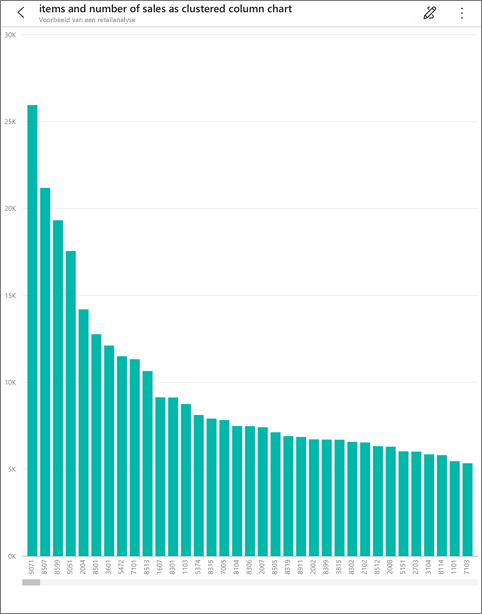
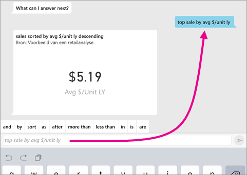
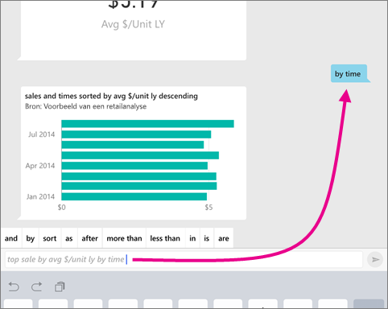
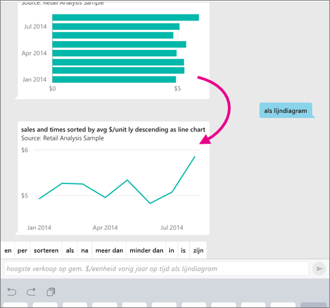

# De virtuele Q&A-analist in iOS-apps - Power BI

De eenvoudigste manier om inzicht te krijgen in uw gegevens is door vragen te stellen in uw eigen woorden. In dit artikel stelt u vragen en bekijkt u inzichten over de voorbeeldgegevens met de virtuele Q&A-analist in de mobiele Microsoft Power BI-app op uw iPad, iPhone en iPod Touch. 

Van toepassing op:

|  |  |
|:--- |:--- |
| iPhones |iPads |

De virtuele Q&A-analist biedt een BI-ervaring met een communicatie-interface waarin gebruik wordt gemaakt van onderliggende Q&A-gegevens in de Power BI-service [(https://powerbi.com)](https://powerbi.com). De virtuele analist stelt gegevensinzichten voor en u kunt uw eigen vragen typen of uitspreken.

Als u zich niet hebt geregistreerd voor Power BI, kunt u zich hier [aanmelden voor een gratis proefversie](https://app.powerbi.com/signupredirect?pbi_source=web) voordat u begint.

## Vereisten

* **De Power BI-app voor iOS installeren**: [Download de iOS-app](https://go.microsoft.com/fwlink/?LinkId=522062) naar uw iPhone of iPad.
De volgende versies bieden ondersteuning voor de Power BI-app voor iOS:
    * iPad met iOS 11 of hoger.
    * iPhone 5 en hoger, met iOS 11 of hoger.
* **Download de voorbeelden Retail Analysis en Opportunity Analysis**: De eerste stap in de quickstart is het downloaden van de voorbeelden van een retailanalyse en een verkoopkansanalyse in de Power BI-service. [Lees hoe u een voorbeeld kunt downloaden](./mobile-apps-download-samples.md) naar uw Power BI-account om aan de slag te gaan. Zorg ervoor dat u de voorbeelden van een retailanalyse en een verkoopkansanalyse kiest.

Wanneer u klaar bent met het voltooien van de vereisten, kunt u de virtuele Q&A-analist proberen.

## Vragen stellen op uw iPhone of iPad
1. Tik op de onderste navigatiebalk op uw iPhone of iPad op de knop Werkruimten , ga naar Mijn werkruimte en open het dashboard Voorbeeld van een retailanalyse.

2. Tik op het pictogram van de virtuele analist Q&A  in het actiemenu aan de onderkant van de pagina (boven aan de pagina op een iPad).
     De virtuele analist geeft enkele suggesties om mee aan de slag te gaan.
3. Typ **show**, tik op **sales** in de lijst met suggesties > **Send** .

    
4. Tik op **op** in de trefwoorden en tik vervolgens op **item** in de lijst met suggesties > **Verzenden** .

    
5. Tik op **als** in de trefwoorden en tik vervolgens op het pictogram Kolomdiagram :::image type="icon" source="./media/mobile-apps-ios-qna/power-bi-ios-q-n-a-column-chart-icon.png" border="false":::, tik vervolgens op **Verzenden** .
6. Tik lang op de weergegeven grafiek en tik vervolgens op **Expand**.

    

    De grafiek wordt geopend in de focusmodus in de app.

    
7. Tik op de pijl in de linkerbovenhoek om terug te gaan naar het venster van de virtuele analist.
8. Tik op de X rechts van het tekstvak om de tekst te verwijderen en opnieuw te beginnen.
9. Probeer een andere vraag: Tik op **top** in de trefwoorden, tik op **sale by avg $/unit ly** > **Verzenden** .

    
10. Kies **op** in de trefwoorden, tik op **tijd** in de lijst met suggesties bovenaan > **Verzenden** .

     
11. Typ **als**, kies het pictogram voor een lijndiagram :::image type="icon" source="./media/mobile-apps-ios-qna/power-bi-ios-q-n-a-line-chart-icon.png" border="false"::: uit de lijst met suggesties > **Verzenden** .

    

## Vragen opslaan
U kunt nu ook vragen over uw gegevens in de mobiele Power BI-app stellen door te spreken in plaats van te typen.

1. Tik op het pictogram van de virtuele analist Q&A  in het actiemenu aan de onderkant van de pagina (boven aan de pagina op een iPad).
2. Tik op het microfoonpictogram .

    

1. Als het microfoonpictogram actief is, kunt u gaan spreken. Zeg bijvoorbeeld Gemiddelde prijseenheid op tijd en tik op **Verzenden** .

    

### Vragen over privacy bij gebruik van spraak naar tekst?
Zie het gedeelte over spraakherkenning in het hoofdstuk [What's New in iOS](https://go.microsoft.com/fwlink/?linkid=845624) in de handleidingen voor iOS-ontwikkelaars van Apple.

## Help en feedback
* Hebt u hulp nodig? Zeg 'Hi' of 'Help' en u krijgt hulp bij het starten van een nieuwe vraag.
* Wilt u feedback geven over de resultaten? Tik lang op een grafiek of een ander resultaat en tik vervolgens op het lachende of fronsende gezichtje.

    

    Uw feedback is anoniem en helpt ons nog betere antwoorden op uw vragen te geven.

## Resultaten van virtuele analist verbeteren
U kunt de resultaten die u en uw klanten van de virtuele analist Q&A krijgen voor een gegevensset verbeteren door meer gerichte vragen te stellen of door de gegevensset verfijnen.

### Vragen stellen
* Volg deze [tips voor het stellen van vragen in Q&A](../end-user-q-and-a-tips.md) in de Power BI-service of de virtuele analist Q&A in uw mobiele iOS-app.

### Gegevensset verfijnen
* Verfijn de gegevensset in Power BI Desktop of in de Power BI-service [om uw gegevens goed te laten werken met Q&A en de virtuele analist Q&A](../../create-reports/service-prepare-data-for-q-and-a.md).

## Volgende stappen
* [Q&A in de Power BI-service](../end-user-q-and-a.md)
* Vragen? Raadpleeg het [gedeelte over mobiele apps in de Power BI-community](https://go.microsoft.com/fwlink/?linkid=839277)
