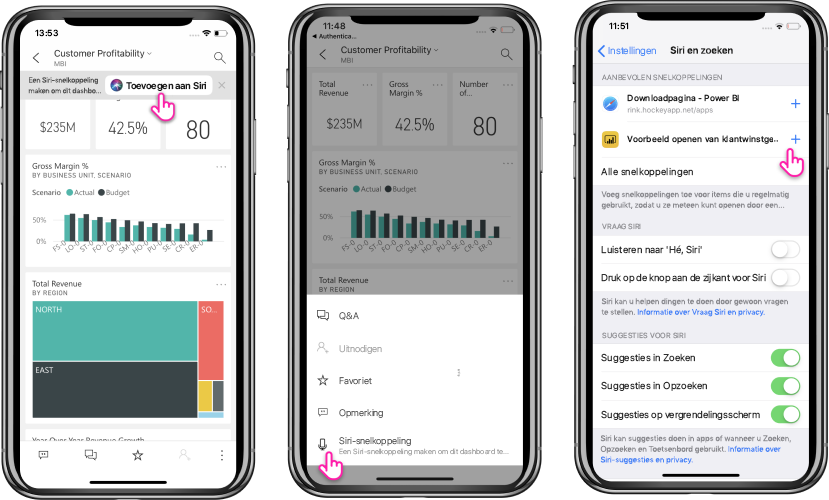
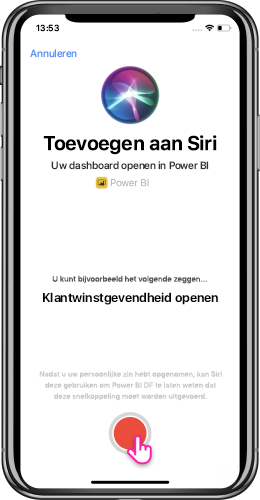

# Siri-snelkoppelingen gebruiken in de mobiele Power BI-app voor iOS (preview)

Gebruik Siri-snelkoppelingen voor rechtstreekse toegang tot de Power BI-inhoud die u nodig hebt.

Gebruik de integratie van Siri-snelkoppelingen om eenvoudig en snel toegang te krijgen tot uw veelgebruikte rapporten of dashboards. Maak een snelkoppeling naar uw item, zodat u Siri kunt vragen het te starten wanneer u de gegevens wilt bekijken.

## Siri-snelkoppeling voor een rapport of dashboard maken

Er zijn drie manieren om Siri-snelkoppelingen naar uw rapporten en dashboards te maken:

- Er wordt een banner met de optie **Toevoegen aan Siri** toegevoegd aan uw veelgebruikte rapporten en dashboards. Tik op de actie om de pagina **Toevoegen aan Siri** te openen.
    
- Gebruik de actie **Siri-snelkoppeling** in het actiemenu (...) **Rapport** of **Dashboard**.
    
- Gebruik de **Voorgestelde snelkoppelingen** in de apparaatinstellingen (**Apparaatinstelling** > **Siri en zoeken**). U kunt met de plusknop (+) een snelkoppeling naar het item toevoegen aan het voorstel.
     
     

Voor een Power BI-rapport wordt de pagina die u tijdens het maken van de snelkoppeling bekijkt, vastgelegd als snelkoppeling. 

Met alle opties wordt de pagina **Toevoegen aan Siri** geopend. Op deze pagina moet u een zin opnemen die u later wilt gebruiken in Siri om het rapport of dashboard te openen. 
   

    

## Siri-sneltoetsen gebruiken om rapport of dashboard weer te geven

Na het maken van een snelkoppeling kunt u steeds via Siri toegang vragen tot het dashboard of rapport waarvoor u de snelkoppeling hebt gemaakt.
Activeer Siri en bied de zin aan die u voor de snelkoppeling hebt opgenomen. Via Siri wordt Power BI gestart met het aangevraagde rapport of dashboard. 

Voor een Power BI-rapport komt u terecht op de pagina die is vastgelegd toen u de snelkoppeling maakte.

  
  

## De zin voor een Siri-snelkoppeling bewerken 
U kunt de zin voor uw snelkoppeling bewerken met behulp van de knop **Siri-snelkoppeling** op het actiemenu (...) **Rapport** of **Dashboard**. De pagina Siri-snelkoppeling wordt geopend met de optie **Zin opnieuw opnemen**. 

## Een Siri-snelkoppeling verwijderen 
Als u een snelkoppeling wilt verwijderen, gaat u naar het item en klik u in het actiemenu (...) op de actie **Siri-snelkoppeling**. De pagina **Siri-snelkoppeling** wordt geopend. Kies **Snelkoppeling verwijderen**.

> [!NOTE]
> De integratie van Siri-snelkoppelingen met de mobiele Power BI-app is beschikbaar voor iPhones en iPads met iOS12 en later.
> 

## Volgende stappen
Verkrijg meer informatie over de mobiele Power BI-app door het volgende te doen: 

* De [mobiele Power BI-app voor de iPhone](http://go.microsoft.com/fwlink/?LinkId=522062) downloaden
* [@MSPowerBI op Twitter](https://twitter.com/MSPowerBI) volgen
* Deelnemen aan gesprekken van de [Power BI-community](http://community.powerbi.com/)

