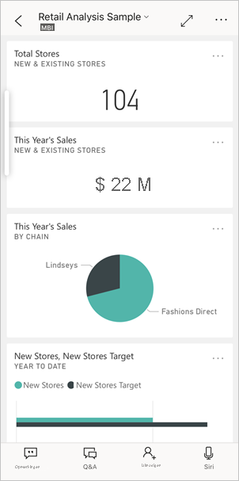

# Snelstart: dashboards en rapporten verkennen in de mobiele Power BI-apps
In deze quickstart volgt u een korte rondleiding door de mobiele Power BI-app en maakt u kennis met een voorbeelddashboard en -rapport. De Power BI-app for iOS wordt weergegeven, maar u kunt gemakkelijk op een ander apparaat meedoen.

Van toepassing op:

|  |  |  |  |
|:--- |:--- |:--- |:--- |
| iPhone | iPad | Android | Windows 10 |

Een dashboard is een verzamelplek voor de levenscyclus en processen van uw bedrijf. Het is een overzicht, één plaats waarop u de huidige status van het bedrijf in de gaten kunt houden. Rapporten zijn interactieve weergaven van uw gegevens met visuals die verschillende bevindingen en inzichten van die gegevens aangeven. 

## Vereisten

* **Registreren voor Power BI**: Als u zich niet hebt geregistreerd voor Power BI, kunt u zich hier [aanmelden voor een gratis proefversie](https://app.powerbi.com/signupredirect?pbi_source=web) voordat u begint.
* **De Power BI-app voor uw apparaat installeren**: Download de mobiele Power BI-app** uit de [App Store](https://apps.apple.com/app/microsoft-power-bi/id929738808) (iOS) of uit [Google Play](https://play.google.com/store/apps/details?id=com.microsoft.powerbim&amp;amp;clcid=0x409) (Android).
* **Het voorbeeld van een retailanalyse downloaden**: De eerste stap in de quickstart is het downloaden van het voorbeeld van een retailanalyse in de Power BI-service. [Lees hoe u een voorbeeld kunt downloaden](./mobile-apps-download-samples.md) naar uw Power BI-account om aan de slag te gaan. Zorg dat u het voorbeeld van een retailanalyse kiest.

Zodra u ervoor hebt gezorgd dat u aan de vereisten voldoet en het voorbeeld van een retailanalyse hebt gedownload naar uw Power BI-account, bent u klaar om aan deze korte rondleiding te beginnen.

## Een dashboard weergeven op uw mobiele apparaat
1. Open de Power BI-app op uw apparaat en meld u aan met uw referenties voor het Power BI-account (dit zijn dezelfde referenties als die welke u gebruikt voor de Power BI-service in de browser).
 
1. Tik nu op het pictogram **Werkruimten** , kies **Mijn werkruimten** en tik vervolgens op het voorbeeld van een retailanalyse om het te openen.

    
   
    Power BI-dashboards zien er op uw mobiele apparaat net iets anders uit dan in de Power BI-service. Alle tegels hebben dezelfde breedte en ze zijn achter elkaar van boven naar beneden gesorteerd.

5. Tik op het sterpictogram  in de onderste werkbalk om dit dashboard in te stellen als favoriet dashboard. Wanneer u een dashboard in de mobiele app als favoriet instelt, wordt het dashboard ook als favoriet in de Power BI-service ingesteld (en omgekeerd).

6. Schuif omlaag en tik op het gevulde lijndiagram 'This Year's Sales, Last Year's Sales'.

    

    De tegel wordt geopend in de focusmodus.

7. Tik in de focusmodus op **Apr** in het diagram. De waarden voor april worden boven in het diagram weergegeven.

    

8. Tik op het pictogram Rapport  onderaan het scherm (op Android-apparaten kan dit mogelijk bovenaan het scherm zijn). Het rapport dat betrekking heeft op deze tegel, wordt geopend in de liggende modus.

    

9. Tik op de gele bel '040 - Juniors' in het bellendiagram. U ziet dat de verwante waarden in de andere diagrammen worden gemarkeerd. 

    

10. Veeg omhoog om de werkbalk aan de onderkant weer te geven en tik op **Meer opties...**.

    

11. Schuif omlaag in de lijst en selecteer **Aantekening**.

    

12. Tik op de werkbalk Aantekening op het pictogram met het lachebekje en tik vervolgens op de rapportpagina waaraan u een aantal lachebekjes wilt toevoegen.
 
    

13. Tik nu op **Delen** in de rechterbovenhoek.

14. Kies de manier waarop u het rapport wilt delen.  

    

    U kunt deze momentopname met iedereen delen, zowel binnen als buiten uw organisatie. Als u de momentopname deelt met iemand in uw organisatie die een eigen Power BI-account heeft, kan deze persoon ook het voorbeeldrapport voor de retailanalyse openen.

## Resources opschonen

Als u deze quickstart hebt voltooid, kunt u als u wilt het dashboard voor het voorbeeld van een retailanalyse, het voorbeeldrapport en de voorbeeldgegevensset verwijderen.

1. Open de Power BI-service ([Power BI-service](https://app.powerbi.com)) en meld u aan.

2. Selecteer **Mijn werkruimte** in het navigatievenster.

3. Selecteer het tabblad met de dashboards en klik vervolgens op de Prullenbak.

    

    Klik nu op het tabblad Rapporten en doe hetzelfde.

4. Selecteer nu het tabblad Gegevenssets, klik op **Meer opties** (...) en kies **Verwijderen**. 

    

## Volgende stappen

In deze quickstart hebt u kennisgemaakt met een voorbeelddashboard en -rapport op uw mobiele apparaat. Lees meer over het werken in de Power BI-service. 

> [!div class="nextstepaction"]
> [Quickstart: navigeren in de Power BI-service](../end-user-experience.md)

