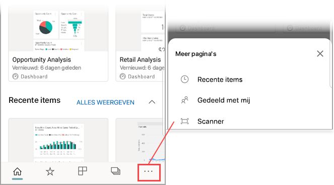

# Een streepjescode met uw apparaat scannen via de mobiele Power BI-app
Scan streepjescodes in de echte wereld om rechtstreeks naar gefilterde BI-informatie in de mobiele Power BI-app te gaan.

Van toepassing op:

|  |  | 
|:--- |:--- |
| iPhone | Android (telefoon of tablet) | 

Stel een collega heeft [een streepjescodeveld in een rapport in Power BI Desktop](../../desktop-mobile-barcodes.md) getagd en het rapport met u gedeeld. 

Als u een productstreepjescode met de scanner in de Power BI-app op uw apparaat scant, ziet u het rapport (of een lijst met rapporten) met die streepjescode. U kunt het rapport openen, gefilterd op die streepjescode.

## Een streepjescode scannen met de Power BI-scanner
1. Open in de mobiele Power BI-app het hoofdnavigatiemenu  in de linkerbovenhoek. 
2. Schuif omlaag naar **Scanner** en selecteer het item. 
   
    
3. Als uw camera niet is ingeschakeld, moet u de Power BI-app toestemming geven voor het gebruik van de camera. U hoeft hier slechts eenmalig toestemming voor te geven. 
4. Richt de scanner op een streepjescode op een product. 
   
    Er wordt een lijst weergegeven met rapporten die aan de desbetreffende streepjescode zijn gekoppeld.
5. Tik op de naam van het rapport om het te openen op uw apparaat, automatisch gefilterd op die streepjescode.

## Op andere streepjescodes filteren in een rapport
Als u op uw apparaat een rapport bekijkt dat op een streepjescode is gefilterd, wilt u hetzelfde rapport mogelijk filteren op een andere streepjescode.

* Als het streepjescodepictogram een filter heeft , is het filter actief en wordt het rapport al gefilterd op een streepjescode. 
* Als het streepjescodepictogram geen filter bevat , is het filter niet actief en is het rapport niet gefilterd op een streepjescode. 

In beide gevallen kunt u op het pictogram tikken om een klein menu met een zwevende scanner te openen.

* Richt de scanner op het nieuwe item om het filter van het rapport te wijzigen in een andere streepjescodewaarde. 
* Selecteer **Streepjescodefilter wissen** om het ongefilterde rapport weer te geven.
* Selecteer **Filteren op recente streepjescodes** om het rapportfilter te wijzigen in een van de streepjescodes die u tijdens de huidige sessie hebt gescand.

## Problemen met het scannen van een streepjescode
Hier volgen enkele berichten die kunnen worden weergegeven wanneer u een streepjescode op een product scant.

### Kan het rapport niet filteren...
Het rapport dat u wilt filteren is gebaseerd op een gegevensmodel waarin deze streepjescodewaarde niet is opgenomen. Het product mineraalwater is bijvoorbeeld niet opgenomen in het rapport.  

### Alle/sommige visuals in het rapport bevatten geen waarde
De streepjescodewaarde die u hebt gescand is wel aanwezig in uw model, maar de visuals of sommige visuals in uw rapport bevatten deze waarde niet, waardoor de status Leeg wordt geretourneerd wanneer u het filter toepast. Bekijk andere rapportpagina's of bewerk uw rapporten Power BI Desktop om deze waarde toe te voegen. 

### U hebt geen rapporten die kunnen worden gefilterd op streepjescodes.
Dit betekent dat u geen rapporten met streepjescode hebt. U kunt alleen rapporten met de streepjescodescanner filteren die de kolom **Streepjescode** bevatten.  

Zorg ervoor dat u of de eigenaar van het rapport een kolom in Power BI Desktop voorziet van het label **Streepjescode**. Meer informatie over [het taggen van een streepjescodeveld in Power BI Desktop](../../desktop-mobile-barcodes.md).

### Kan het rapport niet filteren. Deze streepjescode is niet aanwezig in de rapportgegevens.
Het rapport dat u wilt filteren is gebaseerd op een gegevensmodel waarin deze streepjescodewaarde niet is opgenomen. Het product mineraalwater is bijvoorbeeld niet opgenomen in het rapport. U kunt een ander product scannen, een ander rapport kiezen (als er meerdere rapporten beschikbaar zijn) of het rapport ongefilterd weergeven. 

## Volgende stappen
* [Een streepjescodeveld in Power BI Desktop taggen](../../desktop-mobile-barcodes.md)
* [Dashboardtegels in Power BI](../end-user-tiles.md)
* [Dashboards in Power BI](../end-user-dashboards.md)

