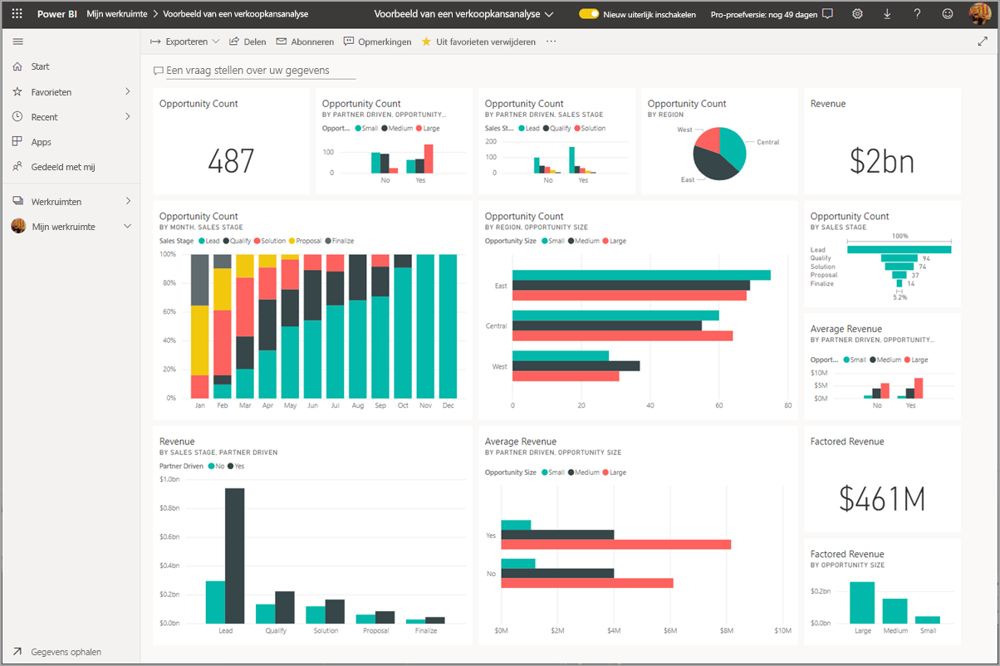
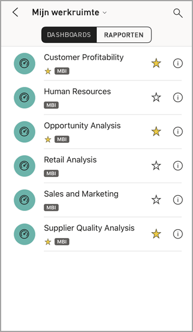
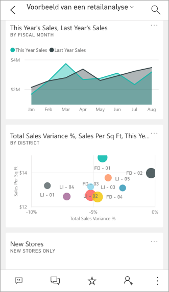
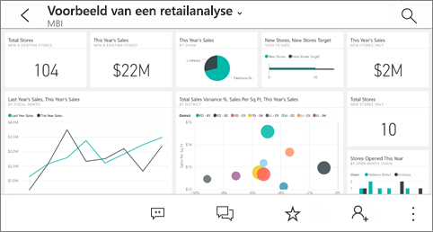
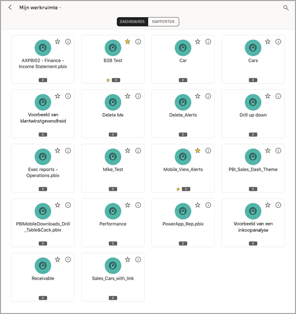
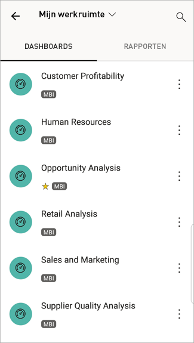
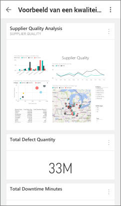

# Dashboards en rapporten weergeven in de mobiele Power BI-apps
Van toepassing op:

|  |  |  |  | 
|:--- |:--- |:--- |:--- |:--- |
| [iPhones](mobile-apps-view-dashboard.md#view-dashboards-on-your-iphone) |[iPads](mobile-apps-view-dashboard.md#view-dashboards-on-your-ipad) |[Android-telefoons](mobile-apps-view-dashboard.md#view-dashboards-on-your-android-phone) |[Android-tablets](mobile-apps-view-dashboard.md#view-dashboards-on-your-android-tablet) |

Dashboards zijn een verzamelplek voor de levenscyclus en processen van uw bedrijf. Een dashboard is een overzicht, één plaats waarop u de huidige status van het bedrijf bewaakt.

## Dashboards maken in de Power BI-service (https://powerbi.com)
**U kunt geen dashboards maken in de mobiele apps.** 

Als u dashboards en rapporten wilt bekijken op uw mobiele apparaat, moet u ze eerst maken in uw webbrowser of hiermee verbinding maken. 

1. Ga naar de Power BI-service ([https://www.powerbi.com](https://www.powerbi.com)) en [meld u aan voor een account](../../fundamentals/service-self-service-signup-for-power-bi.md).
2. [Maak uw eigen Power BI-dashboards en -rapporten](../../fundamentals/service-get-started.md) of maak verbinding met bestaande [Power BI-apps](../../connect-data/service-connect-to-services.md) voor tal van services, zoals [Microsoft Dynamics CRM](../../connect-data/service-connect-to-services.md).

Hier ziet u een Power BI-dashboard in de Power BI-service:

## Dashboards weergeven op uw iPhone
1. Open de Power BI-app op uw iPhone en meld u aan.
   
   Moet u [de iPhone-app downloaden](https://go.microsoft.com/fwlink/?LinkId=522062) via de App Store van Apple?
2. Tik op een dashboard om het te openen.  
   
    
   
   * De gele sterren  geven aan welke dashboards zijn opgeslagen in uw favorieten. 
   * De notatie  (in dit geval 'MBI') onder elke dashboardnaam geeft aan hoe de gegevens in elk dashboard worden geclassificeerd. Lees meer over [gegevensclassificatie in Power BI](../../create-reports/service-data-classification.md).
   
   Standaard zien Power BI-dashboards er enigszins anders uit op uw iPhone. Alle tegels hebben dezelfde grootte en ze zijn achter elkaar van boven naar beneden gesorteerd.
   
    
   
   > [!TIP]
   > Als u de eigenaar van het dashboard bent, kunt u in de Power BI-service [een weergave maken van het dashboard voor telefoons](../../create-reports/service-create-dashboard-mobile-phone-view.md) in de staande modus. 
   > 
   > 
   
    U kunt uw telefoon ook kantelen om het dashboard liggend op uw telefoon weer te geven.
   
    
3. Veeg omhoog en omlaag om alle tegels in het dashboard te bekijken. U kunt:
   
   * [Tikken op een tegel](mobile-tiles-in-the-mobile-apps.md) om deze te openen in de focusmodus en ermee te communiceren.
   * Tikken op de  om de tegel [toe te voegen aan uw favorieten](mobile-apps-favorites.md).
   * Tikken op **Uitnodigen**  om [een collega uit te nodigen](mobile-share-dashboard-from-the-mobile-apps.md) om uw dashboard weer te geven.
   * [Het dashboard met uw Apple Watch synchroniseren](mobile-apple-watch.md).
4. Om terug te gaan naar de lijst met dashboards tikt u op de pijl naast de titel van het dashboard. Tik vervolgens op **Mijn werkruimte**.
   
   

### Dashboards weergeven inliggende modus op uw iPhone
U kunt uw telefoon kantelen om het dashboard liggend weer te geven. De indeling van het dashboard verandert van een reeks met tegels in een weergave van het gehele dashboard. U ziet alle tegels in het dashboard zoals ze in de Power BI-service worden weergegeven.

Als u wilt in- en uitzoomen op verschillende gebieden van uw dashboard, kunt u het ‘knijpgebaar’ gebruiken. U kunt pannen om te navigeren. U kunt nog steeds [tikken op een tegel](mobile-tiles-in-the-mobile-apps.md) om deze te openen in de focusmodus en te communiceren met uw gegevens.

## Dashboards weergeven op uw iPad
1. Open de Power BI-app.
   
   Moet u [de iPad-app eerst downloaden](https://go.microsoft.com/fwlink/?LinkId=522062) via de App Store van Apple?
2. Tik op **Dashboards** aan de bovenkant van de app.  
   
   
   
   * De gele sterren  geven aan welke dashboards zijn opgeslagen in uw favorieten. 
   * De notatie  (in dit geval 'MBI') onder elke dashboardnaam geeft aan hoe de gegevens in elk dashboard worden geclassificeerd. Lees meer over [gegevensclassificatie in Power BI](../../create-reports/service-data-classification.md).
3. U kunt een dashboard delen vanuit uw werkruimte. Tik op het beletselteken ( **...** ) in de rechterbenedenhoek van de dashboardtegel en tik op **Anderen uitnodigen**.
   
   
4. U kunt ook op een dashboard tikken om het te openen en de tegels in dit dashboard te bekijken. In het dashboard kunt u:
   
   * [Tikken op een tegel om te communiceren](mobile-tiles-in-the-mobile-apps.md) met de tegel.
   * [De rapporten](mobile-reports-in-the-mobile-apps.md) achter de tegels openen.
   * [Anderen uitnodigen om het dashboard weer te geven](mobile-share-dashboard-from-the-mobile-apps.md).
   * [Aantekeningen toevoegen aan en een momentopname delen van](mobile-annotate-and-share-a-tile-from-the-mobile-apps.md) een tegel.
5. Als u terug wilt gaan naar Mijn werkruimte, tikt u op de naam van het dashboard in de linkerbovenhoek. Tik vervolgens op **Mijn werkruimte**.
   
   

## Dashboards weergeven op uw Android-telefoon
1. Open de Power BI-app op uw Android-telefoon en meld u aan.
   
   Moet u [ de Android-app eerst downloaden](https://go.microsoft.com/fwlink/?LinkID=544867)?
2. Tik op een dashboard om het te openen.   
   
   

    Gele sterren  geven aan welke dashboards zijn opgeslagen in uw favorieten. 

    De notatie  (in dit geval 'MBI') onder een dashboardnaam geeft aan hoe de gegevens in elk dashboard worden geclassificeerd. Lees meer over [gegevensclassificatie in Power BI](../../create-reports/service-data-classification.md).

    Power BI-dashboards zien er enigszins anders uit op uw Android-telefoon. Alle tegels hebben dezelfde breedte en ze zijn achter elkaar van boven naar beneden gesorteerd.

    

    Als u de eigenaar van het dashboard bent, kunt u in de Power BI-service [een weergave maken van het dashboard voor telefoons](../../create-reports/service-create-dashboard-mobile-phone-view.md) in de staande modus. 

1. U kunt op het dashboard op de verticale knop **Meer opties** (...) naast de naam van een collega tikken om deze uit te nodigen, te vernieuwen of informatie over het dashboard op te halen:
   
   
2. Veeg omhoog en omlaag om alle [tegels in het dashboard te bekijken](mobile-tiles-in-the-mobile-apps.md). 
3. Als u wilt teruggaan naar de startpagina met dashboards, tikt u op de naam van het dashboard om het navigatiepad te openen. Tik vervolgens op **Mijn werkruimte**.   

## Dashboards weergeven op uw Android-tablet
1. Open de Power BI-app op uw Android-tablet en meld u aan.
   
   Moet u [ de Android-app eerst downloaden](https://go.microsoft.com/fwlink/?LinkID=544867)?
2. Tik op een dashboard om het te openen.   
   
   
   
   * De gele sterren  geven aan welke dashboards zijn opgeslagen in uw favorieten. 
   * De notatie  (in dit geval 'MBI') onder elke dashboardnaam geeft aan hoe de gegevens in elk dashboard worden geclassificeerd. Lees meer over [gegevensclassificatie in Power BI](../../create-reports/service-data-classification.md).
3. U kunt op het dashboard op de verticale knop **Meer opties** (...) naast de naam van een collega tikken om deze uit te nodigen, te vernieuwen of informatie over het dashboard op te halen:
   
   
4. Veeg omhoog en omlaag om alle [tegels in het dashboard te bekijken](mobile-tiles-in-the-mobile-apps.md). 
   
   Als u wilt in- en uitzoomen op verschillende gebieden van uw dashboard, kunt u het ‘knijpgebaar’ gebruiken. U kunt pannen om te navigeren. U kunt nog steeds [tikken op een tegel](mobile-tiles-in-the-mobile-apps.md) om deze te openen in de focusmodus en te communiceren met uw gegevens.
5. Als u wilt teruggaan naar de startpagina met dashboards, tikt u op de naam van het dashboard om het navigatiepad te openen. Tik vervolgens op **Mijn werkruimte**:
   
    

    Als u wilt in- en uitzoomen op verschillende gebieden van uw dashboard, kunt u het ‘knijpgebaar’ gebruiken. U kunt pannen om te navigeren. U kunt nog steeds [tikken op een tegel](mobile-tiles-in-the-mobile-apps.md) om deze te openen in de focusmodus en te communiceren met uw gegevens.

## Een telefoonweergave van een dashboard maken in Power BI
Als u de eigenaar van het dashboard bent, kunt u *in de Power BI-service* een weergave maken van het dashboard voor telefoons in de staande modus. 

Meer informatie over [het maken van een telefoonweergave van een dashboard](../../create-reports/service-create-dashboard-mobile-phone-view.md).

## Volgende stappen
* [Download de Android-app](https://go.microsoft.com/fwlink/?LinkID=544867) via Google play  
* [Aan de slag met de Android-app voor Power BI](mobile-android-app-get-started.md)  
* [Wat is Power BI?](../../fundamentals/power-bi-overview.md)
* Vragen? [Misschien dat de Power BI-community het antwoord weet](https://community.powerbi.com/)
