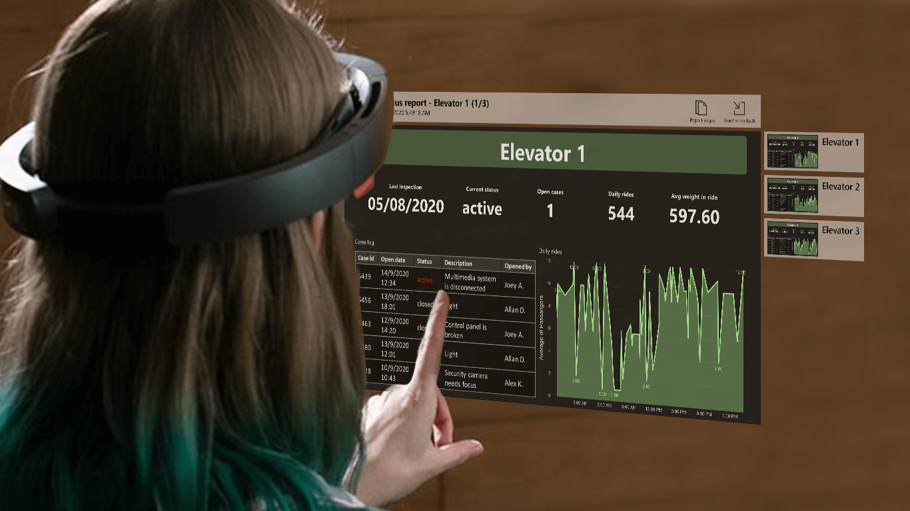

# Power BI voor HoloLens 2 (preview)
De app Power BI voor HoloLens 2 combineert uw Power BI-rapporten en -dashboards met uw fysieke omgeving om een driedimensionale, insluitende en hands-free ervaring te creëren waar u zich door de fysieke wereld kunt bewegen en uw relevante gegevens kunt ophalen, waar en wanneer u maar wilt.

## Download de app Power BI voor HoloLens 2 

De app Power BI voor HoloLens 2 is beschikbaar in de [Microsoft Store](https://go.microsoft.com/fwlink/?linkid=526478).

De app werkt met eenmalige aanmelding, wat betekent dat de app de identiteit van de gebruiker die op dat moment is aangemeld bij het HoloLens 2-apparaat gebruikt om te verifiëren bij de Power BI-service.

[Meer informatie](/hololens/holographic-store-apps) over het installeren van apps op uw HoloLens 2-apparaat.

## Open de Power BI-app op uw HoloLens 2

Open het menu **Start** en selecteer de Power BI-app. De app wordt geopend met al uw favoriete rapporten en dashboards die in uw virtuele toolbelt zijn geladen. Hier kunt u ze selecteren om ze te bekijken.

## De app Power BI voor HoloLens 2 gebruiken

U gebruikt de handbewegingen en de oogregistratiefunctie van HoloLens 2 om de inhoud van uw Power BI te vergroten of verkleinen, een plaats te geven en ermee te werken. [Meer informatie](/hololens/hololens2-basic-usage) over het werken met objecten in de wereld van HoloLens 2.

### Toegang tot rapporten en dashboards

Als u toegang wilt krijgen tot een rapport of dashboard, haalt u het uit uw virtuele toolbelt en plaatst u het op de gewenste locatie. [Meer informatie](/hololens/hololens2-basic-usage#moving-holograms) over het vastpakken en positioneren van app-vensters.

Als u een rapport of dashboard in uw virtuele toolbelt wilt plaatsen, moet het rapport of dashboard als favoriet zijn gemarkeerd. Als er geen rapporten of dashboards in uw toolbelt zitten of als u extra rapporten en dashboards wilt toevoegen, markeert u deze items gewoon als favorieten in de [Power BI-service](../end-user-favorite.md) of de [mobiele Power BI-apps](mobile-apps-favorites.md). Daarna zijn ze beschikbaar in uw virtuele Power BI-toolbelt in HoloLens 2.

### Formaat van rapporten en dashboards wijzigen

Als u het formaat van een rapport of dashboard wilt wijzigen, pakt u het vast bij de hoeken van het app-venster en past u het formaat naar wens aan. [Meer informatie](/hololens/hololens2-basic-usage#resizing-holograms) over het wijzigen van het formaat van app-vensters.

### Rapporten en dashboards in de ruimte positioneren

Als u een rapport of dashboard in de ruimte wilt positioneren, pakt u het vast door uw wijsvinger en duim op de titelbalk samen te knijpen en vervolgens uw hand in die houding naar de gewenste positie te verplaatsen. Laat uw vingers los wanneer ze de gewenste positie hebben bereikt. [Meer informatie](/hololens/hololens2-basic-usage#moving-holograms) over het verplaatsen van app-vensters.

Zodra u het rapport of het dashboard op de gewenste positie hebt geplaatst, wordt de locatie ervan door uw HoloLens 2-apparaat onthouden. Wanneer u een volgende dezelfde locatie bezoekt, vindt u het item dat u op exact dezelfde locatie hebt geplaatst.

### In rapportpagina’s browsen

Elk rapport heeft een pagina-index die u kunt weergeven om van pagina naar pagina te gaan. Selecteer in de rechterbovenhoek van het rapportvenster de knop **Pagina-index** om de pagina-index weer te geven of te verbergen.

### Rapporten openen met QR-codes

Als er een QR-code is gemaakt voor een rapport en deze is gekoppeld aan een item, zoals een apparaat waarvan de gegevens in dat rapport staan, kunt u het rapport openen door alleen maar naar de QR-code van het item te kijken.

[Meer informatie](../../create-reports/service-create-qr-code-for-report.md) over het maken van QR-codes voor rapporten.

### Gegevensvernieuwing

De rapporten en dashboards worden bijgewerkt terwijl u de app gebruikt. Dus als er gegevens worden gewijzigd in Power BI terwijl u de app gebruikt, ziet u dat de wijzigingen zijn doorgevoerd in de rapporten en dashboards die u bekijkt.

## Volgende stappen

* [Kennismaken met HoloLens 2](/hololens/hololens2-basic-usage)