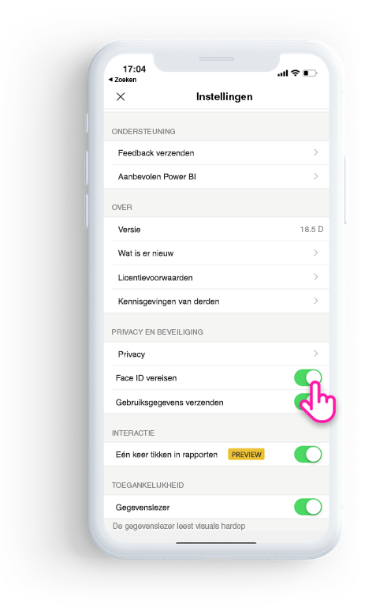
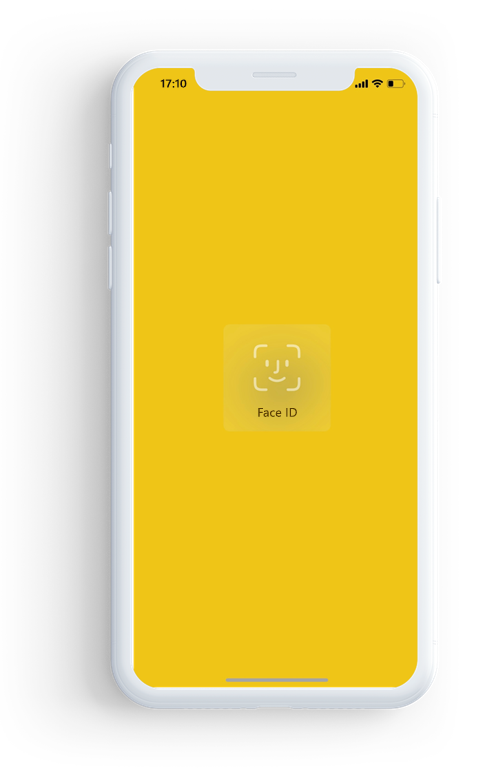

# De Power BI-app beveiligen met Face ID, Touch ID of een wachtwoordcode 

In veel gevallen zijn de gegevens die worden beheerd in Power BI vertrouwelijk. Deze gegevens moeten worden beveiligd en mogen alleen toegankelijk zijn voor geautoriseerde gebruikers. 

Met de Power BI-app voor iOS kunt u uw gegevens beschermen door extra identificatie te configureren. Elke keer dat u de app start of van de achtergrond naar de voorgrond haalt, moet u zich via Face ID, Touch ID of een wachtwoordcode identificeren.

|  |  |
|:--- |:--- |
| iPhones |iPads |

## Face ID, Touch ID of een wachtwoordcode inschakelen in de app-instelling

Als u gebruik wilt maken van extra identificatie in Power BI, gaat u naar de app-instelling onder **Privacy en beveiliging**. Hier ziet u de optie voor het inschakelen van Face ID, Touch ID of een wachtwoordcode op basis van de mogelijkheden van uw apparaat.

Zodra deze instelling is ingeschakeld, wordt u elke keer dat u Power BI start of van de achtergrond naar voren haalt, gevraagd om u te identificeren voordat u toegang krijgt tot de app. 

De beslissing om te vragen naar Face ID, Touch ID of een wachtwoordcode wordt uitgevoerd door iOS op basis van de mogelijkheden van het apparaat. Als uw apparaat Face ID ondersteunt, moet u Face ID gebruiken. Als uw apparaat Touch ID ondersteunt, moet u Touch ID gebruiken. Als geen van beide wordt ondersteund, moet u een wachtwoordcode opgeven.

## MDM gebruiken om Face ID, Touch ID of een wachtwoordcode af te dwingen

Sommige organisaties hebben beveiligingsbeleid en nalevingsvereisten die extra identificatie afdwingen voordat u toegang krijgt tot gevoelige bedrijfsgegevens. 

Met de mobiele Power BI-app voor iOS kunnen beheerders die instelling beheren door de configuratie-instellingen voor de app te pushen vanuit Microsoft Intune en andere MDM-oplossingen (Mobile Device Management). Beheerders kunnen het beveiligingsbeleid voor apps gebruiken om deze instelling in te schakelen voor alle gebruikers of voor een groep gebruikers.

|Sleutel  |Type  |Beschrijving  |
|---------|---------|---------|
| com.microsoft.powerbi.mobile.ForceDeviceAuthentication | Boolean | De standaardwaarde is Onwaar.  Als deze waarde is ingesteld op Waar, worden gebruikers via de app gedwongen zich te identificeren met Face ID, Touch ID of een wachtwoordcode voordat ze Power BI-gegevens kunnen bekijken in de app. Gebruikers die geen Face ID, Touch ID of een wachtwoordcode hebben geconfigureerd op hun apparaat, moeten dit configureren om toegang te krijgen tot Power BI.  |

## Volgende stappen

[MDM gebruiken om de Power BI-app voor iOS extern te configureren](mobile-app-configuration.md)
