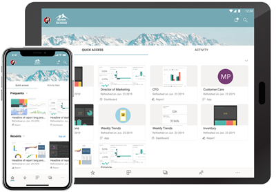

# Aan de slag met de mobiele Power BI-app op iOS-apparaten
De Microsoft Power BI voor iOS-app op de iPhone en iPad biedt de mobiele BI-ervaring voor Power BI, Power BI Report Server en Reporting Services. Bekijk uw bedrijfsdashboards on-premises en in de cloud, en gebruik ze vanaf elke locatie met mobiele live-toegang met aanraakfunctionaliteit. Verken de gegevens in dashboards en deel deze met uw collega's per e-mail of sms-bericht. En blijf via uw [Apple Watch](mobile-apple-watch.md) op de hoogte van uw meest recente gegevens.  

U maakt Power BI-rapporten in Power BI Desktop en publiceert deze:

* [Publiceer de rapporten naar de Power BI-service](../../service-get-started.md) en maak dashboards.
* [Publiceer de rapporten on-premises naar Power BI Report Server](../../report-server/quickstart-create-powerbi-report.md).

Vervolgens gebruikt u de dashboards en rapporten on-premises of in de cloud in de mobiele Power BI-app voor iOS.

Ontdek [wat er nieuw is in de mobiele Power BI-apps](mobile-whats-new-in-the-mobile-apps.md).

## De app downloaden
[Download de iOS-app](https://go.microsoft.com/fwlink/?LinkId=522062 "Download de iOS-app") via de Apple App Store op uw iPhone of iPad.

U kunt de mobiele Power BI-app voor iOS uitvoeren op alle apparaten met iOS 11 of hoger. 

## Aanmelden voor de Power BI-service
Als u nog niet bent aangemeld, gaat u naar [powerbi.com](https://powerbi.microsoft.com/get-started/) en selecteert u onder **Power BI - Samenwerken en delen via de cloud** de optie **Gratis proberen**.

## Aan de slag met de Power BI-app
1. Open de Power BI-app op uw iOS-apparaat.
2. Als u zich wilt aanmelden bij Power BI, tikt u op het tabblad **Power BI** en vult u uw aanmeldingsgegevens in.  
   Als u zich wilt aanmelden bij uw mobiele rapporten en KPI's van Reporting Services, tikt u op het tabblad **Rapportserver** en vult u uw aanmeldingsgegevens in.
   
   
   
   Wanneer u zich in de app bevindt, tikt u in de linkerbovenhoek van het scherm op de afbeelding van het accountprofiel om tussen Power BI en uw rapportserver te schakelen. 

## De Power BI- en Reporting Services-voorbeelden uitproberen
U hoeft zich niet aan te melden om de Power BI- en Reporting Services-voorbeelden weer te geven en te gebruiken.

Als u toegang wilt krijgen tot de voorbeelden, tikt u op **Meer opties** (...) op de navigatiebalk en kiest u **Voorbeelden**.

Bij een aantal Power BI-voorbeelden worden verschillende rapportservervoorbeelden weergegeven.

   
   
   > [!NOTE]
   > Niet alle functies zijn beschikbaar in de voorbeelden. U kunt bijvoorbeeld geen voorbeeldrapporten zien waarop de dashboards zijn gebaseerd, u kunt de voorbeelden niet met anderen delen en u kunt geen voorbeelden aan uw favorieten toevoegen. 
   > 
   >

## Uw inhoud in de mobiele Power BI-apps zoeken

Tik op het vergrootglas in de koptekst om uw Power BI-inhoud te zoeken.

## Uw favoriete dashboards en rapporten weergeven
Tik op **favorieten** () op de navigatiebalk om de pagina Favorieten weer te geven. 

Lees meer over [favorieten in de mobiele Power BI-apps](mobile-apps-favorites.md).

## Ondersteuning voor ondernemingen voor de mobiele Power BI-apps
Organisaties kunnen Microsoft Intune gebruiken voor het beheer van apparaten en toepassingen, waaronder de mobiele Power BI-apps voor Android en iOS.

Microsoft Intune kan bijvoorbeeld worden gebruikt om een pincode voor toegang te vereisen, om te beheren hoe gegevens door de toepassing worden verwerkt of zelfs om toepassingsgegevens te versleutelen wanneer de app niet wordt gebruikt.

> [!NOTE]
> Als u de mobiele Power BI-app op uw iOS-apparaat gebruikt en uw organisatie Microsoft Intune MAM heeft geconfigureerd, is het vernieuwen van gegevens op de achtergrond uitgeschakeld. De volgende keer dat u de app gebruikt, worden de gegevens vanuit de Power BI-service op het web vernieuwd.
> 

Lees meer over [het configureren van mobiele Power BI-apps met Microsoft Intune](../../service-admin-mobile-intune.md). 

## Volgende stappen

* [Wat is Power BI?](../../fundamentals/power-bi-overview.md)
* Vragen? [Misschien dat de Power BI-community het antwoord weet](https://community.powerbi.com/)

