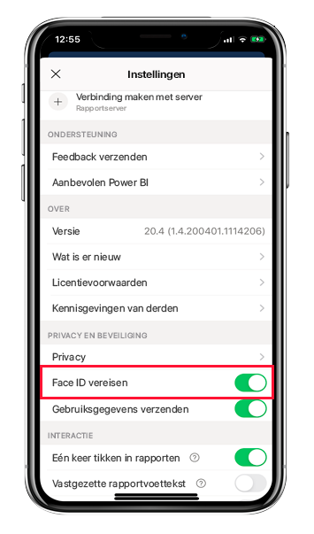
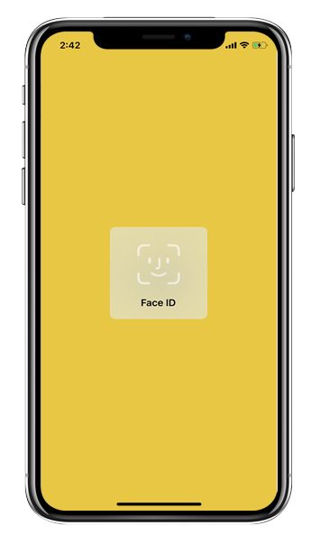
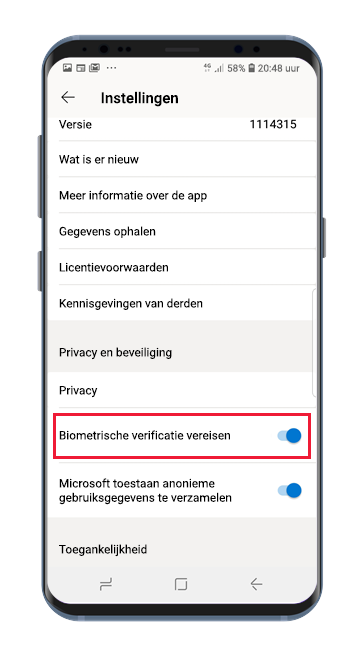
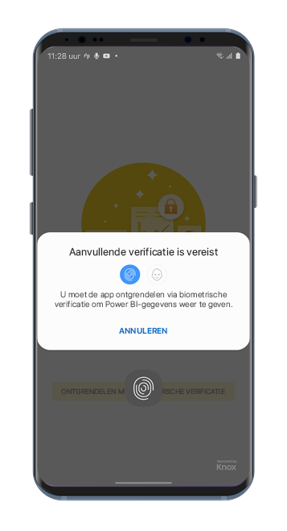

# De Power BI-app beveiligen met Face ID, Touch ID of biometrische gegevens 

In veel gevallen zijn de gegevens die worden beheerd in Power BI vertrouwelijk. Deze gegevens moeten worden beveiligd en mogen alleen toegankelijk zijn voor geautoriseerde gebruikers. 

Met de Power BI-apps voor iOS en Android kunt u uw gegevens beschermen door extra identificatie te configureren. Steeds wanneer de app wordt gestart of naar de voorgrond wordt gebracht, is identificatie vereist. In iOS betekent dit het aanbieden van Face ID, Touch ID of een wachtwoordcode. In Android betekent dit het aanbieden van biometrische gegevens (vingerafdruk-id).

Van toepassing op:

|  |  |  |  |
|:--- |:--- |:--- |:--- |
|iPhones |iPads |Android-telefoons |Android-tablets |

## Face ID, Touch ID of een wachtwoordcode inschakelen in iOS

Als u gebruik wilt maken van extra identificatie in de mobiele Power BI-app voor iOS, gaat u naar de app-instelling onder **Privacy en beveiliging**. Hier ziet u de optie voor het inschakelen van Face ID, Touch ID of een wachtwoordcode. De opties die u ziet zijn afhankelijk van de mogelijkheden van uw apparaat.

Wanneer deze instelling is ingeschakeld, wordt u elke keer dat u de app start of naar de voorgrond brengt, gevraagd om uw id aan te bieden voordat u toegang krijgt tot de app.

Welk type id u moet opgeven is afhankelijk van de mogelijkheden van uw apparaat. Als uw apparaat Face ID ondersteunt, moet u Face ID gebruiken. Als uw apparaat Touch ID ondersteunt, moet u Touch ID gebruiken. Als geen van beide wordt ondersteund, moet u een wachtwoordcode opgeven. In de onderstaande afbeelding ziet u het Face ID-verificatiescherm.

## Biometrische gegevens (vingerafdruk-id) inschakelen in Android

Als u gebruik wilt maken van extra identificatie in mobiele Power BI-app voor Android, gaat u naar de app-instelling onder **Privacy en beveiliging**. U ziet de optie om biometrische gegevens in te schakelen.

Wanneer deze instelling is ingeschakeld, wordt u elke keer dat u de app start of naar de voorgrond brengt, gevraagd om uw biometrische gegevens (vingerafdruk-id) aan te bieden voordat u toegang krijgt tot de app.

In de onderstaande afbeelding ziet u het vingerafdrukverificatiescherm.

>[!NOTE]
>Als u de instelling Biometrische verificatie vereisen van de mobiele app wilt gebruiken, moet u eerst biometrie op uw Android-apparaat instellen. Als uw apparaat geen biometrie ondersteunt, kunt u de toegang tot uw Power BI-gegevens niet beveiligen met behulp van deze instelling voor de mobiele app.
>
>Als uw beheerder [extern beveiligde toegang heeft ingeschakeld](#mdm-enforcement-of-secure-access-to-your-power-bi-mobile-app) voor de mobiele app, moet u biometrie op uw apparaat instellen om toegang te krijgen tot de app, als u dit nog niet hebt gedaan. Als uw apparaat geen biometrie ondersteunt, heeft de externe instelling geen invloed op u. De toegang tot uw mobiele app blijft onbeveiligd.

## MDM-afdwinging van beveiligde toegang tot uw mobiele Power BI-app.

Sommige organisaties hebben beveiligingsbeleid en nalevingsvereisten die extra identificatie afdwingen voordat u toegang krijgt tot gevoelige bedrijfsgegevens.

Met de mobiele Power BI-app voor iOS wordt dit ondersteund doordat beheerders de instelling voor veilige toegang van de mobiele app kunnen beheren door de configuratie-instellingen voor de app te pushen vanuit Microsoft Intune en andere MDM-oplossingen (Mobile Device Management). Beheerders kunnen het beveiligingsbeleid voor apps gebruiken om deze instelling in te schakelen voor alle gebruikers of voor een groep gebruikers. Zie [MDM gebruiken om de mobiele Power BI-app extern te configureren](mobile-app-configuration.md#data-protection-settings-ios-and-android) voor meer informatie.

## Volgende stappen
* [MDM gebruiken om de Power mobiele Power BI-app extern te configureren](mobile-app-configuration.md)
