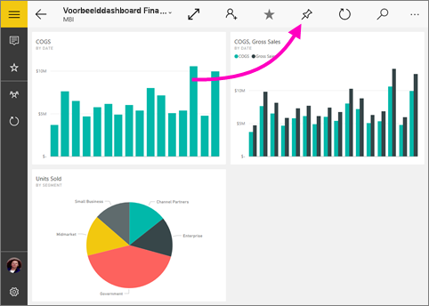
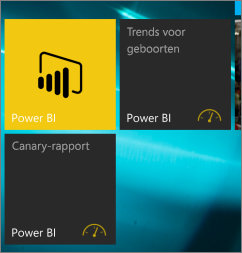

# Een dashboard vastmaken aan het Windows 10-startscherm vanuit de mobiele Power BI-app
U kunt Power BI-dashboards vastmaken aan het Windows-startscherm vanuit de mobiele Power BI-app voor Windows 10. Wanneer u op de tegel in het startscherm tikt, wordt het dashboard geopend in de mobiele Power BI-app voor Windows 10.

>[!NOTE]
>Power BI-ondersteuning voor mobiele apps voor **telefoons met Windows 10 Mobile** wordt stopgezet op 16 maart 2021. [Meer informatie](/legal/powerbi/powerbi-mobile/power-bi-mobile-app-end-of-support-for-windows-phones)

## Een dashboard aan uw startscherm vastmaken als tegel
1. Open een dashboard.
2. Tik op **Aan startscherm vastmaken**  .
   
   
   
   Ga naar het startscherm van uw apparaat om de tegel te bekijken.
   
   

## Volgende stappen
* [De mobiele Power BI-app voor Windows 10 downloaden](https://go.microsoft.com/fwlink/?LinkID=526478) vanuit de Windows Store  
* [Aan de slag met de mobiele Power BI-app voor Windows 10](mobile-windows-10-phone-app-get-started.md)  
* [Wat is Power BI?](../../fundamentals/power-bi-overview.md)
* Vragen? [Misschien dat de Power BI-community het antwoord weet](https://community.powerbi.com/)