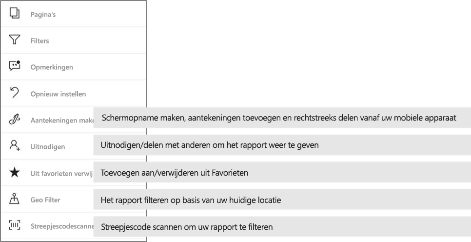

# Rapporten verkennen in de mobiele Power BI-apps
Van toepassing op:

|  |  |  |  |  |
|:--- |:--- |:--- |:--- |:--- |
| iPhones |iPads |Android-telefoons |Android-tablets |Windows 10-apparaten |

Een Power BI-rapport is een interactieve weergave van uw gegevens met visuele elementen die verschillende bevindingen en inzichten van die gegevens vertegenwoordigen. Rapporten weergeven in de mobiele Power BI-apps is de derde stap in een proces dat uit drie stappen bestaat.

1. [Rapporten maken in Power BI Desktop](../../desktop-report-view.md). U kunt zelfs [een rapport optimaliseren voor telefoons](mobile-apps-view-phone-report.md) in Power BI Desktop. 
2. Deze rapporten publiceren naar de Power BI-service [(https://powerbi.com)](https://powerbi.com) of [Power BI Report Server](../../report-server/get-started.md).  
3. Vervolgens kunt u de rapporten gebruiken in de mobiele Power BI-apps.

## Een Power BI-rapport openen in de mobiele app
Power BI-rapporten worden opgeslagen op verschillende plaatsen in de mobiele app, afhankelijk van waar hoe u eraan bent gekomen. Ze kunnen worden opgeslagen in Apps, Gedeeld met mij, werkruimten (met inbegrip van Mijn werkruimte) of op een rapportserver. Soms doorloopt u een gerelateerd dashboard om bij een rapport te komen en soms worden ze in een lijst weergegeven.

In lijsten en menu's ziet u een pictogram naast de naam van een rapport, zodat u begrijpt dat het item een rapport is. 

 

Er zijn twee pictogrammen voor rapporten in mobiele Power BI-app:

*  geeft een rapport aan dat wordt weergegeven in de afdrukstand Liggend en dat er hetzelfde uitziet als in de browser.

*  geeft een rapport aan dat ten minste één voor de telefoon geoptimaliseerde rapportpagina bevat, die staand wordt weergegeven. 

> [!NOTE]
> Als u uw telefoon in de liggende stand houdt, krijgt u altijd de liggende indeling, ook als de rapportpagina een telefoonindeling heeft. 

Tik op het beletselteken (...) in de rechterbovenhoek van een tegel > **Rapport openen** om een rapport van een dashboard op te halen.
  
  
  
  Niet alle tegels kunnen in een rapport worden geopend. Tegels die zijn gemaakt door een vraag te stellen in vak Q&A, openen bijvoorbeeld geen rapporten wanneer u erop tikt. 
  
## Interactie met rapporten
Zodra u een rapport hebt geopend in de app, kunt u ermee aan de slag gaan. U kunt allerlei acties uitvoeren op uw rapport en op de gegevens ervan. In de voettekst van het rapport vindt u acties die in het rapport moeten worden uitgevoerd. Door te tikken of lang te tikken op de gegevens die in het rapport worden weergegeven, kunt u de gegevens segmenteren en analyseren.

### Tikken en lang tikken
Tikken is hetzelfde als een muisklik. Als u het rapport dus kruislings wilt markeren op basis van een gegevenspunt, tikt u op dat gegevenspunt.
Als u op een slicerwaarde tikt, wordt deze waarde geselecteerd en wordt de rest van het rapport gefilterd op die waarde. Als u op een koppeling, knop of bladwijzer tikt, wordt deze geactiveerd op basis van de actie die de auteur heeft gedefinieerd.

U hebt waarschijnlijk gezien dat er een rand wordt weergegeven wanneer u op een visual tikt. Rechtsboven aan de rand ziet u een beletselteken (...). Als u erop tikt, wordt er een menu weergegeven met acties die u op die visual kunt uitvoeren.

### Knopinfo en zoomacties

Als u lang op een gegevenspunt tikt (tikken en vasthouden), wordt de knopinfo weergegeven met de waarden van dat gegevenspunt. 

Als de auteur van het rapport knopinfo voor rapportpagina's heeft geconfigureerd, wordt de standaardknopinfo vervangen door de knopinfo voor de rapportpagina's.

> [!NOTE]
> Knopinfo voor het rapportcanvas wordt ondersteund voor apparaten met meer pixels dan 640 en een grotere viewport dan 320. Als uw apparaat kleiner is, wordt de standaardknopinfo gebruikt in de app.

Auteurs van rapporten kunnen hiërarchieën definiëren in de gegevens en in de relaties tussen rapportpagina's. Op basis van de hiërarchie kunt u inzoomen, uitzoomen en een andere rapportpagina tot in detail analyseren vanuit een visual en een waarde. Wanneer u dus lang op een waarde tikt, worden behalve de knopinfo ook de relevante zoomopties weergegeven in de voettekst. 

Als u met *drillthrough* op een bepaald deel van een visual tikt, wordt u door Power BI naar een andere pagina in het rapport geleid, gefilterd op de waarde waarop u hebt getikt. De schrijver van het rapport kan een of meer mogelijkheden voor drillthrough instellen, waarmee u per mogelijkheid naar een andere pagina wordt geleid. U kunt kiezen wat u in detail wilt analyseren. Met de knop Terug gaat u weer terug naar de vorige rapportpagina.

Meer informatie over [detailanalyse toevoegen in Power BI Desktop](../../desktop-drillthrough.md).
   
   > [!IMPORTANT]
   > In de mobiele Power BI-app wordt zoomen in matrix- en tabelvisuals alleen ingeschakeld via een celwaarde, niet via kolom- en rijheaders.
   
   
   
### De acties gebruiken in de rapportvoettekst
De rapportvoettekst bevat acties die u kunt uitvoeren op de huidige rapportpagina of op het hele rapport. De voettekst biedt snelle toegang tot de meeste nuttige acties, en alle acties zijn toegankelijk via het beletselteken (...).

De acties die u kunt uitvoeren vanuit de voettekst zijn:
1) Het rapportfilter opnieuw instellen en selecties kruislings terugbrengen naar de oorspronkelijke markering.
2) Open het gespreksdeelvenster om opmerkingen over dit rapport weer te geven of toe te voegen.
3) Open het filterdeelvenster om het filter dat momenteel op het rapport is toegepast weer te geven en te wijzigen.
4) Alle pagina's in dit rapport weergeven. Als u op een paginanaam tikt, wordt deze pagina geladen en weergegeven.
U kunt schakelen tussen rapportpagina's door vanaf de rand van het scherm naar het midden te vegen.
5) Alle rapportacties weergeven.

#### Alle rapportacties
Als u op de optie ... in de rapportvoettekst tikt, worden alle acties weergegeven die u op een rapport kunt uitvoeren. 

Sommige acties zijn mogelijk uitgeschakeld, afhankelijk van de specifieke mogelijkheden van het rapport.
Bijvoorbeeld:
1) **Filteren op huidige locatie** is ingeschakeld als de gegevens in uw rapport door de auteur zijn gecategoriseerd met geografische gegevens. [Meer informatie over het identificeren van geografische gegevens in uw rapport](https://docs.microsoft.com/power-bi/desktop-mobile-geofiltering).
2) **Scannen om het rapport te filteren op streepjescode** is alleen ingeschakeld als de gegevensset in het rapport is getagd als streepjescode. [Streepjescodes taggen in Power BI Desktop](https://docs.microsoft.com/power-bi/desktop-mobile-barcodes). 
3) **Uitnodigen** is alleen ingeschakeld als u toestemming hebt om dit rapport te delen met anderen. U hebt alleen toestemming als u de eigenaar van het rapport bent of als de eigenaar u toestemming heeft verleend om het opnieuw te delen.
4) **Aantekeningen maken en delen** kan zijn uitgeschakeld als er in uw organisatie een [Intune-beveiligingsbeleidsregel](https://docs.microsoft.com/intune/app-protection-policies) is waarmee delen vanuit de mobiele Power BI-app is verboden. 

## Volgende stappen
* [Voor uw telefoon geoptimaliseerde Power BI-rapporten weergeven en gebruiken](mobile-apps-view-phone-report.md)
* [Een versie van een rapport maken die is geoptimaliseerd voor telefoons](../../desktop-create-phone-report.md)
* Vragen? [Misschien dat de Power BI-community het antwoord weet](http://community.powerbi.com/)

