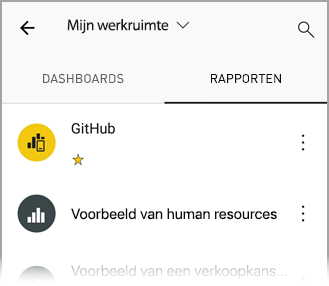
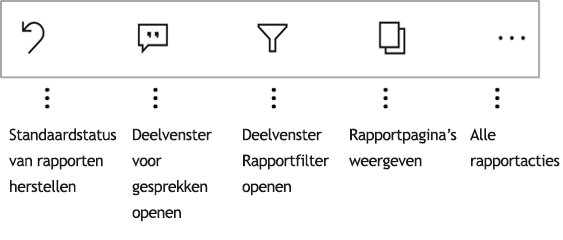

# Rapporten verkennen in de mobiele Power BI-apps
Van toepassing op:

|  |  |  |  |  |
|:--- |:--- |:--- |:--- |:--- |
| iPhones |iPads |Android-telefoons |Android-tablets |Windows 10-apparaten |

Een Power BI-rapport is een interactieve weergave van uw gegevens met visuele elementen die verschillende bevindingen en inzichten van die gegevens vertegenwoordigen. Rapporten weergeven in de mobiele Power BI-apps is de derde stap in een proces dat uit drie stappen bestaat.

1. [Rapporten maken in Power BI Desktop](../../desktop-report-view.md). U kunt zelfs [een rapport optimaliseren voor telefoons](mobile-apps-view-phone-report.md) in Power BI Desktop. 
2. Deze rapporten publiceren naar de Power BI-service [(https://powerbi.com)](https://powerbi.com) of [Power BI Report Server](../../report-server/get-started.md).  
3. Vervolgens kunt u de rapporten gebruiken in de mobiele Power BI-apps.

## Een Power BI-rapport openen in de mobiele app
Power BI-rapporten worden opgeslagen op verschillende plaatsen in de mobiele app, afhankelijk van waar hoe u eraan bent gekomen. Ze kunnen worden opgeslagen in Apps, Gedeeld met mij, werkruimten (met inbegrip van Mijn werkruimte) of op een rapportserver. Soms doorloopt u een gerelateerd dashboard om bij een rapport te komen en soms worden ze in een lijst weergegeven.

In de lijsten en menu's ziet u een pictogram naast de naam van een rapport, zodat u begrijpt dat dit item een rapport is. 

 

Er zijn twee pictogrammen voor rapporten in Power BI-mobiel-apps:

*  Geeft aan dat een rapport dat wordt weergegeven in de liggende richting in de app en zien er hetzelfde als volgt uit in de browser.

*  Geeft aan dat een rapport dat ten minste één telefoon geoptimaliseerd rapportpagina, die wordt weergegeven in de staande heeft. 

Opmerking: Uw telefoon houden in de liggende modus, krijgt altijd u de liggende opmaak, zelfs als de rapportpagina telefoonindeling heeft. 

Als u wilt gaan naar een rapport van een dashboard, tikt u op het weglatingsteken (...) in de rechterbovenhoek van een tegel > **rapport openen**.
  
  
  
  Niet alle tegels hebt de optie om een rapport te openen. Tegels die zijn gemaakt door een vraag te stellen in vak Q&A, openen bijvoorbeeld geen rapporten wanneer u erop tikt. 
  
## Interactie met rapporten
Zodra u een rapport geopend in de app hebt, kun u ermee te werken. Er zijn veel dingen die u met uw rapport en de bijbehorende gegevens doen kunt. In de voettekst van het rapport vindt u acties die u uitvoeren kunt op het rapport en door te tikken en lang te tikken op de gegevens in het rapport dat u kunt ook en servertelemetrie de gegevens weergegeven.

### Met behulp van tikt en lang op
Tik op gelijk is aan een muis klikt u op. Dus als u het rapport op basis van een gegevenspunt wilt kruislings te markeren, tikt u op dat punt.
Tikken op een slicerwaarde, wordt die waarde die is geselecteerd en de rest van het rapport segmenteren door die waarde. Tikken op een koppeling, wordt knop of een bladwijzer geactiveerd op basis van de actie gedefinieerd door de auteur.

U wordt waarschijnlijk gemerkt dat wanneer u tikt u op een visueel element, wordt een rand weergegeven. Op de rechterbovenhoek van de rand is het weglatingsteken (...). Tikken op het brengt een menu met de acties die u op deze visual kunt uitvoeren.

### Knopinfo en inzoomen acties

Wanneer u lange tikt u op (tikken en vasthouden) een gegevenspunt knopinfo wordt weergegeven de waarden dit gegevenspunt vertegenwoordigt wordt gepresenteerd. 

Auteurs van rapporten kunnen hiërarchieën definiëren in de gegevens en relaties tussen rapportpagina's. Hiërarchie kunt inzoomen op inzoomen om en inzoomen door een andere pagina van het rapport van een visueel element en een waarde. Wanneer u lange tikt u op een waarde, naast de knopinfo wordt dus de relevante drill-opties in de voettekst weergegeven. 

Als u met *drillthrough* op een bepaald deel van een visual tikt, wordt u door Power BI naar een andere pagina in het rapport geleid, gefilterd op de waarde waarop u hebt getikt.  De schrijver van het rapport kan een of meer mogelijkheden voor drillthrough instellen, waarmee u per mogelijkheid naar een andere pagina wordt geleid. In dat geval kunt u kiezen wat u in detail wilt analyseren. De knop vorige keert u terug naar de vorige pagina van het rapport.

Meer informatie over [detailanalyse toevoegen in Power BI Desktop](../../desktop-drillthrough.md).
   
   > [!IMPORTANT]
   > In Power BI-mobiel-app, is inzoomen in matrix- en tabelvisuals door alleen de waarde van een cel en niet door de kolommen en rijen headers ingeschakeld.
   
   
   
### Met behulp van de acties in de voettekst van het rapport
De voettekst van het rapport heeft de acties die u kunt uitvoeren op de huidige rapportpagina of het volledige rapport. De voettekst snelle toegang tot de handigste acties heeft en alle acties zijn op te vragen uit het weglatingsteken (...).

De acties die u vanaf de voetteksten uitvoeren kunt zijn:
1) Opnieuw instellen van het rapport filteren en kruislings markeren selecties terug naar de oorspronkelijke staat.
2) Open het deelvenster van de conversatie wilt weergeven of opmerkingen toevoegen aan dit rapport.
3) Open het filterdeelvenster weergeven en wijzigen van het filter op dat moment worden toegepast op het rapport.
4) Lijst met alle pagina's in dit rapport. Tikken op de paginanaam van de wordt geladen en presenteren van die pagina.
Verplaatsen naar een andere rapportpagina's kan worden gedaan door de lezer van de rand van het scherm op het midden.
5) Alle acties weergeven.

#### Alle Rapportacties
Tikken op de... in de voettekst van het rapport de optie, alle acties die u op een rapport uitvoeren kunt kan worden gebracht. 

Sommige van de acties kunnen worden uitgeschakeld, omdat ze afhankelijk van de mogelijkheden van een specifiek rapport zijn.
Bijvoorbeeld:
1) **Filteren op de huidige locatie** is ingeschakeld als de gegevens in uw rapport is gecategoriseerd door de auteur met geografische gegevens. [Informatie over het identificeren van geografische gegevens in uw rapport](https://docs.microsoft.com/power-bi/desktop-mobile-geofiltering).
2) **Scannen naar het rapport filteren op streepjescode** is alleen ingeschakeld als de gegevensset in uw rapport is gemarkeerd als de streepjescode. [Hoe het labelen van streepjescodes in Power BI Desktop](https://docs.microsoft.com/power-bi/desktop-mobile-barcodes). 
3) **Uitnodigen** is alleen ingeschakeld als u bent gemachtigd dit rapport te delen met anderen. U heeft de machtiging alleen als u de eigenaar bent van het rapport of als u opnieuw delen machtiging zijn gegeven door de eigenaar.
4) **Aantekeningen maken en delen** mogelijk uitschakelen als er een [beveiligingsbeleid voor Intune](https://docs.microsoft.com/intune/app-protection-policies) in uw organisatie die delen van Power BI-mobiel-app is verboden. 

## Volgende stappen
* [Voor uw telefoon geoptimaliseerde Power BI-rapporten weergeven en gebruiken](mobile-apps-view-phone-report.md)
* [Een versie van een rapport maken die is geoptimaliseerd voor telefoons](../../desktop-create-phone-report.md)
* Vragen? [Misschien dat de Power BI-community het antwoord weet](http://community.powerbi.com/)

